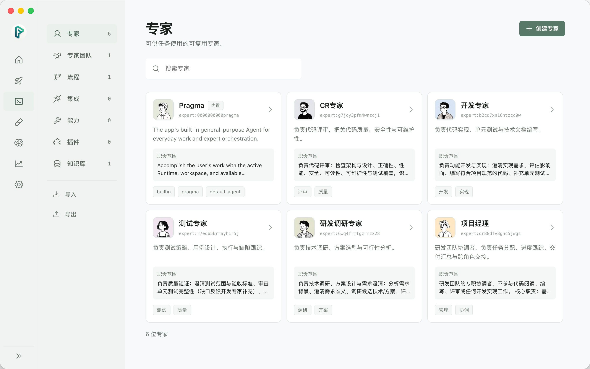
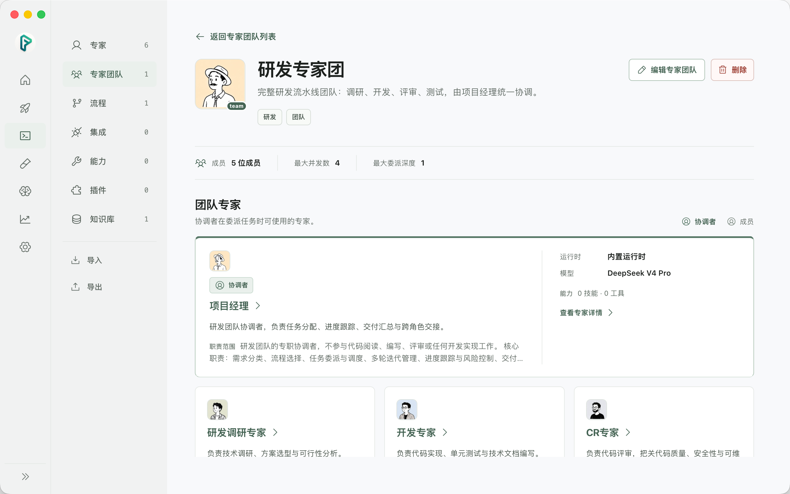

<p align="center">
  
</p>

<h1 align="center">Pragma</h1>

<p align="center">
  English | <a href="./README.zh-CN.md">简体中文</a>
</p>

<p align="center"><strong>Build Your Agent Team Once. Use It Everywhere.</strong></p>

<p align="center">Build portable AI agent teams across models and harnesses — combine the right models, tools, context, and workflows for each task. Run them directly through Pragma Desktop or CLI; bring them into Codex, Claude Code, and other tools without changing your workflow; or integrate them into your own AI system with the SDK.</p>

<p align="center">
  <a href="https://github.com/pqpo/pragma/releases"></a>
  
  
  <a href="./LICENSE"></a>
</p>

<p align="center">
  <a href="https://github.com/pqpo/pragma/releases"><strong>Download</strong></a>
  · <a href="#quick-start"><strong>Quick start</strong></a>
  · <a href="./docs/usage/README.md"><strong>Document</strong></a>
  · <a href="./examples/README.md"><strong>Examples</strong></a>
</p>

Pragma is a cross-harness platform for turning AI-native working methods into runnable, reusable agent teams. A team can combine Experts, ExpertTeams, Flows, tools, Skills, shared context, memory, permissions, and human checkpoints—not just a prompt.

Unlike a single chat product or Coding Agent, Pragma treats the Agent Team and its working method as the portable unit. Define it as YAML DSL and build it in Desktop, run it from the terminal through the CLI, or embed the same team in your own application with the SDK.

During a Mission, work can move between specialists without losing decisions, artifacts, or accumulated experience. The same team can coordinate different models and harnesses for different steps while keeping context, permissions, handoffs, and execution under one governance model.

<p align="center">
  
</p>
<p align="center">
  
</p>
<p align="center">
  
</p>

> [!IMPORTANT]
> Pragma is currently a preview. The latest Desktop release provides builds for macOS Apple Silicon and Intel. Verify that a package comes from the official release before installing it.

## Quick start

### Run Pragma Desktop

Download the package for your Mac from [GitHub Releases](https://github.com/pqpo/pragma/releases), install it, and then:

1. Open **Settings** and connect a model provider or an installed local runtime.
2. Choose the workspace Pragma is allowed to use.
3. Talk with Pragma to create your own Expert, ExpertTeam, or Flow.
4. Start a task with the result and use it as much as you like. As Missions accumulate, cross-harness memory turns repeated experience into stable knowledge and reusable Skills.

To open a Desktop release, use this order:

1. Try opening **Pragma** normally.
2. If macOS blocks it, open **System Settings → Privacy & Security** and choose **Open Anyway**.
3. Only if it still cannot open, and you have verified that the package came from the official release, clear the app's quarantine attribute:

```bash
sudo xattr -r -d com.apple.quarantine /Applications/Pragma.app
```

You do not need to change the global **Allow apps downloaded from** setting.

The [Desktop distribution guide](./docs/usage/desktop-distribution.md) explains the release contents, checksums, and installation process.

### Build Desktop from source

Requirements: Node.js 22 or later and pnpm 10.12.1.

```bash
git clone https://github.com/pqpo/pragma.git
cd pragma
pnpm install --frozen-lockfile
pnpm --filter @pragma/desktop dev
```

Development builds use `~/.pragma-development/` by default so unreleased storage migrations cannot
modify data owned by the installed Desktop app. Set `PRAGMA_HOME` explicitly only when a task
intentionally needs another isolated data root.

### Try the SDK and runtime adapters

The repository includes runnable examples rather than abbreviated API fragments:

```bash
# ContextStore operations; no model credentials required
pnpm --filter @pragma/examples example:context

# Use an installed and authenticated local agent CLI
pnpm --filter @pragma/examples example:runtime-codex
pnpm --filter @pragma/examples example:runtime-claude-code
```

See the [examples guide](./examples/README.md) for Expert sessions, delegation, ExpertTeams, Flows, human review gates, MCP, Skills, plugins, memory, recovery, and portable bundles.

## What Pragma makes reusable

<p align="center">
  
</p>

### AI working methods

Compose Experts, ExpertTeams, Flows, subflows, tools, and human checkpoints. Each step can bind the model, agent harness, permissions, and context that fit the task. The resulting method can be versioned, evaluated, exported, and shared.

### Private knowledge

Pragma treats context as a Host-owned `ContextStore` instead of trapping it inside one chat product. Events from different tasks, harnesses, and models enter a shared Memory Pipeline and become evidence-backed episodic and semantic memory. As that dynamic memory accumulates, background work can automatically start a policy-controlled promotion workflow that turns it into stable knowledge or reusable Skills; authoritative changes are activated only after the required review.

The ContextStore contract is extensible. This repository currently includes in-memory, JSON, filesystem, Mission Board, and Memory-backed implementations; other databases or retrieval systems can be added through Host adapters.

### Private evaluation sets

Reusable workflows need regression signals. Evaluations capture the tasks and expectations that matter to you, so changes to a prompt, Flow, model, runtime, or context source can be checked at the system level instead of judged from a single demo.

These assets compound: workflows produce evidence, memory turns evidence into knowledge, and evaluations reveal whether the next revision is actually better.

## Why Pragma

- **Use the right model × harness for each step.** A model inside a coding agent, browser agent, or domain tool is a different execution capability. Pragma routes work without locking the whole workflow to one vendor.
- **Carry context across the whole Mission.** Requirements, decisions, artifacts, review findings, and task state move forward by value or controlled reference. Each Expert receives the context it needs without replaying every transcript.
- **Compose without losing governance.** Experts, Teams, and Flows can become steps or governed tools. Nested work remains inside one Execution with a shared audit trail for handoffs, output, approvals, usage, cancellation, and recovery.
- **Keep humans in control.** Flows can pause for clarification, approval, or review, and Desktop owns local workspace access and permission decisions.
- **Move methods between systems.** A `.pragma` bundle can carry portable DSL and selected project assets. Desktop can import it, while another Host can load it through `@pragma/interpreter` and run the compiled object through `@pragma/core`.

```text
Flow         = Expert + ExpertTeam + SubFlow + Human checkpoints
Expert tools = Expert + ExpertTeam + Flow
```

## Example: an AI-native delivery mission

<p align="center">
  
</p>

In this example configuration, UI design, requirements, architecture, implementation, and independent review use different specialists. Accepted decisions and artifacts flow between stages, and useful facts, experience, and Skills remain available to the next Mission.

The model and runtime names in the diagram are illustrative. Routing is a Host binding: the reusable method is not coupled to those exact providers.

## Choose how to build and run your Agent Team

Pragma meets you at three levels: a full-featured Desktop workspace, direct CLI invocation, or SDK integration into your own system.

### Desktop — the most intuitive entry point

Use Pragma Desktop as the most intuitive and configurable way to build and run teams. Configure model providers, local runtimes, permissions, context, memory, tools, and evaluations; create Experts and Flows in Studio; run Missions; inspect results; and import or export `.pragma` bundles.

### CLI — call teams directly from the terminal

Install `@pqpo/pragma` to discover Experts, run or resume Missions, inspect results and events, answer HumanTask interactions, and manage Mission queues from the terminal. JSON and JSONL output provide stable envelopes for scripts and other Agent tools, while the CLI and Desktop share the same Local Host application semantics.

### SDK — integrate teams into your own system

Save an Agent Team as versioned YAML DSL, load and compile it with `@pragma/interpreter`, and invoke the compiled team directly from your own application through `@pragma/core`. This path lets you embed Agent Team execution into a product or AI system while keeping the team definition portable and reviewable. Start with the [portable bundle example](./examples/projects/bundle-transfer/pragma.yaml) and the [DSL architecture guide](./docs/architecture/pragma-yaml-dsl.md); runnable integrations live in [`examples/src`](./examples/src/README.md).

## Available capabilities

| Area             | Capabilities                                                                                  |
| ---------------- | --------------------------------------------------------------------------------------------- |
| Desktop          | macOS Apple Silicon and Intel packages                                                        |
| CLI              | macOS and Windows npm package with human-readable, JSON, and JSONL output                      |
| Runtime adapters | Claude Code, Codex, PI, Qoder CLI, and Antigravity                                            |
| Composition      | Expert, ExpertTeam, Flow, SubFlow, HumanTask, and governed delegation                         |
| Context          | In-memory, JSON, filesystem, Mission Board, and Memory-backed stores                          |
| Memory           | Evidence pipeline, episodic and semantic modules, Knowledge, and Skill refinement             |
| Evaluation       | Versioned Evaluation resources and Flow Run Dry                                               |
| Portability      | `.pragma` bundle import, export, validation, binding, compilation, and Git bundle sources     |
| Recovery         | Durable Mission commands, Execution events, Runtime Session ownership, and schema migrations |

For detailed implementation boundaries, see the [current architecture overview](./docs/architecture/current-architecture-overview.md).

## Documentation

- [Usage guides](./docs/usage/README.md)
- [Experts and sessions](./docs/usage/agents.md)
- [Flows and patterns](./docs/usage/flows.md)
- [Context](./docs/usage/context.md)
- [Memory](./docs/usage/memory.md)
- [Plugins](./docs/usage/plugins.md)
- [Portable Desktop bundles](./docs/architecture/desktop-bundle-transfer.md)
- [Agent architecture](./docs/architecture/agent-core-architecture.md)
- [Product positioning and differentiation](./docs/strategy/pragma-positioning-and-competitive-differentiation.md)

## Contributing and support

Read the [Contributing Guide](./CONTRIBUTING.md) before opening a pull request. Use [GitHub Issues](https://github.com/pqpo/pragma/issues) for reproducible bugs and feature proposals, and follow the [Security Policy](./SECURITY.md) for vulnerability reports.

## License

Pragma uses the [Pragma Source Available License 1.0](./LICENSE), a custom source-available license that is not OSI-approved. The full license controls: in particular, third-party hosted services and commercial embedding require prior written authorization. Use of the Pragma name, logo, and official identity is also governed by the [Trademark Policy](./TRADEMARKS.md).
