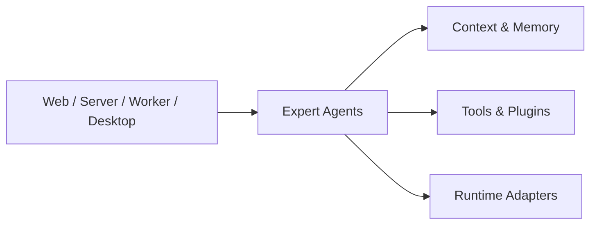

# Pragma

<p align="center">
  <strong>A multi-expert AI collaboration platform built for production-grade complex scenarios.</strong>
</p>

<p align="center">
  <a href="./README.zh-CN.md">简体中文</a>
</p>

<p align="center">
  
  
  
  
  
</p>

Pragma helps teams build AI expert groups for production-grade work: requirements analysis, technical planning, code implementation, code review, testing analysis, and domain knowledge support.

It is not designed as a single general-purpose chatbot. Pragma focuses on reusable expert definitions, shared context, controlled tool access, runtime replacement, and governance boundaries that can grow with complex engineering and business executions.

## Why Pragma?

Production AI work usually needs more than one prompt and one model call. Real teams need specialists, review gates, shared project knowledge, tool permissions, traceable execution, and the ability to move work between cloud and local runtimes.

Pragma is built around those constraints:

- **Expert-first collaboration**: define specialized experts with roles, instructions, context, tools, and model configuration.
- **Production boundaries**: keep protocols, runtime execution, client SDKs, server infrastructure, and apps separated.
- **Shared context and memory**: expose long-lived project knowledge and memory through governed context namespaces.
- **Tool and plugin foundation**: attach managed tools, MCP capabilities, skills, and domain plugins without hard-wiring them into app code.
- **Runtime flexibility**: run experts through replaceable runtime adapters, including cloud and local runtime implementations.
- **Human control points**: support approval, clarification, and review flows for actions that require human judgment.

## Core Capabilities



Pragma currently provides:

- `Expert` creation APIs for defining reusable AI experts.
- Context systems backed by in-memory or filesystem stores.
- Managed tools, MCP tool integration, plugin loading, and approval policies.
- Runtime adapter contracts and concrete PI / Codex runtime packages.
- Directive and execution primitives for composing expert work with deterministic TypeScript tasks.
- Browser-safe shared schemas and DTOs built with Zod.
- Web, server, worker, desktop, client SDK, and infrastructure package boundaries in a pnpm monorepo.

## Quickstart

### Requirements

```text
Node.js >= 22
pnpm 10.12.1
```

### Install

```bash
pnpm install
pnpm -r list
```

### Start the Server

```bash
pnpm --filter @pragma/server-app dev
```

The server exposes `GET /health` on port `3001`:

```bash
curl http://localhost:3001/health
```

Expected response:

```json
{
  "service": "server",
  "status": "ok"
}
```

### Start the Web App

```bash
pnpm --filter @pragma/web dev
```

Open:

```text
http://localhost:3000
```

The page should show the web app status and the server health result.

### Start the Worker

```bash
pnpm --filter @pragma/worker dev
```

Expected output:

```text
Pragma Worker Ready
```

### Start the Desktop App

```bash
pnpm --filter @pragma/desktop run prepare:electron
pnpm --filter @pragma/desktop dev
```

Electron 42 downloads its binary on first CLI usage. `prepare:electron` triggers that download explicitly so local development and CI fail less often on a missing binary.

## Run Your First Expert

The `examples/` workspace contains focused examples for creating experts, using context, testing memory behavior, running local Codex runtime sessions, and exercising human approval flows.

Prepare model configuration:

```bash
cp examples/.env.example examples/.env
```

Then edit `examples/.env`:

```text
PRAGMA_MODEL_PROVIDER=openai
PRAGMA_MODEL_NAME=gpt-4o-mini
PRAGMA_MODEL_BASE_API=https://api.openai.com/v1
PRAGMA_MODEL_API=openai-responses
PRAGMA_MODEL_API_KEY=replace-with-your-api-key
```

Run the basic expert example:

```bash
pnpm --filter @pragma/examples dev src/run-expert-agent.ts
```

Pass a custom prompt:

```bash
pnpm --filter @pragma/examples dev src/run-expert-agent.ts "Summarize the Expert lifecycle in three sentences."
```

More examples:

```bash
pnpm --filter @pragma/examples dev src/run-workspace-context-agent.ts
pnpm --filter @pragma/examples dev src/run-memory-system-example.ts
pnpm --filter @pragma/examples dev src/run-tool-approval-example.ts
pnpm --filter @pragma/examples dev src/run-codex-runtime-agent.ts
pnpm --filter @pragma/examples dev src/run-claude-code-runtime-agent.ts
```

See [examples/README.md](./examples/README.md) for the full example guide.

## Monorepo Layout

```text
apps/
  web/       Next.js web application
  server/    Fastify HTTP API application
  worker/    Node.js worker application
  desktop/   Desktop local agent bridge

packages/
  shared/         Cross-runtime schemas, DTOs, domain models, and pure utilities
  client/         Browser/client HTTP SDK
  server/         Server-side infrastructure boundary
  core/           Expert, context, tools, plugins, and runtime contracts
  runtime/pi/     PI runtime adapter
  runtime/codex/  Codex local runtime adapter
  eslint-config/  Shared ESLint config
  tsconfig/       Shared TypeScript config

plugins/
  memory/         Memory plugin
  repo-manager/   Repository management plugin

examples/         Runnable Expert examples
docs/             Architecture notes, ADRs, conventions, and usage guides
infra/            Infrastructure composition directory
```

## Architecture Boundaries

Pragma keeps package boundaries explicit so the platform can evolve without coupling browser code, server infrastructure, expert definitions, and runtime implementations.

Allowed internal dependency direction:

```text
apps/web        -> client -> shared
apps/server     -> server -> core -> shared
apps/worker     -> server -> runtime-* -> core -> shared
apps/desktop    -> core -> shared
runtime-*       -> core -> shared
```

Important rules:

- `shared` must remain browser-safe and runtime-neutral.
- `client` must not depend on `server` or `core`.
- `core` must not depend on concrete runtime packages, server apps, client SDKs, React, or Next.js.
- Concrete runtime implementations live in independent `@pragma/runtime-*` packages.
- Cross-package imports must use `@pragma/*` package imports, not relative paths.

For deeper context:

- [Module boundaries](./docs/architecture/module-boundaries.md)
- [Agent core architecture](./docs/architecture/agent-core-architecture.md)
- [Expert agent standard protocol](./docs/architecture/expert-agent-standard-protocol.md)
- [Local agent bridge](./docs/architecture/local-agent-bridge.md)
- [Monorepo and dependency rules ADR](./docs/adr/001-monorepo-and-dependency-rules.md)

## Documentation

- [Usage guide index](./docs/usage/README.md)
- [Agents](./docs/usage/agents.md)
- [Context](./docs/usage/context.md)
- [Memory](./docs/usage/memory.md)
- [Plugins](./docs/usage/plugins.md)
- [Human interaction](./docs/usage/human-interaction.md)
- [Coding conventions](./docs/conventions/coding-conventions.md)

## Quality Commands

```bash
pnpm lint
pnpm typecheck
pnpm test
pnpm build
pnpm check
```

`pnpm check` runs lint, typecheck, and tests. CI also runs `pnpm build`.

## Project Status

Pragma is under active development. The current repository focuses on the long-term engineering foundation: strict module boundaries, runtime adapter contracts, expert definitions, context systems, plugin loading, human approval flows, and runnable examples.

Breaking changes are acceptable when they improve architecture, remove obsolete compatibility layers, or make the platform easier to verify.

## Security Model

AI experts should not be trusted to self-police sensitive actions. File access, shell execution, network access, secrets, local runtime execution, and other privileged operations must be constrained by tools, runtime adapters, server-side policies, or the future Desktop permission guard.

The local agent bridge is designed around outbound Desktop connections, explicit device/session registration, capability registration, and local user approval rather than exposing a local runner directly to the network.

## Contributing

Before changing code, read [AGENTS.md](./AGENTS.md) and the architecture boundary documents. Keep changes scoped to the right package, add or update tests where behavior changes, and run the relevant quality commands before opening a pull request.
