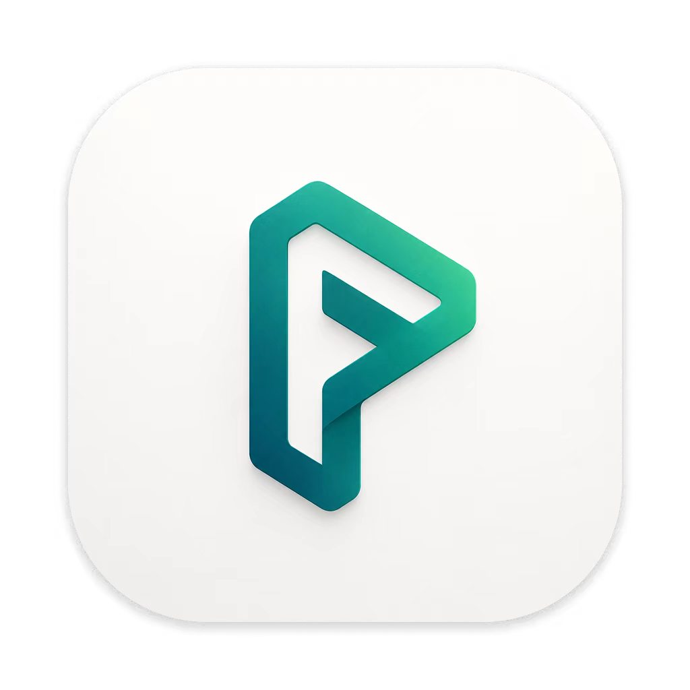
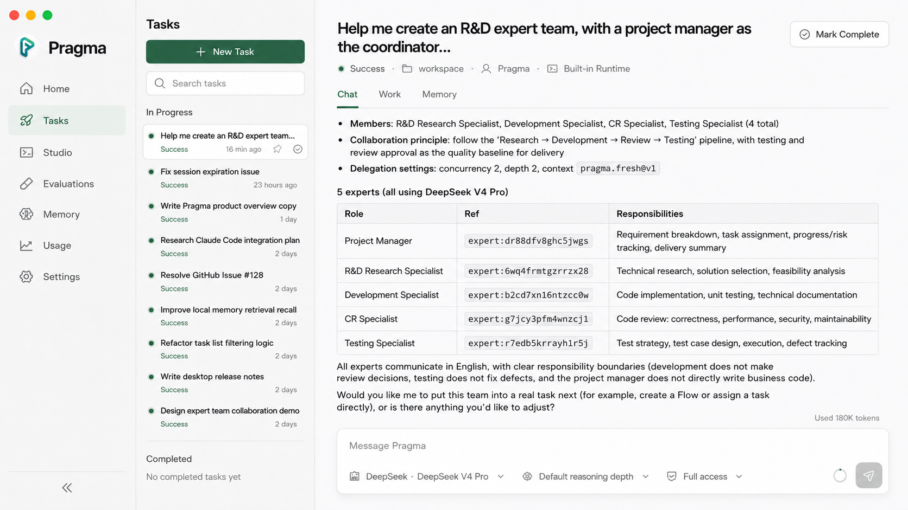
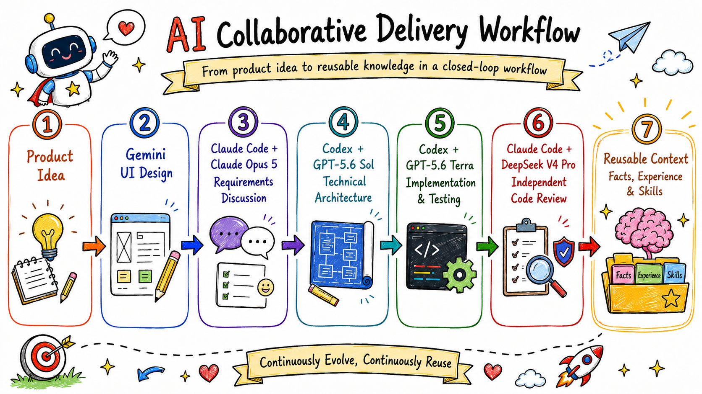

<p align="center">
  
</p>

<h1 align="center">Pragma</h1>

<p align="center">
  English | <a href="./README.zh-CN.md">简体中文</a>
</p>

<p align="center">Turn the way you work with AI into a reusable asset.</p>

<p align="center">
  <a href="https://github.com/pqpo/pragma/releases"></a>
  
  
  <a href="./LICENSE"></a>
</p>

<p align="center">
  <a href="https://github.com/pqpo/pragma/releases"><strong>Download</strong></a>
  · <a href="#quick-start"><strong>Quick start</strong></a>
  · <a href="./docs/usage/README.md"><strong>Document</strong></a>
  · <a href="./examples/README.md"><strong>Examples</strong></a>
</p>

Pragma is a code-public desktop application for orchestrating multiple agent harnesses, models, tools, context sources, and human decisions into reusable AI workflows.

A Mission can move from one specialist to another without losing its decisions, artifacts, or accumulated experience. Pragma does not replace Claude Code, Codex, PI, Qoder CLI, Antigravity CLI, or the next great agent—it makes them work together.

The more you use Pragma, the more it compounds. Events from different tasks, harnesses, and models become cross-harness dynamic memory; useful experience and facts can then be promoted automatically, under policy and review controls, into a stable knowledge base or reusable Skills.

<p align="center">
  
</p>

> [!IMPORTANT]
> Pragma is currently a preview. The latest Desktop release provides unsigned builds for macOS Apple Silicon and Intel. See [Current status](#current-status) before adopting it for critical work.

## Quick start

### Run Pragma Desktop

Download the package for your Mac from [GitHub Releases](https://github.com/pqpo/pragma/releases), install it, and then:

1. Open **Settings** and connect a model provider or an installed local runtime.
2. Choose the workspace Pragma is allowed to use.
3. Talk with Pragma to create your own Expert, ExpertTeam, or Flow.
4. Start a task with the result and use it as much as you like. As Missions accumulate, cross-harness memory turns repeated experience into stable knowledge and reusable Skills.

The current app is not code-signed. To open a Desktop release, use this order:

1. Try opening **Pragma** normally.
2. If macOS blocks it, open **System Settings → Privacy & Security** and choose **Open Anyway**.
3. Only if it still cannot open, and you have verified that the package came from the official release, clear the app's quarantine attribute:

```bash
sudo xattr -r -d com.apple.quarantine /Applications/Pragma.app
```

You do not need to change the global **Allow apps downloaded from** setting for this unsigned release.

The [Desktop distribution guide](./docs/usage/desktop-distribution.md) explains the release contents, checksums, and limitations.

### Build Desktop from source

Requirements: Node.js 22 or later and pnpm 10.12.1.

```bash
git clone https://github.com/pqpo/pragma.git
cd pragma
pnpm install --frozen-lockfile
pnpm --filter @pragma/desktop dev
```

### Try the SDK and runtime adapters

The repository includes runnable examples rather than abbreviated API fragments:

```bash
# ContextStore operations; no model credentials required
pnpm --filter @pragma/examples example:context

# Use an installed and authenticated local agent CLI
pnpm --filter @pragma/examples example:runtime-codex
pnpm --filter @pragma/examples example:runtime-claude-code
```

See the [examples guide](./examples/README.md) for Expert sessions, delegation, ExpertTeams, Flows, human review gates, MCP, Skills, plugins, memory, recovery, and portable bundles.

## What Pragma makes reusable

<p align="center">
  
</p>

### AI working methods

Compose Experts, ExpertTeams, Flows, subflows, tools, and human checkpoints. Each step can bind the model, agent harness, permissions, and context that fit the task. The resulting method can be versioned, evaluated, exported, and shared.

### Private knowledge

Pragma treats context as a Host-owned `ContextStore` instead of trapping it inside one chat product. Events from different tasks, harnesses, and models enter a shared Memory Pipeline and become evidence-backed episodic and semantic memory. As that dynamic memory accumulates, background work can automatically start a policy-controlled promotion workflow that turns it into stable knowledge or reusable Skills; authoritative changes are activated only after the required review.

The ContextStore contract is extensible. This repository currently includes in-memory, JSON, filesystem, Mission Board, and Memory-backed implementations; other databases or retrieval systems can be added through Host adapters.

### Private evaluation sets

Reusable workflows need regression signals. Evaluations capture the tasks and expectations that matter to you, so changes to a prompt, Flow, model, runtime, or context source can be checked at the system level instead of judged from a single demo.

These assets compound: workflows produce evidence, memory turns evidence into knowledge, and evaluations reveal whether the next revision is actually better.

## Why Pragma

- **Use the right model × harness for each step.** A model inside a coding agent, browser agent, or domain tool is a different execution capability. Pragma routes work without locking the whole workflow to one vendor.
- **Carry context across the whole Mission.** Requirements, decisions, artifacts, review findings, and task state move forward by value or controlled reference. Each Expert receives the context it needs without replaying every transcript.
- **Compose without losing governance.** Experts, Teams, and Flows can become steps or governed tools. Nested work remains inside one Execution with a shared audit trail for handoffs, output, approvals, usage, cancellation, and recovery.
- **Keep humans in control.** Flows can pause for clarification, approval, or review, and Desktop owns local workspace access and permission decisions.
- **Move methods between systems.** A `.pragma` bundle can carry portable DSL and selected project assets. Desktop can import it, while another Host can load it through `@pragma/interpreter` and run the compiled object through `@pragma/core`.

```text
Flow         = Expert + ExpertTeam + SubFlow + Human checkpoints
Expert tools = Expert + ExpertTeam + Flow
```

## Example: an AI-native delivery mission

<p align="center">
  
</p>

In this example configuration, UI design, requirements, architecture, implementation, and independent review use different specialists. Accepted decisions and artifacts flow between stages, and useful facts, experience, and Skills remain available to the next Mission.

The model and runtime names in the diagram are illustrative. Routing is a Host binding: the reusable method is not coupled to those exact providers.

## Choose your integration path

### Desktop

Use Desktop to configure providers and local runtimes, create Experts and Flows in Studio, run Missions, inspect context and memory, manage evaluations, and import or export `.pragma` bundles.

### Pragma DSL

Pragma DSL describes Experts, ExpertTeams, Flows, capabilities, context stores, runtime profiles, automations, and evaluations as versioned YAML. The Interpreter parses, links, validates, migrates, compiles, and dumps these definitions. Start with the [portable bundle example](./examples/projects/bundle-transfer/pragma.yaml) and the [DSL architecture guide](./docs/architecture/pragma-yaml-dsl.md).

### TypeScript packages

Embed the execution model into another Host with `@pragma/core`, or load portable definitions and bundles with `@pragma/interpreter`. Runnable integrations live in [`examples/src`](./examples/src/README.md); the [bundle transfer guide](./docs/architecture/desktop-bundle-transfer.md) covers Host bindings and portability boundaries.

## Current status

| Area                    | Current status                                                                                            |
| ----------------------- | --------------------------------------------------------------------------------------------------------- |
| Project maturity        | Preview; breaking changes are still possible                                                              |
| Desktop release         | macOS Apple Silicon and Intel; unsigned                                                                   |
| Windows / Linux Desktop | Not included in the current public release                                                                |
| Runtime adapters        | Claude Code, Codex, PI, and Qoder CLI packages are implemented                                            |
| Composition             | Expert, ExpertTeam, Flow, SubFlow, and HumanTask                                                          |
| Context                 | Host contract plus in-memory, JSON, filesystem, Mission Board, and Memory-backed stores                   |
| Memory                  | Evidence pipeline with episodic and semantic modules; knowledge and Skill refinement are preview features |
| Evaluation              | Versioned evaluations and Flow Run Dry execution                                                          |
| Portability             | `.pragma` bundle import, export, validation, binding, and compilation                                     |
| Distribution            | No code signing or automatic updates yet                                                                  |

For detailed implementation boundaries, see the [current architecture overview](./docs/architecture/current-architecture-overview.md).

## Documentation

- [Usage guides](./docs/usage/README.md)
- [Experts and sessions](./docs/usage/agents.md)
- [Flows and patterns](./docs/usage/flows.md)
- [Context](./docs/usage/context.md)
- [Memory](./docs/usage/memory.md)
- [Plugins](./docs/usage/plugins.md)
- [Portable Desktop bundles](./docs/architecture/desktop-bundle-transfer.md)
- [Agent architecture](./docs/architecture/agent-core-architecture.md)
- [Product positioning and differentiation](./docs/strategy/pragma-positioning-and-competitive-differentiation.md)

## Contributing and support

Read the [Contributing Guide](./CONTRIBUTING.md) before opening a pull request. Use [GitHub Issues](https://github.com/pqpo/pragma/issues) for reproducible bugs and feature proposals, and follow the [Security Policy](./SECURITY.md) for vulnerability reports.

## License

Pragma uses the [Pragma Source Available License 1.0](./LICENSE), a custom source-available license that is not OSI-approved. The full license controls: in particular, third-party hosted services and commercial embedding require prior written authorization. Use of the Pragma name, logo, and official identity is also governed by the [Trademark Policy](./TRADEMARKS.md).
