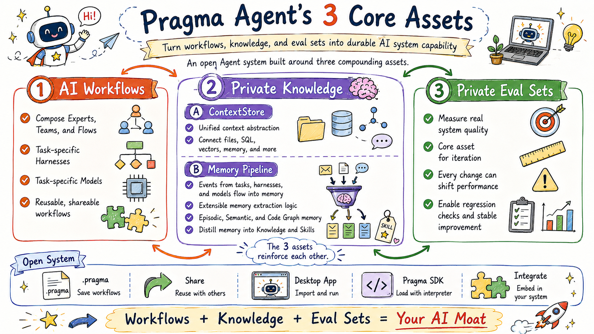
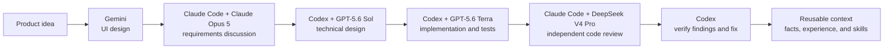
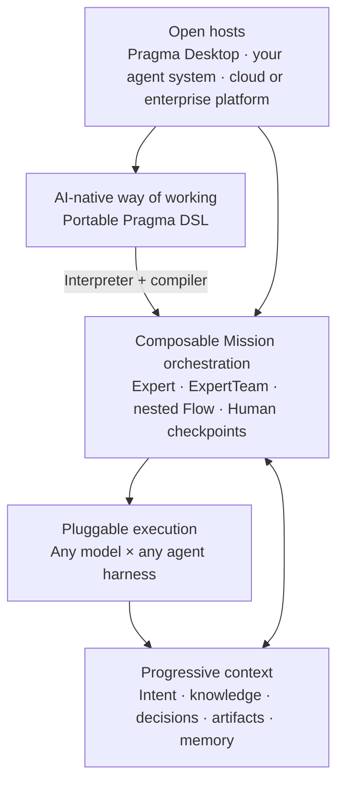

# Pragma

<p align="center">
  
  
  
  
  
</p>

<p align="center">
  English | <a href="./README.zh-CN.md">简体中文</a>
</p>

> **Turn the way you work with AI into a reusable asset.**

Pragma is an open platform for creating, running, and sharing AI-native ways of working. One mission can combine different models, agent harnesses, experts, tools, and human decisions—while its context and accumulated experience continue to flow with the work.

It does not try to replace Gemini, Claude Code, Codex, PI, Qoder CLI, or the next great agent. Pragma makes them work together.

<p align="center">
  
</p>

## Why Pragma?

Great AI work rarely happens inside one chat window. An experienced AI user knows how to:

- choose the right model and harness for each task;
- preserve decisions and constraints when moving between agents;
- bring in the right context at the right time;
- separate implementation from independent review;
- turn successful paths and failures into a better method for next time.

Today, that knowledge mostly lives in people's heads and scattered conversations. Switching tools means copying prompts, retelling the story, moving artifacts, and losing lessons.

Pragma turns that invisible craft into an explicit, executable, and shareable way of working.

## What makes Pragma different

### The best model × harness for every step

A model is not a complete agent. The same model behaves differently inside a chat, a coding harness, a browser agent, or a domain-specific system.

Pragma treats the combination of **model, harness, tools, permissions, and context** as the real execution capability. Different experts and workflow steps can use different combinations, without locking the whole method to one vendor.

### One progressive context across the whole mission

Context should grow with the work instead of restarting at every tool boundary. Pragma unifies requirements, decisions, knowledge, artifacts, review findings, and task state into a progressive context that every stage can continue from.

It does not blindly send the entire history to every agent. Stable constraints can stay always available, relevant knowledge can be loaded on demand, and large artifacts can travel by reference. Each expert receives what it needs, when it needs it.

This is how context crosses harness boundaries: not by pretending one product's private session can be moved into another, but by carrying forward the meaning of the work.

### Experts compose into auditable AI-native systems

Pragma's building blocks are reusable at every level:

```text
Flow         = Expert + ExpertTeam + SubFlow + Human checkpoints
Expert tools = Expert + ExpertTeam + Flow
```

A Flow can assign one step to a specialist Expert, another to a coordinated Team, and another to an entire child Flow. An Expert can expose other Experts, Teams, or Flows as governed tools and decide when to use them.

This composition does not create a collection of disconnected agent sessions. The compiler validates the dependency graph and rejects cycles; nested work remains inside one Execution, where handoffs, outputs, tool calls, approvals, usage, cancellation, and recovery form a single audit trail.

### Memory is context that has earned the right to survive

Pragma treats memory as a special form of context, not as a separate black box. Evidence from execution can evolve from short-lived task state into:

- **Experience:** what happened, including successful and failed paths;
- **Facts:** durable knowledge, constraints, and preferences backed by evidence;
- **Skills:** reusable approaches, anti-patterns, and recovery playbooks.

The result is more than conversation history. A completed mission can improve how the next mission is understood and executed.

### Your working method becomes portable

An AI-native way of working includes more than prompts. It captures who should do the work, which model and harness to use, what context to provide, how stages hand off, where humans approve, and how results are validated.

Pragma expresses that method as a portable DSL. Its interpreter and compiler can parse, validate, link, compile, and regenerate the definition. You can run it in Pragma Desktop, embed it into your own agent system, or connect it to a future host without rewriting the method around a proprietary execution engine.

### Open to any agent system

Pragma is an orchestration layer, not a closed agent world. Runtime adapters connect specialist harnesses; model providers connect commercial, gateway, and local models; plugins connect tools and domain capabilities; hosts retain control over UI, storage, permissions, and deployment.

As better models and agent products appear, they can join the system without invalidating the methods you have already built.

## Example: one coding mission, six specialists



This is not merely a chain of model calls:

1. UI artifacts and design rationale become context for the requirements discussion.
2. Accepted requirements, unresolved questions, and repository constraints flow into the technical design.
3. Implementation receives the approved plan, relevant files, and acceptance criteria—not a lossy paste of several transcripts.
4. Review starts from an independent perspective and returns structured findings.
5. Codex verifies every finding against the repository, fixes real issues, and validates the result.
6. Stable facts, useful experience, and reusable techniques become context for the next mission.

The entire method—roles, routing, context, handoffs, review gates, and definition of done—can be versioned, evaluated, improved, and shared.

## Conceptual architecture



The architecture follows five ideas:

- **Method and execution are separate:** describe the work once, then bind it to the best available runtimes.
- **Everything is composable:** Experts, Teams, and Flows can become steps or tools inside larger systems.
- **Context is continuous:** knowledge and outcomes can survive individual models, sessions, and harnesses.
- **Complexity is progressive:** users can start with one expert and grow into teams, flows, approvals, evaluation, and memory.
- **The host stays in control:** Pragma can power its own Desktop experience or become part of another agent product.

## Use Pragma

### Start with Desktop

#### Download from Releases

You can download the latest Desktop app from the [Releases](https://github.com/pqpo/pragma/releases) page.

> **Note for macOS users:** The app downloaded from Releases is not code-signed. After installation, you need to run the following command to remove the quarantine attribute:
>
> ```bash
> sudo xattr -r -d com.apple.quarantine /Applications/Pragma.app
> ```

#### Build from Source

Requirements:

```text
Node.js >= 22
pnpm 10.12.1
```

```bash
pnpm install
pnpm --filter @pragma/desktop run prepare:electron
pnpm --filter @pragma/desktop dev
```


Desktop is the simplest way to start a mission, choose a workspace, and use local or connected runtimes.

Studio can export any Expert, ExpertTeam, or Flow as a portable `.pragma` bundle. The export includes its reusable dependency graph as canonical DSL and can optionally include capabilities, plugins, knowledge, and visual Flow layouts. Secrets, local sessions, Missions, and machine-specific paths stay local. Another Desktop can import the bundle, or your own agent system can pass the exported file directly to `@pragma/interpreter`—without unpacking it or depending on Desktop code—and compile its root into a runnable `@pragma/core` object.

### Describe a reusable AI-native system with Pragma DSL

The following excerpts show both directions of composition. An Expert can use an Expert, Team, or Flow as a tool:

```yaml
apiVersion: pragma/v3
kind: Expert
metadata:
  id: 0tyw4e02pw3d8vjt
  name: Delivery Orchestrator
  description: Coordinates a complete delivery mission.
spec:
  scope: Own delivery quality from design through final verification.
  instructions: Choose the appropriate specialist or governed workflow for each task.
  tools:
    - adapter: pragma.tool.call@v1
      target: { ref: expert:3sfd30h5017wd17d }
      tool: { name: ask_reviewer, description: Ask the independent reviewer. }
    - adapter: pragma.tool.call@v1
      target: { ref: team:vyv9pwwzaksth2dd }
      tool: { name: ask_delivery_team, description: Ask the delivery team. }
    - adapter: pragma.tool.call@v1
      target: { ref: flow:ffdfk2cczgqjda7q }
      tool: { name: run_quality_gate, description: Run the quality-gate Flow. }
```

A Flow can compose an Expert, Team, and child Flow as explicit, auditable steps:

```yaml
apiVersion: pragma/v3
kind: Flow
metadata:
  id: t9ne4d8njvvxv2ea
  name: AI-native Delivery
  description: Coordinates planning, team review, and a reusable quality gate.
spec:
  input:
    schema:
      type: object
      properties: { brief: { type: string } }
      required: [brief]
      additionalProperties: false
  graph:
    start: coordinate
    steps:
      coordinate:
        expert: { ref: expert:0tyw4e02pw3d8vjt }
        prompt:
          segments:
            - { text: "Plan this delivery: " }
            - { variable: { source: flow-input, path: [brief] } }
      team_review:
        team: { ref: team:vyv9pwwzaksth2dd }
        prompt: { segments: [{ text: "Review the delivery plan and implementation." }] }
      quality_gate:
        flow: { ref: flow:ffdfk2cczgqjda7q }
        input: { brief: "$flow.input.brief" }
    transitions:
      coordinate: team_review
      team_review: quality_gate
      quality_gate: { end: true }
```

The same language describes Experts, ExpertTeams, Flows, capabilities, context, runtime profiles, and evaluations. Definitions can be stored with a project, generated from compiled objects, reviewed in Git, exported from Desktop, and moved between hosts.

### Load and run a Desktop bundle in your own agent system

The `.pragma` file exported by Desktop implements the Interpreter-owned `pragma.bundle/v1` protocol. A custom Host can load the archive directly, select one of its exported roots, resolve that root's dependency closure against its own Runtime and Host bindings, and run the compiled object through `@pragma/core`:

```ts
import { createPragma, type Flow } from "@pragma/core";
import { loadPragmaProject } from "@pragma/interpreter";

const project = await loadPragmaProject({
  kind: "bundle",
  source: { kind: "file", path: "./ai-native-delivery.pragma" },
});

try {
  // A bundle can export more than one root. This example runs its Flow root.
  const root = project.bundle?.manifest.roots.find((ref) => ref.startsWith("flow:"));
  if (root === undefined) throw new Error("The bundle does not export a Flow root.");

  const prepared = await project.prepareCompile<Flow>(root, {
    workspace: process.cwd(),
    runtimes: myRuntimeResolver,
  });
  if (prepared.status !== "ready") {
    // `needs_binding` identifies Runtime, capability, secret, or other Host
    // requirements that your integration must provide before compiling.
    throw new Error(`Bundle root is not runnable: ${JSON.stringify(prepared, null, 2)}`);
  }

  const app = createPragma({ runtimes: myRuntimeResolver });
  const execution = await app.flows.start(prepared.compiled.value, {
    input: { brief: "Build and verify the next product release." },
  });

  const output = await execution.subscribeOutput({ scope: { kind: "all" } });
  const streaming = (async () => {
    try {
      for await (const item of output) {
        process.stdout.write(item.delta ?? String(item.value ?? ""));
      }
    } finally {
      await output.close();
    }
  })();

  const result = await execution.result;
  await streaming;

  console.log("Final result:", result);

  // The same Execution exposes the complete audit trail.
  const audit = await execution.listEvents({ scope: { kind: "all" }, limit: 1_000 });
  console.log("Audit events:", audit.items.length);
} finally {
  // Bundle projects use a temporary extraction root owned by the Interpreter.
  await project.dispose();
}
```

No Desktop import step is involved: the Interpreter verifies the archive and lock, resolves the selected root's exported dependency graph, and compiles it into a runnable Core object. If `prepareCompile()` returns `needs_binding`, your Host can satisfy the reported Bundle requirements through the Interpreter's binding APIs before compiling. `scope: { kind: "all" }` streams output from the root Flow and its nested Experts, Teams, and child Flows. Your agent system continues to own Runtime selection, permissions, persistence, product experience, and infrastructure while reusing the system authored in Desktop.

## Learn more

- [Product positioning and differentiation](./docs/strategy/pragma-positioning-and-competitive-differentiation.md)
- [Usage guides](./docs/usage/README.md)
- [Context](./docs/usage/context.md)
- [Memory](./docs/usage/memory.md)
- [Portable Desktop bundles](./docs/architecture/desktop-bundle-transfer.md)
- [Agent architecture](./docs/architecture/agent-core-architecture.md)
- [Contributing](./CONTRIBUTING.md)

## License

Pragma is licensed under the [Pragma Source Available License 1.0](./LICENSE). Use of the Pragma name, logos, or official identity is governed by the [Trademark Policy](./TRADEMARKS.md).
