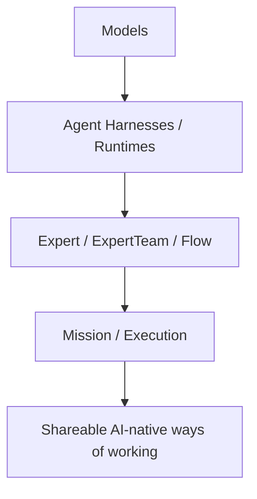
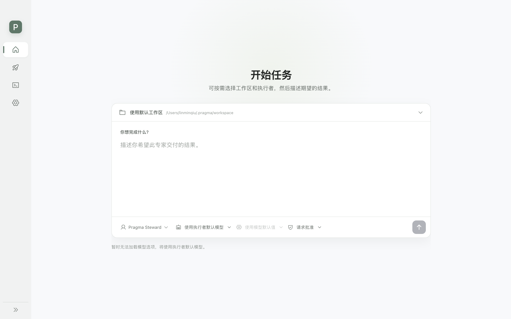

# Pragma
<p align="center">
  
  
  
  
  
</p>

<p align="center">
  English | <a href="./README.zh-CN.md">简体中文</a>
</p>

> **Vision:** make AI-native ways of working reusable and help more people become AI super individuals.

Pragma helps experienced AI users turn repeatable working methods into runnable assets. A method can combine expert definitions, tools, memory, approval gates, runtime choices, model configuration, and delivery checks. Other users can run the method without understanding the orchestration underneath.

Pragma is not another chatbot, coding agent, expert marketplace, or low-code workflow builder. It is an open organization layer above models and specialized agent harnesses: Codex, Claude Code, Qoder CLI, PI, and future runtime adapters can all become execution options for different tasks.

## Why Pragma?

Good AI work is rarely just a prompt. Experienced users learn which tasks need direct conversation, which need a specialist expert, which need a coding harness, which need browser or research tools, and which require human review before action.

Pragma exists to preserve and share that judgment:

- **Harness-neutral execution**: choose different agent harnesses or runtimes for different experts and steps.
- **Reusable working methods**: package expert roles, context, tools, permissions, validation, and delivery expectations together.
- **Creator depth, user simplicity**: creators can design and verify rich execution combinations; users can start from a task and run the right method.
- **Cross-runtime handoff**: move context, files, artifacts, sessions, usage, and review signals across runtime boundaries.
- **Governed operations**: keep privileged actions behind tools, runtime adapters, server policies, and local permission gates.

## AI-native Ways of Working

An AI-native way of working is more than a prompt or a flow chart. A shareable method should describe:

```text
task scope and limits
+ required inputs
+ Expert / ExpertTeam / Flow
+ runtime and model choices
+ skills, tools, context, and memory
+ permissions, budget, and human approvals
+ execution and failure handling
+ validation criteria
+ deliverables
+ proven examples and known limits
```

Pragma treats this method as the product object users discover, run, revise, and share. The underlying project, DSL, runtime bindings, context stores, and execution records exist to make that method portable and verifiable.

## How Pragma Is Different

| Dimension           | Claude Code                             | WorkBuddy                                     | Workflow builders                            | Pragma                                                                       |
| ------------------- | --------------------------------------- | --------------------------------------------- | -------------------------------------------- | ---------------------------------------------------------------------------- |
| Primary role        | Specialized coding harness              | Integrated AI workspace with expert ecosystem | Node-based automation or LLM workflow design | Organization layer across models and agent harnesses                         |
| Core object         | Coding session, subagent, skills, hooks | Experts, expert teams, skills, projects       | Graphs, nodes, triggers, integrations        | Runtime, Expert, ExpertTeam, Flow, Mission                                   |
| Main strength       | Deep software engineering execution     | Low-friction all-in-one user experience       | Visual composition and automation            | Harness-neutral execution and reusable AI-native methods                     |
| Runtime model       | Claude Code is the harness              | Product-owned execution system                | Usually one orchestration engine             | Codex, Claude Code, Qoder CLI, PI, and future adapters are pluggable runtimes |
| Sharing unit        | Repo config, skills, plugins            | Experts, teams, skills, workspace assets      | Templates and workflows                      | Methods with runtime requirements, permissions, validation, and deliverables |
| Pragma relationship | Can be used as a runtime                | Adjacent product category                     | Adjacent implementation style                | Coordinates execution combinations across runtimes                           |

Pragma should not be understood as "a stronger expert team" or "another workflow platform." The durable distinction is that a reusable method can span different models and agent harnesses instead of being locked inside one product's execution system.



## What You Can Use Today

Pragma currently provides:

- `Expert` creation APIs for defining reusable AI experts.
- `ExpertTeam` and `Flow` foundations for coordinated execution.
- Context systems backed by in-memory or filesystem stores.
- Managed tools, MCP tool integration, plugin loading, and approval policies.
- Runtime adapter contracts and PI / Codex / Claude Code / Qoder CLI runtime packages.
- Runtime context, session ownership, invocation, event, usage, and handoff primitives.
- Browser-safe shared schemas and DTOs built with Zod.
- Web, server, worker, desktop, client SDK, and infrastructure package boundaries in a pnpm monorepo.

The current repository focuses on the execution kernel and engineering foundation. The broader sharing experience, runtime marketplace, cloud control plane, and creator/user product surfaces are still under active development.

## Use the Pragma desktop app

### Requirements

```text
Node.js >= 22
pnpm 10.12.1
```

Install dependencies:

```bash
pnpm install
pnpm -r list
```

Start the desktop app:

```bash
pnpm --filter @pragma/desktop run prepare:electron
pnpm --filter @pragma/desktop dev
```

Electron 42 and later download their binary on first CLI usage. `prepare:electron` triggers that download explicitly so local development and CI fail less often on a missing binary.



Desktop is the product entry for starting missions, selecting a workspace, choosing an executor, and routing work to local or cloud runtimes as the host integration matures.

## Integration Paths

Pragma is intentionally usable at different depths. You can start from the Desktop app, embed the Core framework into your own system, or author portable YAML and load it through the interpreter.

### Build with Core

Use `@pragma/core` when your application wants to own the host, runtime binding, persistence, and UI while reusing Pragma's Expert, Session, Flow, Context, and Runtime contracts.

```ts
import { createPragma, createStaticRuntimeResolver, defineExpert } from "@pragma/core";

const runtime = createYourRuntimeAdapter();

const expert = await defineExpert({
  id: "release-lead",
  name: "Release Lead",
  description: "Plans and reviews release work.",
  scope: "Coordinate release preparation.",
  instructions: "Ask for missing release context, identify risks, and produce a release checklist.",
  tags: ["release"],
  workspace: process.cwd(),
});

const app = createPragma({
  runtimes: createStaticRuntimeResolver({
    runtimes: [runtime],
    defaultRuntimeId: runtime.descriptor.id,
  }),
});

const session = await app.experts.createSession(expert);
const turn = await session.prompt("Prepare a release checklist for v1.2.0.");
```

### Load DSL with the Interpreter

Use `@pragma/interpreter` when you want experts, teams, flows, capabilities, context stores, and runtime profiles to live as portable `pragma/v3` YAML resources.

```yaml
apiVersion: pragma/v3
kind: Expert
metadata:
  id: releaselead000001
  name: Release Lead
  description: Plans and reviews release work.
spec:
  scope: Coordinate release preparation.
  instructions: Ask for missing release context, identify risks, and produce a release checklist.
```

```ts
import { createPragma } from "@pragma/core";
import { loadPragmaProject } from "@pragma/interpreter";

const project = await loadPragmaProject("./pragma.yaml");
const compiled = await project.compile("expert:releaselead000001", {
  workspace: process.cwd(),
  runtimes: myRuntimeResolver,
});

const app = createPragma({ runtimes: myRuntimeResolver });
const session = await app.experts.createSession(compiled.value, {
  runtime: compiled.rootRuntimeId,
});
```

The `examples/` workspace remains useful for deeper runtime, context, memory, approval, and flow examples; it is not the primary product entry.

## Monorepo Layout

```text
apps/
  web/       Next.js web application
  server/    Fastify HTTP API application
  worker/    Node.js worker application
  desktop/   Desktop local agent bridge

packages/
  shared/         Cross-runtime schemas, DTOs, domain models, and pure utilities
  client/         Browser/client HTTP SDK
  server/         Server-side infrastructure boundary
  core/           Expert, context, tools, plugins, and runtime contracts
  interpreter/    Pragma YAML DSL parsing, validation, linking, and compilation
  default-agent/  Built-in general-purpose Pragma Agent
  runtime/pi/     PI runtime adapter
  runtime/codex/  Codex local runtime adapter
  runtime/claude-code/ Claude Code local runtime adapter
  runtime/qodercli/ Qoder CLI local runtime adapter
  eslint-config/  Shared ESLint config
  tsconfig/       Shared TypeScript config

plugins/
  memory/         Memory plugin
  repo-manager/   Repository management plugin

examples/         Runnable Expert examples
docs/             Architecture notes, ADRs, conventions, and usage guides
infra/            Infrastructure composition directory
```

## Architecture Boundaries

Pragma keeps package boundaries explicit so browser code, server infrastructure, expert definitions, and runtime implementations can evolve independently.

Allowed internal dependency direction:

```text
apps/web        -> client -> shared
apps/server     -> server -> core -> shared
apps/worker     -> server -> runtime-* -> core -> shared
apps/desktop    -> core -> shared
runtime-*       -> core -> shared
```

Important rules:

- `shared` must remain browser-safe and runtime-neutral.
- `client` must not depend on `server` or `core`.
- `core` must not depend on concrete runtime packages, server apps, client SDKs, React, or Next.js.
- Concrete runtime implementations live in independent `@pragma/runtime-*` packages.
- Cross-package imports must use `@pragma/*` package imports, not relative paths.

For deeper context:

- [Module boundaries](./docs/architecture/module-boundaries.md)
- [Agent core architecture](./docs/architecture/agent-core-architecture.md)
- [Expert agent standard protocol](./docs/architecture/expert-agent-standard-protocol.md)
- [Local agent bridge](./docs/architecture/local-agent-bridge.md)
- [Monorepo and dependency rules ADR](./docs/adr/001-monorepo-and-dependency-rules.md)
- [Product positioning and competitive differentiation](./docs/strategy/pragma-positioning-and-competitive-differentiation.md)

## Documentation

- [Usage guide index](./docs/usage/README.md)
- [Agents](./docs/usage/agents.md)
- [Context](./docs/usage/context.md)
- [Memory](./docs/usage/memory.md)
- [Plugins](./docs/usage/plugins.md)
- [Flows and human tasks](./docs/usage/flows.md)
- [Coding conventions](./docs/conventions/coding-conventions.md)

## Quality Commands

```bash
pnpm lint
pnpm typecheck
pnpm test
pnpm build
pnpm check
```

`pnpm check` runs lint, typecheck, and tests. CI also runs `pnpm build`.

## Security Model

AI experts should not be trusted to self-police sensitive actions. File access, shell execution, network access, secrets, local runtime execution, and other privileged operations must be constrained by tools, runtime adapters, server-side policies, or the future Desktop permission guard.

The local agent bridge is designed around outbound Desktop connections, explicit device/session registration, capability registration, and local user approval rather than exposing a local runner directly to the network.

## Contributing

Before changing code, read [CONTRIBUTING.md](./CONTRIBUTING.md), [AGENTS.md](./AGENTS.md), and the architecture boundary documents. Keep changes scoped to the right package, add or update tests where behavior changes, and run the relevant quality commands before opening a pull request.

Community participation is governed by the [Code of Conduct](./CODE_OF_CONDUCT.md). Report vulnerabilities privately according to the [Security Policy](./SECURITY.md), and review [Support](./SUPPORT.md), [Governance](./GOVERNANCE.md), and the [Trademark Policy](./TRADEMARKS.md) for project boundaries.

## License

Pragma is licensed under the [Pragma Source Available License 1.0](./LICENSE). Review the license before using, redistributing, hosting, or embedding Pragma in another product or service. Use of the Pragma name, logos, or official identity is governed by the [Trademark Policy](./TRADEMARKS.md).
