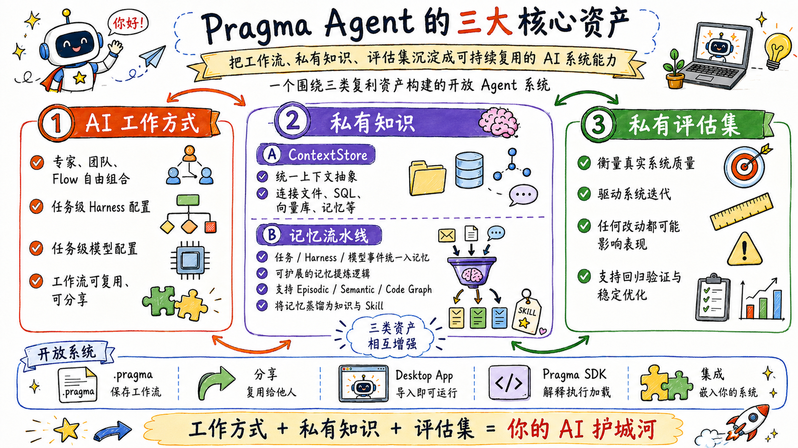
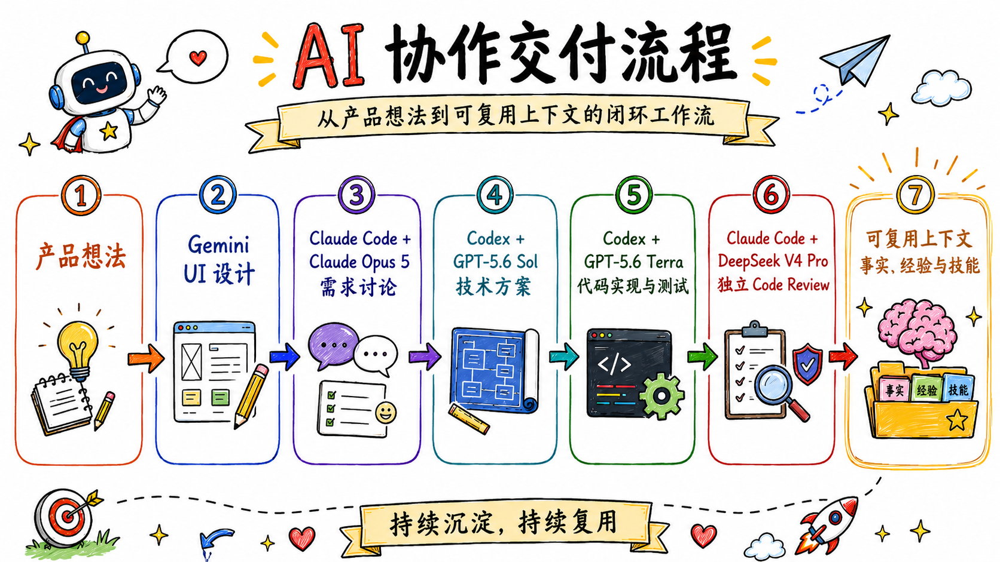
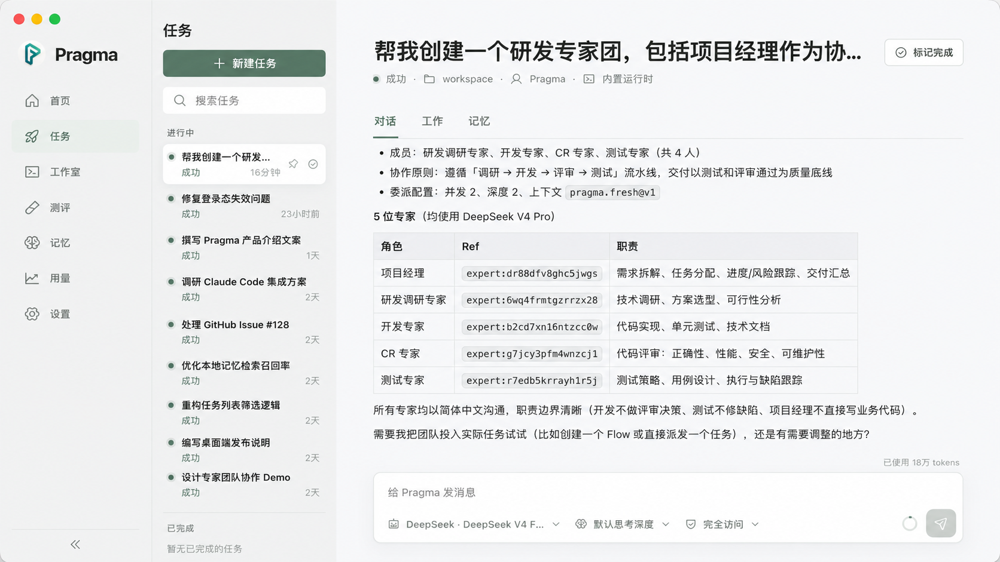

# Pragma

<p align="center">
  
  
  
  
  
</p>

<p align="center">
  <a href="./README.md">English</a> | 简体中文
</p>

> **把你的 AI 工作方式，沉淀成可以复用的资产。**

Pragma 是一个用于创造、运行和分享 AI-native 工作方式的开放平台。一项 Mission 可以组合不同的模型、Agent Harness、专家、工具与人工决策，同时让上下文和积累的经验持续跟随工作流动。

Pragma 不试图替代 Gemini、Claude Code、Codex、PI、Qoder CLI，也不试图替代下一个优秀的 Agent。Pragma 让它们协同工作。

## 为什么需要 Pragma？

真正高质量的 AI 工作，很少只发生在一个对话窗口里。有经验的 AI 使用者知道如何：

- 为每类任务选择合适的模型与 Harness；
- 在切换 Agent 时保留已经形成的决策和约束；
- 在正确的时机引入正确的上下文；
- 让代码实现与独立审查彼此隔离；
- 把成功路径和失败经验变成下一次更好的方法。

今天，这些知识大多存在于个人头脑和零散对话中。每次切换工具，都要重新复制 Prompt、复述背景、搬运产物，并不断丢失经验。

Pragma 把这种不可见的个人技巧，变成显式、可执行、可分享的工作方式。

## Pragma 的三项核心资产

<p align="center">
  
</p>

Pragma 围绕用户使用 AI 时逐步沉淀的三类长期资产展开：

1. **AI 工作方式。** Expert、ExpertTeam 与 Flow 可以自由组合。不同任务可以选择不同的 Agent Harness、大模型、工具、权限与上下文，让有效的方法变成显式、可复用、可版本化、可分享的系统。
2. **私有知识。** Pragma 将所有上下文抽象为 `ContextStore`，可对接文件系统、关系型数据库、向量数据库、记忆系统等任意数据源。不同任务、Harness 与模型产生的消息事件会进入统一的 Memory Pipeline。不同记忆目标可以使用各自可扩展的提炼逻辑：当前支持 episodic memory 与 semantic memory，编程任务还可以通过扩展 Pipeline 之上的提炼层加入 code-graph memory。动态记忆还可以按策略蒸馏为稳定的知识库或可复用 Skill。
3. **私有评估集。** 判断 AI 系统质量离不开测评。私有评估集记录团队真正关心的任务、预期与回归信号；工作方式、上下文来源、Harness 或模型的任何改动都可能影响整体系统性能，因此评估集是比较版本、控制回归和持续改进的长期资产。

三类资产会相互增强：工作方式产生执行证据，记忆把证据沉淀为知识，评估集验证改动是否真正提升系统质量。

Pragma 从设计上就是开放系统。AI 工作方式可以保存为 `.pragma` 文件并分享给他人；Desktop 可以直接导入，其他系统也可以通过 Pragma SDK 中的 `@pragma/interpreter` 加载，再使用 `@pragma/core` 编译并接入自己的运行环境。

## Pragma 的差异化

### 每一步都选择最合适的模型 × Harness

模型不等于完整的 Agent。同一个模型运行在普通对话、Coding Harness、浏览器 Agent 或专业系统中，会展现出完全不同的能力。

Pragma 把 **模型、Harness、工具、权限与上下文** 的组合视为真正的执行能力。不同 Expert 和 Flow 步骤可以使用不同组合，而不必把整套工作方式锁定在某一个厂商的执行环境里。

### 一项 Mission，共享一套渐进式上下文

上下文应该随着工作逐步生长，而不是每次切换工具都从头开始。Pragma 把需求、决策、知识、产物、评审意见与任务状态组织成统一的渐进式上下文，让每个阶段都能在前序成果上继续工作。

这并不意味着把全部历史无差别地发送给每个 Agent。稳定约束可以始终可用，相关知识可以按需加载，大型产物可以通过引用传递。每个 Expert 只在需要的时候获得真正需要的信息。

这才是跨 Harness 的上下文传递：不是假装把一个产品的私有 Session 搬进另一个产品，而是让工作的真实含义持续向前流动。

### Expert 可以组合成可审计的 AI-native 系统

Pragma 的基础单元可以在每个层级复用：

```text
Flow        = Expert + ExpertTeam + 子 Flow + 人工确认
Expert Tool = Expert + ExpertTeam + Flow
```

一个 Flow 可以把某个步骤交给专业 Expert，把另一个步骤交给协作型 ExpertTeam，还可以把一整套子 Flow 当作步骤复用。一个 Expert 也可以把其他 Expert、ExpertTeam 或 Flow 暴露为受治理的 Tool，并自主判断何时调用。

这种组合不会产生一组彼此割裂的 Agent Session。Compiler 会校验完整依赖图并拒绝循环依赖；所有嵌套工作都保留在同一个 Execution 中，交接、输出、工具调用、人工审批、用量、取消与恢复共同形成一条完整审计链。

### 记忆，是值得长期保留的特殊上下文

Pragma 把 Memory 看成一种特殊 Context，而不是独立的黑盒系统。执行过程中产生的证据，可以从短期任务状态逐步演化为：

- **Experience**：发生过什么，包括成功路径与失败路径；
- **Fact**：有证据支持、值得长期保留的知识、约束与偏好；
- **Skill**：可复用的方法、反模式与恢复手册。

不同任务、Harness 与模型产生的消息事件都会进入统一的 Memory Pipeline。不同记忆目标可以挂载不同的提炼逻辑，因此 episodic、semantic 以及未来的 code-graph memory 可以独立演进；再通过策略将动态记忆蒸馏为稳定知识库或可复用 Skill。

最终保留下来的不只是对话历史。一次完成的 Mission，可以改善下一次 Mission 被理解和执行的方式。

### 工作方式可以跨系统移植

AI-native 工作方式不只是一组 Prompt。它还描述谁来完成任务、使用哪个模型与 Harness、提供什么上下文、阶段之间如何交接、哪里需要人工确认，以及如何验证最终结果。

Pragma 使用可移植 DSL 表达这套方法。解释器（Interpreter）与编译器（Compiler）可以解析、校验、链接、编译并重新生成定义。它既可以运行在 Pragma Desktop，也可以嵌入你自己的 Agent 系统，或者连接未来的新 Host，而不必围绕某个封闭执行引擎重新编写整套方法。

### 可以接入任何 Agent 系统

Pragma 是开放编排层，不是封闭的 Agent 世界。Runtime Adapter 用来连接专业 Harness，Model Provider 用来连接商业模型、模型网关与本地模型，Plugin 用来连接工具和领域能力，而 Host 始终拥有 UI、存储、权限与部署方式的控制权。

当更好的模型和 Agent 产品出现时，它们可以直接加入系统，而不需要废弃已经沉淀的工作方式。

## 示例：一次编码任务，组合六位 AI 专家



这并不是简单地依次调用几个模型：

1. UI 产物和设计理由成为需求讨论的上下文。
2. 已确认需求、待决问题和仓库约束继续流入技术方案阶段。
3. 实现 Expert 获得批准后的方案、相关文件与验收标准，而不是几段对话的有损复制。
4. Code Review 从独立视角开始，并返回结构化评审意见。
5. Codex 逐条对照仓库复核，只修复真实问题，并验证最终结果。
6. 稳定事实、有价值的经验和可复用方法成为下一项 Mission 的上下文。

整套方法——角色、路由、上下文、交接、评审闸门和完成标准——都可以被版本化、评测、改进与分享。

## 理念架构

- **工作方式与执行环境分离**：只描述一次方法，再为它绑定当下最合适的 Runtime。
- **一切皆可组合**：Expert、ExpertTeam 与 Flow 都可以成为更大系统中的步骤或 Tool。
- **上下文持续流动**：知识和结果可以跨越单个模型、Session 与 Harness。
- **复杂度渐进增加**：从一个 Expert 开始，再逐步扩展到 ExpertTeam、Flow、人工审批、评测与记忆。
- **Host 保持控制权**：Pragma 可以驱动自己的 Desktop，也可以成为其他 Agent 产品的一部分。

## 使用 Pragma

### 从 Desktop 开始

#### 从 Release 下载

你可以从 [Releases](https://github.com/pqpo/pragma/releases) 页面下载最新的 Desktop 应用。

> **macOS 用户请注意：** Release 中的应用没有经过代码签名。安装后需要执行以下命令以移除隔离属性：
>
> ```bash
> sudo xattr -r -d com.apple.quarantine /Applications/Pragma.app
> ```

#### 从源码编译

环境要求：

```text
Node.js >= 22
pnpm 10.12.1
```

```bash
pnpm install
pnpm --filter @pragma/desktop run prepare:electron
pnpm --filter @pragma/desktop dev
```



Desktop 是启动 Mission、选择 Workspace，并使用本地或已连接 Runtime 的最简单入口。

Studio 可以把任意 Expert、ExpertTeam 或 Flow 导出为可移植的 `.pragma` Bundle。导出文件会以规范化 DSL 包含它的可复用依赖图，并可选择携带 Capability、Plugin、知识库和 Flow 视觉布局；Secret、本地 Session、Mission 与机器相关路径始终留在本机。另一台 Desktop 可以直接导入，你自己的 Agent 系统也可以把导出的文件直接交给 `@pragma/interpreter`，无需解包或依赖 Desktop 代码，再将其中的根资源编译成可运行的 `@pragma/core` 对象。

### 使用 Pragma DSL 描述可复用 AI-native 系统

下面的片段展示了两个方向的组合。Expert 可以把 Expert、ExpertTeam 或 Flow 作为 Tool：

```yaml
apiVersion: pragma/v3
kind: Expert
metadata:
  id: 0tyw4e02pw3d8vjt
  name: Delivery Orchestrator
  description: Coordinates a complete delivery mission.
spec:
  scope: Own delivery quality from design through final verification.
  instructions: Choose the appropriate specialist or governed workflow for each task.
  tools:
    - adapter: pragma.tool.call@v1
      target: { ref: expert:3sfd30h5017wd17d }
      tool: { name: ask_reviewer, description: Ask the independent reviewer. }
    - adapter: pragma.tool.call@v1
      target: { ref: team:vyv9pwwzaksth2dd }
      tool: { name: ask_delivery_team, description: Ask the delivery team. }
    - adapter: pragma.tool.call@v1
      target: { ref: flow:ffdfk2cczgqjda7q }
      tool: { name: run_quality_gate, description: Run the quality-gate Flow. }
```

Flow 则可以把 Expert、ExpertTeam 和子 Flow 组合成显式、可审计的执行步骤：

```yaml
apiVersion: pragma/v3
kind: Flow
metadata:
  id: t9ne4d8njvvxv2ea
  name: AI-native Delivery
  description: Coordinates planning, team review, and a reusable quality gate.
spec:
  input:
    schema:
      type: object
      properties: { brief: { type: string } }
      required: [brief]
      additionalProperties: false
  graph:
    start: coordinate
    steps:
      coordinate:
        expert: { ref: expert:0tyw4e02pw3d8vjt }
        prompt:
          segments:
            - { text: "Plan this delivery: " }
            - { variable: { source: flow-input, path: [brief] } }
      team_review:
        team: { ref: team:vyv9pwwzaksth2dd }
        prompt: { segments: [{ text: "Review the delivery plan and implementation." }] }
      quality_gate:
        flow: { ref: flow:ffdfk2cczgqjda7q }
        input: { brief: "$flow.input.brief" }
    transitions:
      coordinate: team_review
      team_review: quality_gate
      quality_gate: { end: true }
```

同一种语言可以描述 Expert、ExpertTeam、Flow、Capability、Context、Runtime Profile 与 Evaluation。定义可以跟随项目保存、从编译后的对象重新生成、在 Git 中评审、从 Desktop 导出，并在不同 Host 之间移动。

### 在自己的 Agent 系统中加载并运行 Desktop Bundle

Desktop 导出的 `.pragma` 文件实现了由 Interpreter 定义的 `pragma.bundle/v1` 协议。自有 Host 可以直接加载这个归档文件，选择其中一个导出根资源，使用自己的 Runtime 与 Host binding 解析该根资源的依赖闭包，再通过 `@pragma/core` 运行编译后的对象：

```ts
import { createPragma, type Flow } from "@pragma/core";
import { loadPragmaProject } from "@pragma/interpreter";

const project = await loadPragmaProject({
  kind: "bundle",
  source: { kind: "file", path: "./ai-native-delivery.pragma" },
});

try {
  // 一个 Bundle 可以导出多个根资源；本例运行其中的 Flow 根资源。
  const root = project.bundle?.manifest.roots.find((ref) => ref.startsWith("flow:"));
  if (root === undefined) throw new Error("Bundle 中没有导出的 Flow 根资源。");

  const prepared = await project.prepareCompile<Flow>(root, {
    workspace: process.cwd(),
    runtimes: myRuntimeResolver,
  });
  if (prepared.status !== "ready") {
    // `needs_binding` 会列出集成方在编译前必须提供的 Runtime、Capability、
    // Secret 或其他 Host requirement。
    throw new Error(`Bundle 根资源暂不可运行：${JSON.stringify(prepared, null, 2)}`);
  }

  const app = createPragma({ runtimes: myRuntimeResolver });
  const execution = await app.flows.start(prepared.compiled.value, {
    input: { brief: "Build and verify the next product release." },
  });

  const output = await execution.subscribeOutput({ scope: { kind: "all" } });
  const streaming = (async () => {
    try {
      for await (const item of output) {
        process.stdout.write(item.delta ?? String(item.value ?? ""));
      }
    } finally {
      await output.close();
    }
  })();

  const result = await execution.result;
  await streaming;

  console.log("Final result:", result);

  // 同一个 Execution 提供完整审计事件。
  const audit = await execution.listEvents({ scope: { kind: "all" }, limit: 1_000 });
  console.log("Audit events:", audit.items.length);
} finally {
  // Bundle Project 使用由 Interpreter 管理的临时解包目录。
  await project.dispose();
}
```

整个过程不需要经过 Desktop 的导入功能：Interpreter 会校验归档和 Lock，解析所选根资源的导出依赖图，再将其编译成可运行的 Core 对象。如果 `prepareCompile()` 返回 `needs_binding`，你的 Host 可以先通过 Interpreter 的 binding API 满足报告出的 Bundle requirements，再进行编译。`scope: { kind: "all" }` 会同时获得根 Flow 及其嵌套 Expert、ExpertTeam 与子 Flow 的流式输出。你的 Agent 系统仍然掌控 Runtime 选择、权限、持久化、产品体验和基础设施，同时复用在 Desktop 中构建的系统。

## 进一步了解

- [产品定位与差异化](./docs/strategy/pragma-positioning-and-competitive-differentiation.md)
- [使用指南](./docs/usage/README.md)
- [上下文](./docs/usage/context.md)
- [记忆](./docs/usage/memory.md)
- [Desktop 可移植 Bundle](./docs/architecture/desktop-bundle-transfer.md)
- [Agent 架构](./docs/architecture/agent-core-architecture.md)
- [参与贡献](./CONTRIBUTING.md)

## License

Pragma 使用 [Pragma Source Available License 1.0](./LICENSE)。Pragma 名称、Logo 和官方身份的使用方式由[商标政策](./TRADEMARKS.md)管理。
