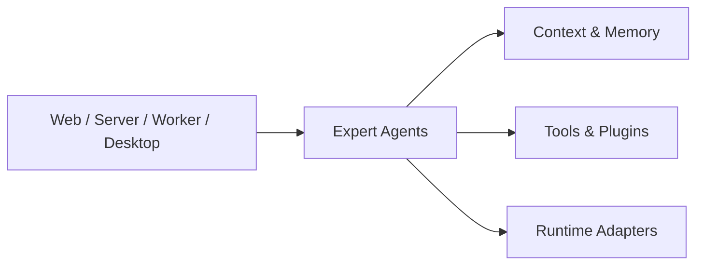

# Pragma

<p align="center">
  <strong>组合模型、Agent Harness、专家与流程，形成可靠的 AI-native 工作方式。</strong>
</p>

<p align="center">
  <a href="./README.md">English</a>
</p>

<p align="center">
  
  
  
  
  
  
</p>

Pragma 是一个运行时中立的平台，用于组合模型、Agent Harness、专家、工具和流程。有经验的分享者可以
创建并分享经过验证的 AI-native 工作方式，普通用户无需理解底层编排即可直接使用。

它不是单个通用聊天机器人，也不是单一 Agent Harness。Pragma 更关注可复用的专家定义、跨 Runtime
执行、共享上下文、受控工具访问、可恢复 Mission，以及能随复杂工程和业务工作持续演进的治理边界。

## 为什么是 Pragma？

生产环境里的 AI 工作通常不只是一次提示词和一次模型调用。真实团队需要专家分工、评审关卡、共享项目知识、工具权限、可追踪执行，以及在云端和本地运行时之间切换工作的能力。

Pragma 围绕这些约束构建：

- **专家优先的协作模型**：用角色、指令、上下文、工具和模型配置定义专业专家。
- **生产级边界**：把协议、运行时执行、客户端 SDK、服务端基础设施和应用入口分层隔离。
- **共享上下文与记忆**：通过受治理的 context namespace 暴露长期项目知识和记忆。
- **工具与插件基础**：接入 managed tools、MCP 能力、skills 和领域插件，而不是把能力写死在应用代码里。
- **运行时灵活性**：通过可替换的 runtime adapter 运行专家，支持云端和本地运行时实现。
- **人类控制点**：为需要人工判断的操作提供审批、澄清和评审流程。

## 核心能力



Pragma 当前提供：

- 用于定义可复用 AI 专家的 `ExpertAgent` 创建 API。
- 基于内存或文件系统存储的上下文系统。
- Managed tools、MCP 工具集成、插件加载和审批策略。
- Runtime adapter 合约，以及 PI / Codex / Claude Code runtime 实现包。
- 用于组合专家工作和确定性 TypeScript 任务的 Directive 与工作流基础能力。
- 基于 Zod 的浏览器安全 shared schema 和 DTO。
- 基于 pnpm monorepo 的 Web、Server、Worker、Desktop、Client SDK 和基础设施包边界。

## 快速开始

### 环境要求

```text
Node.js >= 22
pnpm 10.12.1
```

### 安装

```bash
pnpm install
pnpm -r list
```

### 启动 Server

```bash
pnpm --filter @pragma/server-app dev
```

Server 默认在 `3001` 端口提供 `GET /health`：

```bash
curl http://localhost:3001/health
```

期望响应：

```json
{
  "service": "server",
  "status": "ok"
}
```

### 启动 Web App

```bash
pnpm --filter @pragma/web dev
```

打开：

```text
http://localhost:3000
```

页面会展示 Web 应用状态和 Server 健康检查结果。

### 启动 Worker

```bash
pnpm --filter @pragma/worker dev
```

期望输出：

```text
Pragma Worker Ready
```

### 启动 Desktop App

```bash
pnpm --filter @pragma/desktop run prepare:electron
pnpm --filter @pragma/desktop dev
```

Electron 42 会在首次调用 Electron CLI 时下载二进制文件。`prepare:electron` 会显式触发下载，减少本地开发和 CI 因缺少二进制文件而失败的情况。

## 运行第一个专家

`examples/` workspace 包含多个聚焦示例，用于演示专家创建、上下文使用、记忆行为、本地 Codex runtime session 和人工审批流程。

准备模型配置：

```bash
cp examples/.env.example examples/.env
```

然后编辑 `examples/.env`：

```text
PRAGMA_MODEL_PROVIDER=openai
PRAGMA_MODEL_NAME=gpt-4o-mini
PRAGMA_MODEL_BASE_API=https://api.openai.com/v1
PRAGMA_MODEL_API=openai-responses
PRAGMA_MODEL_API_KEY=replace-with-your-api-key
```

运行基础专家示例：

```bash
pnpm --filter @pragma/examples example:expert-chat
```

启动后可在同一个 `ExpertSession` 中持续输入问题；输入 `/exit` 退出。建议先让 Expert
记住一个随机验证码，再在下一轮追问，以验证多轮上下文。

完整示例说明见 [examples/README.md](./examples/README.md)。

## Monorepo 结构

```text
apps/
  web/       Next.js Web 应用
  server/    Fastify HTTP API 应用
  worker/    Node.js Worker 应用
  desktop/   Desktop 本地 Agent 桥接入口

packages/
  shared/         跨运行时 schema、DTO、领域模型和纯工具
  client/         浏览器或客户端 HTTP SDK
  server/         服务端基础设施边界
  core/           ExpertAgent、上下文、工具、插件和 runtime 合约
  interpreter/    Pragma YAML DSL 解析、校验、链接和编译
  default-agent/  内置通用 Pragma Agent
  runtime/pi/     PI runtime adapter
  runtime/codex/  Codex local runtime adapter
  runtime/claude-code/ Claude Code local runtime adapter
  eslint-config/  共享 ESLint 配置
  tsconfig/       共享 TypeScript 配置

plugins/
  memory/         记忆插件
  repo-manager/   仓库管理插件

examples/         可运行的 ExpertAgent 示例
docs/             架构说明、ADR、编码约定和使用指南
infra/            基础设施编排目录
```

## 架构边界

Pragma 保持明确的 package 边界，让平台可以持续演进，同时避免浏览器代码、服务端基础设施、专家定义和 runtime 实现互相耦合。

允许的内部依赖方向：

```text
apps/web        -> client -> shared
apps/server     -> server -> core -> shared
apps/worker     -> server -> runtime-* -> core -> shared
apps/desktop    -> core -> shared
runtime-*       -> core -> shared
```

关键规则：

- `shared` 必须保持浏览器安全和运行时中立。
- `client` 不能依赖 `server` 或 `core`。
- `core` 不能依赖具体 runtime 包、server app、client SDK、React 或 Next.js。
- 具体 runtime 实现放在独立的 `@pragma/runtime-*` 包。
- 跨 package 导入必须使用 `@pragma/*` package import，不能使用相对路径。

深入了解：

- [模块边界](./docs/architecture/module-boundaries.md)
- [Agent Core 架构](./docs/architecture/agent-core-architecture.md)
- [Expert Agent 标准协议](./docs/architecture/expert-agent-standard-protocol.md)
- [本地 Agent 桥接](./docs/architecture/local-agent-bridge.md)
- [Monorepo 与依赖规则 ADR](./docs/adr/001-monorepo-and-dependency-rules.md)
- [产品定位与竞争差异化](./docs/strategy/pragma-positioning-and-competitive-differentiation.md)
- [源码可用许可证与商标边界](./docs/strategy/source-available-licensing-and-trademarks.md)

## 文档

- [使用指南索引](./docs/usage/README.md)
- [Agents](./docs/usage/agents.md)
- [Context](./docs/usage/context.md)
- [Memory](./docs/usage/memory.md)
- [Plugins](./docs/usage/plugins.md)
- [Flows 与 HumanTask](./docs/usage/flows.md)
- [编码约定](./docs/conventions/coding-conventions.md)

## 质量命令

```bash
pnpm lint
pnpm typecheck
pnpm test
pnpm build
pnpm check
```

`pnpm check` 会运行 lint、typecheck 和 test。CI 会额外运行 `pnpm build`。

## 项目状态

Pragma 正在积极开发中。当前仓库重点建设长期工程底座：严格模块边界、runtime adapter 合约、专家定义、上下文系统、插件加载、人工审批流程和可运行示例。

当 breaking change 能改善架构、删除无长期价值的兼容层，或让平台更容易验证时，项目会接受 breaking change。

## 安全模型

不应依赖 AI 专家自行约束敏感操作。文件访问、shell 执行、网络访问、secrets、本地 runtime 执行和其他高权限操作，都必须由工具、runtime adapter、服务端策略或未来 Desktop 权限闸门来限制。

本地 Agent 桥接的设计基于 Desktop 主动向云端建立连接、明确的设备和会话注册、能力注册以及本地用户审批，而不是把本地 runner 直接暴露到网络。

## 贡献

修改代码前，请先阅读 [CONTRIBUTING.md](./CONTRIBUTING.md)、[AGENTS.md](./AGENTS.md) 和架构边界
文档。改动应放在正确的 package 中；行为变化需要补充或更新测试；提交 PR 前请运行相关质量命令。

社区参与遵守[行为准则](./CODE_OF_CONDUCT.md)。安全漏洞应按照[安全政策](./SECURITY.md) 私下报告；
项目支持、治理和品牌使用边界分别见 [SUPPORT.md](./SUPPORT.md)、[GOVERNANCE.md](./GOVERNANCE.md)
与[商标政策](./TRADEMARKS.md)。

## 源码可用状态

Pragma 使用 [Pragma Source Available License 1.0](./LICENSE)。它允许查看、修改、内部使用和自托管，
同时禁止未经授权的第三方托管或管理服务，以及在第三方产品和服务中的商业嵌入。它是自定义
source-available（源码可用）许可证，不是标准 Apache-2.0 或 OSI 认可的开源许可证。

许可证要求保留法律声明和官方用户界面中的 Pragma 品牌。Pragma 名称、Logo 和官方身份的其他使用
方式由[商标政策](./TRADEMARKS.md)管理。
