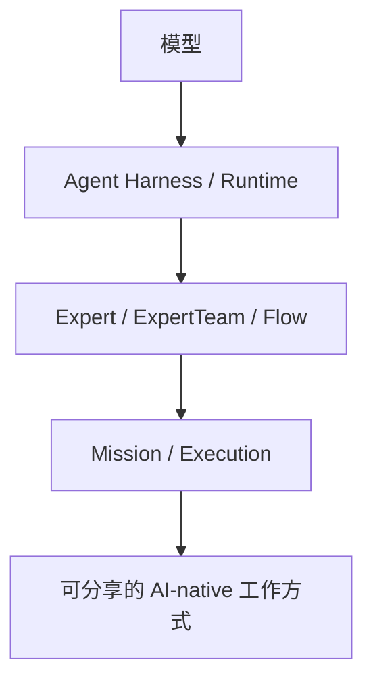

# Pragma

<p align="center">
  
  
  
  
  
</p>

<p align="center">
  <a href="./README.md">English</a> | 简体中文
</p>

> **愿景：Pragma 帮助沉淀和分享 AI-native 工作方式，让人人都能成为 AI 超级个体。**

Pragma 帮助有经验的 AI 使用者，把可重复的工作方法沉淀成可运行资产。一套工作方式可以组合专家定义、工具、记忆、审批闸门、Runtime 选择、模型配置和交付验收标准；普通用户无需理解底层编排，也可以直接运行。

Pragma 不是另一个聊天机器人、Coding Agent、专家市场，也不是低代码工作流工具。它是位于模型与专业 Agent Harness 之上的开放组织层：Codex、Claude Code、PI 以及未来更多 Runtime Adapter，都可以成为不同任务的执行选择。

## 为什么是 Pragma？

有效的 AI 工作通常不只是一个 Prompt。有经验的使用者会判断：哪些任务适合直接对话，哪些任务需要专业 Expert，哪些任务应该交给 Coding Harness，哪些任务需要浏览器或研究工具，哪些操作必须经过人工评审。

Pragma 要沉淀和分享的正是这种判断：

- **Harness 中立执行**：不同 Expert 和步骤可以选择不同 Agent Harness 或 Runtime。
- **可复用工作方式**：把专家角色、上下文、工具、权限、验证方法和交付标准一起打包。
- **分享者足够深，使用者足够简单**：分享者可以设计和验证复杂执行组合，使用者只需要从任务出发。
- **跨 Runtime 交接**：在 Runtime 边界之间交接 context、文件、artifact、session、usage 和评审信号。
- **受治理的操作**：高权限动作必须经过工具、runtime adapter、服务端策略和本地权限闸门约束。

## AI-native 工作方式

AI-native 工作方式不只是 Prompt，也不只是流程图。一套可分享的方法至少应该描述：

```text
适用任务与边界
+ 输入要求
+ Expert / ExpertTeam / Flow
+ Runtime 与模型选择
+ Skills / Tools / Context / Memory
+ 权限、预算与人工确认
+ 执行与失败处理
+ 验证方法
+ 交付物定义
+ 推荐案例与已知限制
```

Pragma 把这套方法作为用户发现、运行、修订和分享的产品对象。底层 Project、DSL、Runtime 绑定、Context Store 和 Execution Record，都是为了让这套方法可移植、可验证。

## Pragma 与其他产品的区别

| 维度             | Claude Code                           | WorkBuddy                          | 工作流工具                  | Pragma                                                   |
| ---------------- | ------------------------------------- | ---------------------------------- | --------------------------- | -------------------------------------------------------- |
| 主要角色         | 专业 Coding Harness                   | 内置专家生态的一体化 AI 工作台     | 节点式自动化或 LLM 流程设计 | 组织多个模型和 Agent Harness 的开放层                    |
| 核心对象         | Coding Session、Subagent、Skill、Hook | 专家、专家团、Skill、项目          | 图、节点、触发器、集成      | Runtime、Expert、ExpertTeam、Flow、Mission               |
| 主要优势         | 深入的软件工程执行能力                | 低门槛、一体化体验、专家与渠道生态 | 可视化编排和自动化          | Harness 中立执行与可复用 AI-native 工作方式              |
| Runtime 模型     | Claude Code 自身就是 Harness          | 产品自有执行体系                   | 通常是单一编排引擎          | Codex、Claude Code、PI 和未来 Adapter 都是可插拔 Runtime |
| 分享单元         | 仓库配置、Skill、插件                 | 专家、专家团、Skill、工作台资产    | 模板和工作流                | 包含 Runtime 要求、权限、验证方法和交付物的工作方式      |
| 与 Pragma 的关系 | 可以成为 Pragma 的 Runtime            | 相邻产品形态                       | 相邻实现方式                | 跨 Runtime 组织执行组合                                  |

Pragma 不应被理解成“更强的专家团”或“又一个工作流平台”。真正长期的区别在于：可复用工作方式可以跨不同模型和 Agent Harness 组合，而不是被锁在单一产品的执行体系里。



## 当前可用能力

Pragma 当前提供：

- 用于定义可复用 AI 专家的 `Expert` 创建 API。
- `ExpertTeam` 与 `Flow` 的协同执行基础。
- 基于内存或文件系统存储的上下文系统。
- Managed tools、MCP 工具集成、插件加载和审批策略。
- Runtime adapter 合约，以及 PI / Codex / Claude Code runtime 实现包。
- Runtime context、session ownership、invocation、event、usage 和 handoff 基础协议。
- 基于 Zod 的浏览器安全 shared schema 和 DTO。
- 基于 pnpm monorepo 的 Web、Server、Worker、Desktop、Client SDK 和基础设施包边界。

当前仓库重点建设执行内核和长期工程底座。更完整的分享体验、Runtime 市场、云端控制面，以及面向分享者和使用者的产品界面仍在持续建设中。

## 使用 Pragma 桌面应用

### 环境要求

```text
Node.js >= 22
pnpm 10.12.1
```

安装依赖：

```bash
pnpm install
pnpm -r list
```

启动 Desktop App：

```bash
pnpm --filter @pragma/desktop run prepare:electron
pnpm --filter @pragma/desktop dev
```

Electron 42 及更高版本会在首次调用 Electron CLI 时下载二进制文件。`prepare:electron` 会显式触发下载，减少本地开发和 CI 因缺少二进制文件而失败的情况。


Desktop 是启动 Mission、选择工作区、选择执行者，并把任务路由到本地或云端 Runtime 的产品入口；更完整的 Host 集成仍在持续演进。

## 集成方式

Pragma 可以按不同深度使用。你可以直接从 Desktop 开始，也可以把 Core 框架接入自己的系统，或者编写可移植 YAML，通过 interpreter 加载。

### 基于 Core 构建

当你的应用希望自己掌控 Host、Runtime 绑定、持久化和 UI，同时复用 Pragma 的 Expert、Session、Flow、Context 与 Runtime 合约时，可以直接使用 `@pragma/core`。

```ts
import { createPragma, createStaticRuntimeResolver, defineExpert } from "@pragma/core";

const runtime = createYourRuntimeAdapter();

const expert = await defineExpert({
  id: "release-lead",
  name: "Release Lead",
  description: "Plans and reviews release work.",
  scope: "Coordinate release preparation.",
  instructions: "Ask for missing release context, identify risks, and produce a release checklist.",
  tags: ["release"],
  workspace: process.cwd(),
});

const app = createPragma({
  runtimes: createStaticRuntimeResolver({
    runtimes: [runtime],
    defaultRuntimeId: runtime.descriptor.id,
  }),
});

const session = await app.experts.createSession(expert);
const turn = await session.prompt("Prepare a release checklist for v1.2.0.");
```

### 使用 Interpreter 加载 DSL

当你希望 Expert、ExpertTeam、Flow、Capability、ContextStore 和 RuntimeProfile 以可移植的 `pragma/v3` YAML 形式保存时，可以使用 `@pragma/interpreter`。

```yaml
apiVersion: pragma/v3
kind: Expert
metadata:
  id: releaselead000001
  name: Release Lead
  description: Plans and reviews release work.
spec:
  scope: Coordinate release preparation.
  instructions: Ask for missing release context, identify risks, and produce a release checklist.
```

```ts
import { createPragma } from "@pragma/core";
import { loadPragmaProject } from "@pragma/interpreter";

const project = await loadPragmaProject("./pragma.yaml");
const compiled = await project.compile("expert:releaselead000001", {
  workspace: process.cwd(),
  runtimes: myRuntimeResolver,
});

const app = createPragma({ runtimes: myRuntimeResolver });
const session = await app.experts.createSession(compiled.value, {
  runtime: compiled.rootRuntimeId,
});
```

`examples/` workspace 仍然适合查看更深入的 Runtime、Context、Memory、Approval 和 Flow 示例，但它不是主要产品入口。

## Monorepo 结构

```text
apps/
  web/       Next.js Web 应用
  server/    Fastify HTTP API 应用
  worker/    Node.js Worker 应用
  desktop/   Desktop 本地 Agent 桥接入口

packages/
  shared/         跨运行时 schema、DTO、领域模型和纯工具
  client/         浏览器或客户端 HTTP SDK
  server/         服务端基础设施边界
  core/           ExpertAgent、上下文、工具、插件和 runtime 合约
  interpreter/    Pragma YAML DSL 解析、校验、链接和编译
  default-agent/  内置通用 Pragma Agent
  runtime/pi/     PI runtime adapter
  runtime/codex/  Codex local runtime adapter
  runtime/claude-code/ Claude Code local runtime adapter
  eslint-config/  共享 ESLint 配置
  tsconfig/       共享 TypeScript 配置

plugins/
  memory/         记忆插件
  repo-manager/   仓库管理插件

examples/         可运行的 Expert 示例
docs/             架构说明、ADR、编码约定和使用指南
infra/            基础设施编排目录
```

## 架构边界

Pragma 保持明确的 package 边界，让浏览器代码、服务端基础设施、专家定义和 runtime 实现可以独立演进。

允许的内部依赖方向：

```text
apps/web        -> client -> shared
apps/server     -> server -> core -> shared
apps/worker     -> server -> runtime-* -> core -> shared
apps/desktop    -> core -> shared
runtime-*       -> core -> shared
```

关键规则：

- `shared` 必须保持浏览器安全和运行时中立。
- `client` 不能依赖 `server` 或 `core`。
- `core` 不能依赖具体 runtime 包、server app、client SDK、React 或 Next.js。
- 具体 runtime 实现放在独立的 `@pragma/runtime-*` 包。
- 跨 package 导入必须使用 `@pragma/*` package import，不能使用相对路径。

深入了解：

- [模块边界](./docs/architecture/module-boundaries.md)
- [Agent Core 架构](./docs/architecture/agent-core-architecture.md)
- [Expert Agent 标准协议](./docs/architecture/expert-agent-standard-protocol.md)
- [本地 Agent 桥接](./docs/architecture/local-agent-bridge.md)
- [Monorepo 与依赖规则 ADR](./docs/adr/001-monorepo-and-dependency-rules.md)
- [产品定位与竞争差异化](./docs/strategy/pragma-positioning-and-competitive-differentiation.md)

## 文档

- [使用指南索引](./docs/usage/README.md)
- [Agents](./docs/usage/agents.md)
- [Context](./docs/usage/context.md)
- [Memory](./docs/usage/memory.md)
- [Plugins](./docs/usage/plugins.md)
- [Flows 与 HumanTask](./docs/usage/flows.md)
- [编码约定](./docs/conventions/coding-conventions.md)

## 质量命令

```bash
pnpm lint
pnpm typecheck
pnpm test
pnpm build
pnpm check
```

`pnpm check` 会运行 lint、typecheck 和 test。CI 会额外运行 `pnpm build`。

## 安全模型

不应依赖 AI 专家自行约束敏感操作。文件访问、shell 执行、网络访问、secrets、本地 runtime 执行和其他高权限操作，都必须由工具、runtime adapter、服务端策略或未来 Desktop 权限闸门来限制。

本地 Agent 桥接的设计基于 Desktop 主动向云端建立连接、明确的设备和会话注册、能力注册以及本地用户审批，而不是把本地 runner 直接暴露到网络。

## 贡献

修改代码前，请先阅读 [CONTRIBUTING.md](./CONTRIBUTING.md)、[AGENTS.md](./AGENTS.md) 和架构边界文档。改动应放在正确的 package 中；行为变化需要补充或更新测试；提交 PR 前请运行相关质量命令。

社区参与遵守[行为准则](./CODE_OF_CONDUCT.md)。安全漏洞应按照[安全政策](./SECURITY.md) 私下报告；项目支持、治理和品牌使用边界分别见 [SUPPORT.md](./SUPPORT.md)、[GOVERNANCE.md](./GOVERNANCE.md) 与[商标政策](./TRADEMARKS.md)。

## License

Pragma 使用 [Pragma Source Available License 1.0](./LICENSE)。使用、再分发、托管或嵌入到其他产品和服务前，请先阅读许可证。Pragma 名称、Logo 和官方身份的使用方式由[商标政策](./TRADEMARKS.md)管理。
