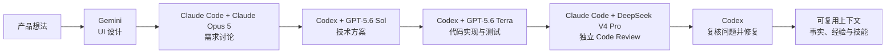
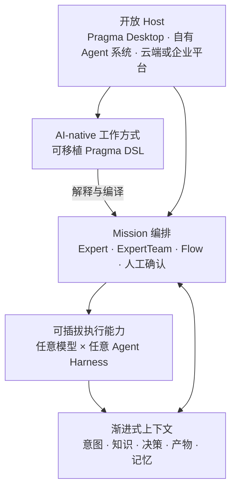

# Pragma

<p align="center">
  
  
  
  
  
</p>

<p align="center">
  <a href="./README.md">English</a> | 简体中文
</p>

> **把你的 AI 工作方式，沉淀成可以复用的资产。**

Pragma 是一个用于创造、运行和分享 AI-native 工作方式的开放平台。一项 Mission 可以组合不同的模型、Agent Harness、专家、工具与人工决策，同时让上下文和积累的经验持续跟随工作流动。

Pragma 不试图替代 Gemini、Claude Code、Codex、PI、Qoder CLI，也不试图替代下一个优秀的 Agent。Pragma 让它们协同工作。

## 为什么需要 Pragma？

真正高质量的 AI 工作，很少只发生在一个对话窗口里。有经验的 AI 使用者知道如何：

- 为每类任务选择合适的模型与 Harness；
- 在切换 Agent 时保留已经形成的决策和约束；
- 在正确的时机引入正确的上下文；
- 让代码实现与独立审查彼此隔离；
- 把成功路径和失败经验变成下一次更好的方法。

今天，这些知识大多存在于个人头脑和零散对话中。每次切换工具，都要重新复制 Prompt、复述背景、搬运产物，并不断丢失经验。

Pragma 把这种不可见的个人技巧，变成显式、可执行、可分享的工作方式。

## Pragma 的差异化

### 每一步都选择最合适的模型 × Harness

模型不等于完整的 Agent。同一个模型运行在普通对话、Coding Harness、浏览器 Agent 或专业系统中，会展现出完全不同的能力。

Pragma 把 **模型、Harness、工具、权限与上下文** 的组合视为真正的执行能力。不同 Expert 和 Flow 步骤可以使用不同组合，而不必把整套工作方式锁定在某一个厂商的执行环境里。

### 一项 Mission，共享一套渐进式上下文

上下文应该随着工作逐步生长，而不是每次切换工具都从头开始。Pragma 把需求、决策、知识、产物、评审意见与任务状态组织成统一的渐进式上下文，让每个阶段都能在前序成果上继续工作。

这并不意味着把全部历史无差别地发送给每个 Agent。稳定约束可以始终可用，相关知识可以按需加载，大型产物可以通过引用传递。每个 Expert 只在需要的时候获得真正需要的信息。

这才是跨 Harness 的上下文传递：不是假装把一个产品的私有 Session 搬进另一个产品，而是让工作的真实含义持续向前流动。

### 记忆，是值得长期保留的特殊上下文

Pragma 把 Memory 看成一种特殊 Context，而不是独立的黑盒系统。执行过程中产生的证据，可以从短期任务状态逐步演化为：

- **Experience**：发生过什么，包括成功路径与失败路径；
- **Fact**：有证据支持、值得长期保留的知识、约束与偏好；
- **Skill**：可复用的方法、反模式与恢复手册。

最终保留下来的不只是对话历史。一次完成的 Mission，可以改善下一次 Mission 被理解和执行的方式。

### 工作方式可以跨系统移植

AI-native 工作方式不只是一组 Prompt。它还描述谁来完成任务、使用哪个模型与 Harness、提供什么上下文、阶段之间如何交接、哪里需要人工确认，以及如何验证最终结果。

Pragma 使用可移植 DSL 表达这套方法。解释器（Interpreter）与编译器（Compiler）可以解析、校验、链接、编译并重新生成定义。它既可以运行在 Pragma Desktop，也可以嵌入你自己的 Agent 系统，或者连接未来的新 Host，而不必围绕某个封闭执行引擎重新编写整套方法。

### 可以接入任何 Agent 系统

Pragma 是开放编排层，不是封闭的 Agent 世界。Runtime Adapter 用来连接专业 Harness，Model Provider 用来连接商业模型、模型网关与本地模型，Plugin 用来连接工具和领域能力，而 Host 始终拥有 UI、存储、权限与部署方式的控制权。

当更好的模型和 Agent 产品出现时，它们可以直接加入系统，而不需要废弃已经沉淀的工作方式。

## 示例：一次编码任务，组合六位 AI 专家



这并不是简单地依次调用几个模型：

1. UI 产物和设计理由成为需求讨论的上下文。
2. 已确认需求、待决问题和仓库约束继续流入技术方案阶段。
3. 实现 Expert 获得批准后的方案、相关文件与验收标准，而不是几段对话的有损复制。
4. Code Review 从独立视角开始，并返回结构化评审意见。
5. Codex 逐条对照仓库复核，只修复真实问题，并验证最终结果。
6. 稳定事实、有价值的经验和可复用方法成为下一项 Mission 的上下文。

整套方法——角色、路由、上下文、交接、评审闸门和完成标准——都可以被版本化、评测、改进与分享。

## 理念架构



这套架构遵循四个理念：

- **工作方式与执行环境分离**：只描述一次方法，再为它绑定当下最合适的 Runtime。
- **上下文持续流动**：知识和结果可以跨越单个模型、Session 与 Harness。
- **复杂度渐进增加**：从一个 Expert 开始，再逐步扩展到 ExpertTeam、Flow、人工审批、评测与记忆。
- **Host 保持控制权**：Pragma 可以驱动自己的 Desktop，也可以成为其他 Agent 产品的一部分。

## 使用 Pragma

### 从 Desktop 开始

环境要求：

```text
Node.js >= 22
pnpm 10.12.1
```

```bash
pnpm install
pnpm --filter @pragma/desktop run prepare:electron
pnpm --filter @pragma/desktop dev
```


Desktop 是启动 Mission、选择 Workspace，并使用本地或已连接 Runtime 的最简单入口。

### 使用 Pragma DSL 描述可复用 Expert

```yaml
apiVersion: pragma/v3
kind: Expert
metadata:
  id: releaselead000001
  name: Release Lead
  description: Plans, verifies, and improves software releases.
spec:
  scope: Coordinate release preparation.
  instructions: Build an evidence-backed release plan, identify risks, and verify every gate.
```

同一种语言可以描述 Expert、ExpertTeam、Flow、Capability、Context 和 Runtime Profile。定义可以跟随项目保存、从编译后的对象重新生成、在 Git 中评审，并在不同 Host 之间移动。

### 嵌入自己的 Agent 系统

```ts
import { loadPragmaProject } from "@pragma/interpreter";

const project = await loadPragmaProject("./pragma.yaml");
const compiled = await project.compile("expert:releaselead000001", {
  workspace: process.cwd(),
  runtimes: myRuntimeResolver,
});

const expert = compiled.value;
```

使用 `@pragma/core` 获得 Expert 执行与 Runtime 合约；使用 `@pragma/interpreter` 获得可移植定义、校验、编译与 DSL 往返生成能力。你的应用仍然可以完全掌控产品体验、持久化、权限和基础设施。

## 进一步了解

- [产品定位与差异化](./docs/strategy/pragma-positioning-and-competitive-differentiation.md)
- [使用指南](./docs/usage/README.md)
- [上下文](./docs/usage/context.md)
- [记忆](./docs/usage/memory.md)
- [Agent 架构](./docs/architecture/agent-core-architecture.md)
- [参与贡献](./CONTRIBUTING.md)

## License

Pragma 使用 [Pragma Source Available License 1.0](./LICENSE)。Pragma 名称、Logo 和官方身份的使用方式由[商标政策](./TRADEMARKS.md)管理。
