# Agent Core 架构说明

本文说明 `@pragma/core` 的架构边界、模块分类、运行流程和未来分布式部署形态。

`@pragma/core` 是 Pragma 的专家 Agent 执行核心。它不负责 HTTP API、数据库 Controller、Web UI 或 Desktop 权限界面，而是提供：

- 专家 Agent 的声明模型、创建入口和能力装配。
- Agent 上下文、工具、插件和模型配置管理。
- Runtime Adapter 抽象，使 Agent 可以运行在不同执行环境中。
- Flow 编排能力，把 Agent、确定性任务或子 Flow 组织成可执行流程。
- Workflow、Task、Mailbox、Sandbox 等运行期协议边界。

Core 的定位是“可替换运行时 + 可治理编排协议”的中间层：

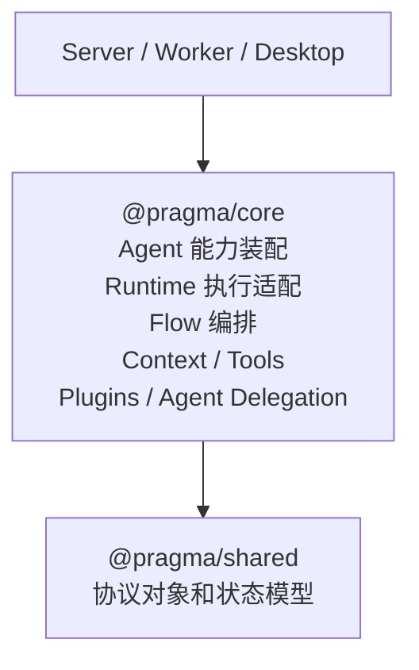

## 模块分类

Core 源码位于 `packages/core/src`。本文按职责分类说明模块，而不是按代码目录逐项展开。

### Agent 能力层

Agent 能力层负责把一个专家的身份、指令、上下文、工具、插件和模型配置装配成标准 `ExpertAgent`。

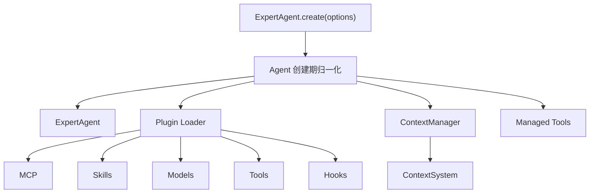

核心边界：

- `ExpertAgent.create()` 是标准创建入口。
- `defineAgent()` 和 `agent()` 只是声明语法糖，不应实现另一套 Agent 包装层。
- 插件、工具和上下文都在 Agent 创建阶段归一化。
- Agent 不直接依赖具体模型 SDK、本地执行器、Server Controller 或 Web UI。

`ExpertAgent` 的主要能力包括：

- 构建运行上下文。
- 读写和搜索上下文。
- 创建默认上下文工具。
- 通过 Runtime Registry 创建运行会话。
- 作为 `Directive` 被组合 Flow 调用。

### Context 与工具层

Context 与工具层负责把长期知识、项目上下文、记忆检索结果和受控能力暴露给 Agent。

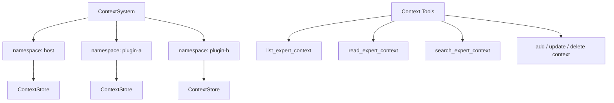

核心边界：

- 上下文通过 namespace 隔离来源。
- `ContextSystem` 是 Agent core 的通用 context substrate，不直接内建 memory 语义。
- memory、task memory、skill memory 等能力属于插件系统，由插件通过 context、tools 和 hooks 扩展。
- `ContextManager` 只负责最终 prompt 装配与 context 读取，不承担记忆聚合职责。
- 上下文不会一次性塞进 Runtime，而是由 Agent 或工具按需读取。
- Tool approval 是工具能力的一部分，但最终权限仍应由 Runtime、Desktop 权限闸门或上层策略共同裁决。
- `packages/shared` 只保存跨端协议和值对象，不放 Node 专属上下文实现。

### Runtime 执行层

Runtime 执行层负责屏蔽具体执行环境。Agent 只知道如何创建会话和提交任务，不知道底层是 PI agent SDK、云端沙箱、本地 Desktop 桥接，还是自托管执行器。

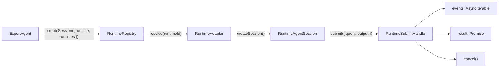

核心边界：

- `RuntimeAdapter` 是稳定扩展点。
- `RuntimeAgentSession` 表示一次 Agent 会话。
- `submit()` 同时返回流式事件和最终结构化结果。
- 具体 Runtime 实现位于独立 `@pragma/runtime-*` 包，不属于 `@pragma/core`。
- Worker 当前装配 PI 和 Codex runtime，并以 PI 作为默认 runtime。
- 未来 Runtime 可以接入云端容器沙箱、本地 Desktop Runtime、自托管 Runtime 或远程托管 Agent。

当前 Runtime 包：

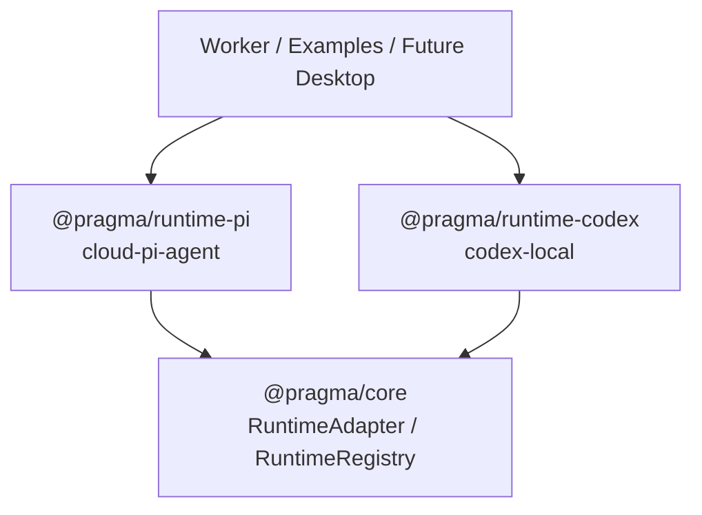

### Flow 编排层

Flow 编排层负责把多个可执行单元组织成可执行流程。这里的可执行单元不只包括 Agent，也包括本地确定性任务、编译后的组合 Flow，以及任何实现 `Directive` 协议的对象。

这里有一个刻意的命名分层：

- `Directive` 是底层统一执行协议，表示“可以被运行”的最小接口。
- `defineFlow()` 是用户侧组合入口，返回 `FlowSpec` builder。
- `defineTask()` 把确定性 TypeScript handler 包装成一个 leaf `Directive`。
- 编译归一化默认发生在 `flow.use()` 和 `createPragma().run()` 边界，用户日常不需要显式调用 `compile()`。
- `CompiledDirective` 是内部执行形态，本身也是 `Directive`，所以组合 Flow 可以继续嵌套。

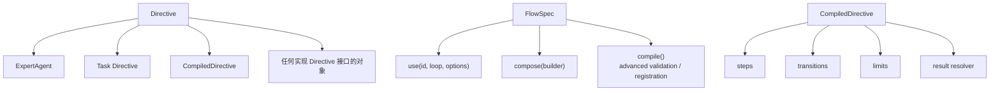

Flow 的关键设计是：步骤只持有 `Directive`，不再按 agent、task、subflow 建立不同分支。

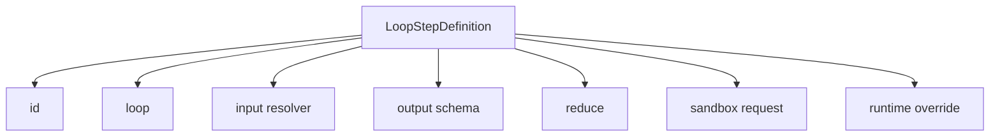

核心边界：

- `Directive` 是统一执行接口。
- `ExpertAgent` 本身实现 `Directive`。
- `defineTask()` 把确定性 TypeScript handler 包装为 `Directive`。
- `defineFlow()` 声明组合流程，`.compose()` 声明步骤之间的流转。
- `flow.use()` 可以接收 Agent、Task、CompiledDirective、子 Flow 或任何 `Directive` 实现。
- `createPragma().run()` 可以直接运行 Agent、Task、CompiledDirective 或 Flow。
- `CompiledDirective` 也实现 `Directive`，所以可以继续嵌套。
- `reduce()` 只做状态归并，不应执行外部副作用。

### 运行协调层

运行协调层是 Directive 执行时最重要的边界。它由 `TaskManager`、`StateManager`、`Mailbox`、`SandboxManager` 和 `LoopDefinitionStore` 协作完成。

```mermaid
flowchart TB
  app["Pragma"]

  app --> taskManager["TaskManager"]
  taskManager --> dispatch["分发 task"]
  taskManager --> lease["获取 lease"]
  taskManager --> execute["执行 step.loop.run()"]
  taskManager --> transition["推进 transition"]

  app --> stateManager["StateManager"]
  stateManager --> workflowState["workflow / task 权威状态"]
  stateManager --> humanState["human interaction 权威状态"]
  stateManager --> loopState["RunState"]
  stateManager --> revision["revision"]
  stateManager --> idempotency["幂等事件应用"]

  app --> mailbox["Mailbox"]
  mailbox --> pubsub["command / event 发布订阅"]
  mailbox --> consumerGroup["consumer group"]

  app --> sandboxManager["SandboxManager"]
  sandboxManager --> workflowSandbox["workflow sandbox"]
  sandboxManager --> taskSandbox["task sandbox"]
  sandboxManager --> workspaceCapability["workspace capability"]

  app --> loopDefinitionStore["LoopDefinitionStore"]
  loopDefinitionStore --> binding["workflowRunId 与 CompiledDirective 绑定"]
```

职责边界：

| 模块                  | 负责                                                | 不负责                        |
| --------------------- | --------------------------------------------------- | ----------------------------- |
| `TaskManager`         | 任务分发、租约、执行协调、等待恢复、transition 推进 | 保存权威状态、承载消息系统    |
| `StateManager`        | Workflow/Task/Human Interaction 状态、`RunState`、revision、幂等应用 | 执行 Agent、发布消息          |
| `Mailbox`             | command/event 发布订阅、消息过滤、通信协议承载      | 决定状态变化、执行任务        |
| `Task Memory`         | 共享/私有工作记忆、handoff、协作留言板              | 保存权威状态、替代消息总线    |
| `SandboxManager`      | sandbox 生命周期、workspace、capability             | 编排 transition、保存业务状态 |
| `LoopDefinitionStore` | 保存运行所需的已编译 Directive 定义                      | 执行步骤、修改状态            |

默认本地组装：

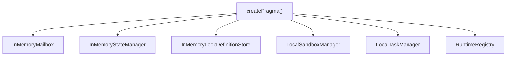

这个默认实现适合本地验证和单进程测试。生产或分布式部署时，应替换为持久化状态、可靠消息、远程沙箱和多 worker 任务执行。

## 运行流程

### Agent 会话流程

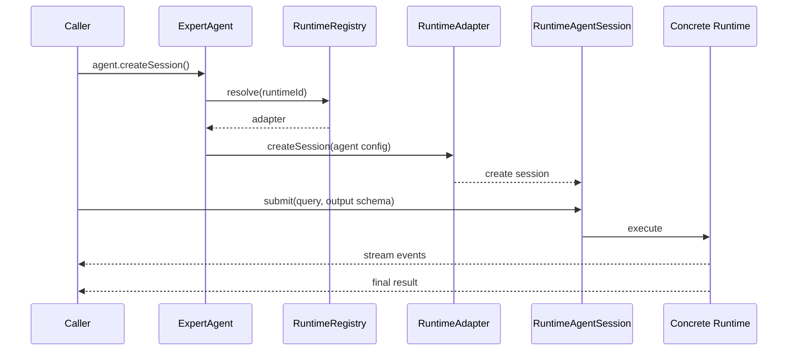

Agent 会话是 Runtime 层概念。它适合单个专家任务，也可以由 Flow 的某个 step 间接触发。

### Directive 执行流程

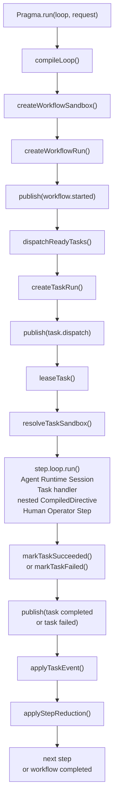

这个流程中，`TaskManager` 可以被替换为远程 worker 调度器，`StateManager` 可以被替换为数据库实现，`Mailbox` 可以被替换为队列或事件总线，`SandboxManager` 可以被替换为容器、VM、Kubernetes Job 或 Desktop 本地工作区。

### Human-in-the-loop 执行流程

Human-in-the-loop 是 Directive 层的一等能力，不是某个 Runtime 的私有回调。需求澄清、人工审批、编码 review gate 和手工介入都统一建模为 Human Interaction。

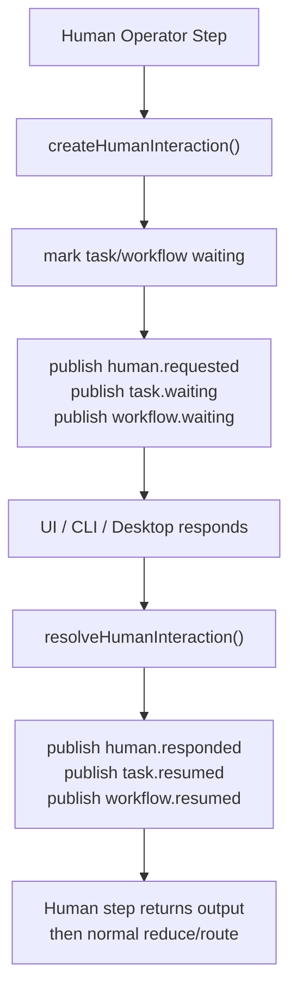

关键原则：

- Human Interaction 的事实源是 `StateManager`，Mailbox 只发布 `human.requested`、`human.responded` 等事件。
- 等待期间 workflow 和 task 进入 `waiting`；waiting task 不参与 lease 过期恢复。
- 用户响应后，Human step 输出会像普通 task 输出一样进入 `reduce()` 和 `route()`。
- `review_gate` 用于阶段性人工验收，例如编码后 approve、request changes 或 manual patch；单个工具调用的敏感权限仍由 tool approval 处理。
- Agent 内部调用 `askUserQuestion` 时，也应通过 Directive 的 human interaction broker 转成同一套等待/恢复协议，而不是绕过 StateManager。

## 状态模型

Directive 运行状态来自 `@pragma/shared`，Core 只通过接口读写。

```mermaid
flowchart TB
  workflow["WorkflowRunRecord"]
  workflow --> workflowId["id"]
  workflow --> workflowLoopId["loopId"]
  workflow --> workflowStatus["status"]
  workflow --> currentStepIds["currentStepIds"]
  workflow --> completedStepIds["completedStepIds"]
  workflow --> loopState["state: RunState"]
  workflow --> defaultSandbox["defaultSandbox"]
  workflow --> workflowRevision["revision"]

  task["TaskRunRecord"]
  task --> taskId["id"]
  task --> workflowRunId["workflowRunId"]
  task --> stepId["stepId"]
  task --> visit["visit"]
  task --> taskStatus["status"]
  task --> taskPayload["input / output / error"]
  task --> runtimeId["runtimeId"]
  task --> taskSandbox["sandbox"]
  task --> lease["lease"]

  human["HumanInteractionRecord"]
  human --> interactionId["id"]
  human --> interactionWorkflowRunId["workflowRunId"]
  human --> interactionTask["taskRunId / stepId"]
  human --> kind["kind"]
  human --> interactionStatus["status"]
  human --> interactionPayload["request / response"]
  human --> operator["operator"]
  human --> auditTime["createdAt / resolvedAt"]
```

状态推进原则：

- `StateManager` 是状态事实源。
- 所有 task 状态流转必须经过 `StateManager`。
- `revision` 用于防止并发覆盖。
- message id 用于幂等事件应用。
- `RunState` 保存工作流输入、中间结果和步骤归并后的状态。
- `HumanInteractionRecord` 保存人工等待点的请求、响应、操作者和审计时间。

典型 task 状态流转：

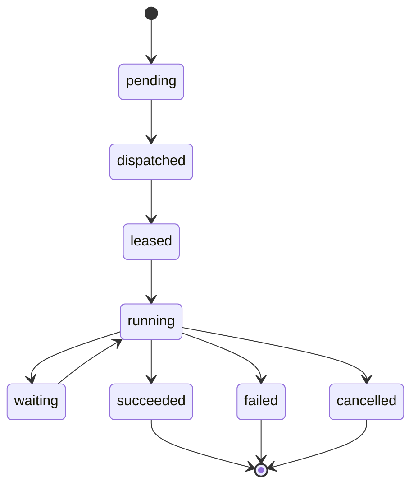

典型 workflow 状态流转：

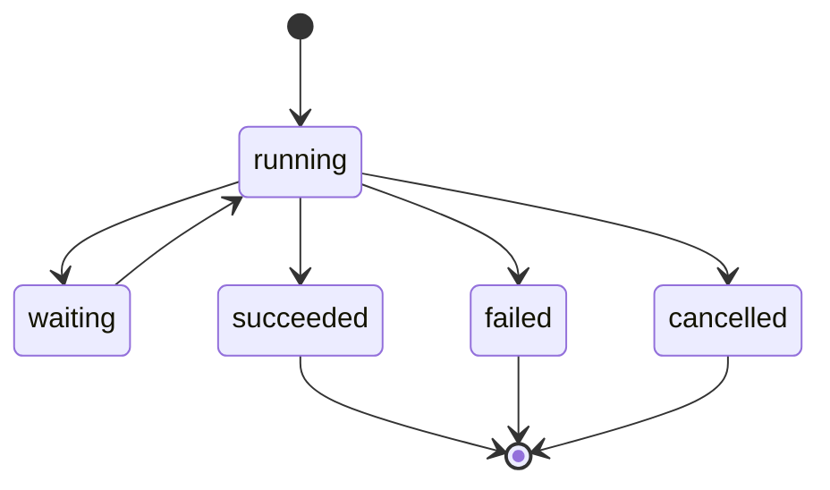

## Sandbox 模型

Sandbox 是 Directive 执行时的工作区和能力边界。它不是固定实现，而是 `SandboxManager` 接口。

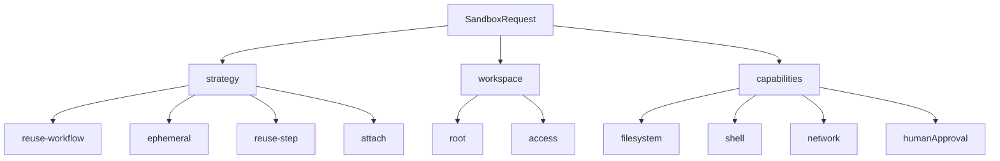

当前默认 `LocalSandboxManager` 使用本机 workspace，不提供强安全隔离。它用于开发、测试和本地单进程运行。未来生产环境应根据部署形态替换为：

- 容器沙箱。
- VM / Firecracker 沙箱。
- Kubernetes Job / Pod 沙箱。
- 远程执行服务。
- Desktop 本地授权工作区。

Sandbox 边界不应绕过 Tool approval、Runtime permission 或 Desktop 本地权限 UI。它只负责运行环境的资源边界，权限治理仍需要上层策略共同参与。

## 分布式部署形态

Core 当前默认本地实现可以平滑演进到分布式部署。推荐拆分如下：

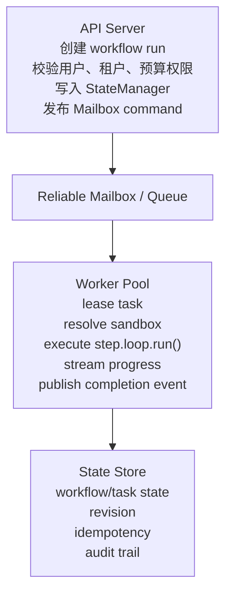

可替换组件：

| 当前默认                      | 分布式替换方向                                                     |
| ----------------------------- | ------------------------------------------------------------------ |
| `InMemoryStateManager`        | PostgreSQL、CockroachDB、DynamoDB、FoundationDB 或其他事务性状态库 |
| `InMemoryMailbox`             | Redis Streams、SQS、Kafka、NATS、RabbitMQ 或内部事件总线           |
| `LocalTaskManager`            | 多 worker 调度器、远程执行 worker、Kubernetes worker               |
| `LocalSandboxManager`         | 容器、VM、Kubernetes、远程沙箱、Desktop bridge                     |
| `InMemoryLoopDefinitionStore` | 数据库、对象存储、版本化 workflow definition store                 |
| 默认 `RuntimeRegistry`        | 租户级、区域级或能力感知 Runtime Registry                          |

分布式实现必须保留以下语义：

- task lease 必须可续租、可过期恢复。
- waiting task 必须能被持久化，且不能被 lease recovery 重派发。
- Human Interaction 响应必须幂等，重复响应不能覆盖首次有效响应。
- task completion / failure / cancellation 必须幂等。
- workflow state update 必须有并发保护。
- message delivery 可以至少一次，但状态应用必须防重复。
- sandbox cleanup 必须可重试。
- Runtime event stream 不应成为状态事实源，最终状态仍以 `StateManager` 为准。

## 本地 Desktop Runtime 方向

未来本地 Agent 通过 Desktop App 接入云端，不新增 `apps/local-runner`。

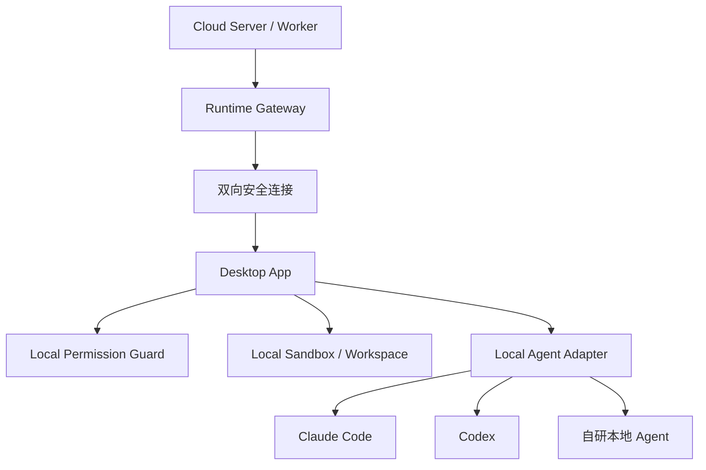

Core 中应承载桥接协议、消息类型和 Runtime Adapter 合约；具体 Runtime Adapter 实现放在独立 `@pragma/runtime-*` 包；Desktop App 承载登录、设备绑定、本地工作区选择和用户确认 UI；Server/Worker 承载调度、审计、预算和治理。

## 设计约束

- Core 可以依赖 `@pragma/shared`，不依赖具体 runtime、`@pragma/client`、Web UI 或 Server 应用层。
- Server/Worker 可以调度 Core，Core 不反向调用 Server Controller。
- Agent 执行能力优先加到 `ExpertAgent` 和 Runtime Adapter 边界，不只放在某个 SDK 包装层里。
- Runtime 实现可以替换，但必须把事件、结果、取消和错误转换成 Core 统一协议。
- Directive 运行期组件可以替换，但必须保留 `TaskManager`、`StateManager`、`Mailbox`、`SandboxManager` 的职责边界。
- 文档和实现冲突时，以更接近当前代码的具体文档为准，并同步修正另一处。
