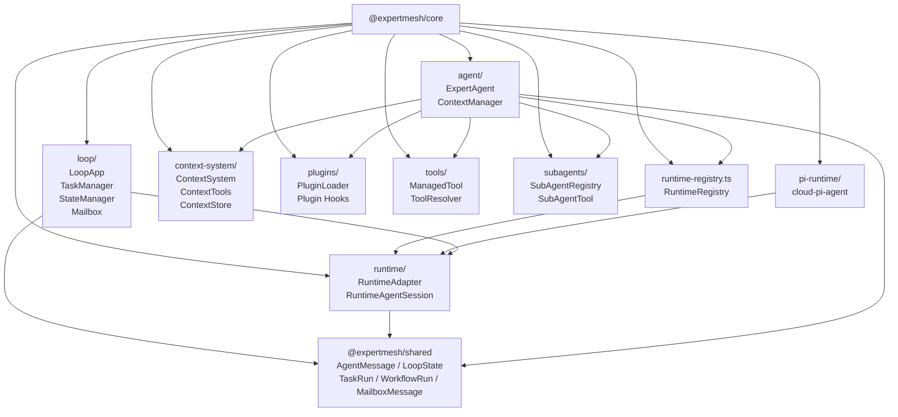
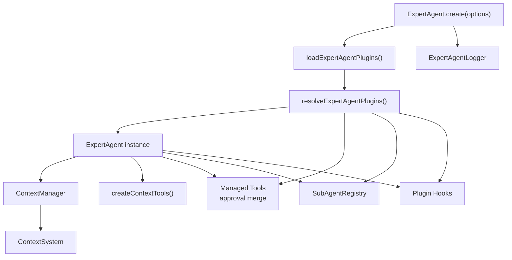
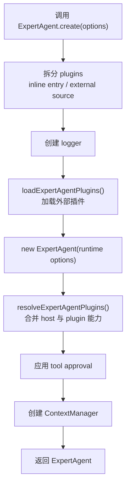
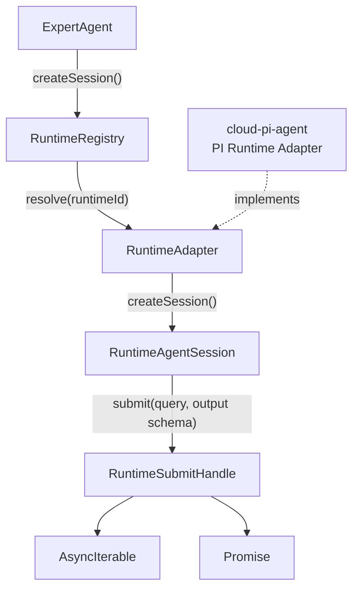
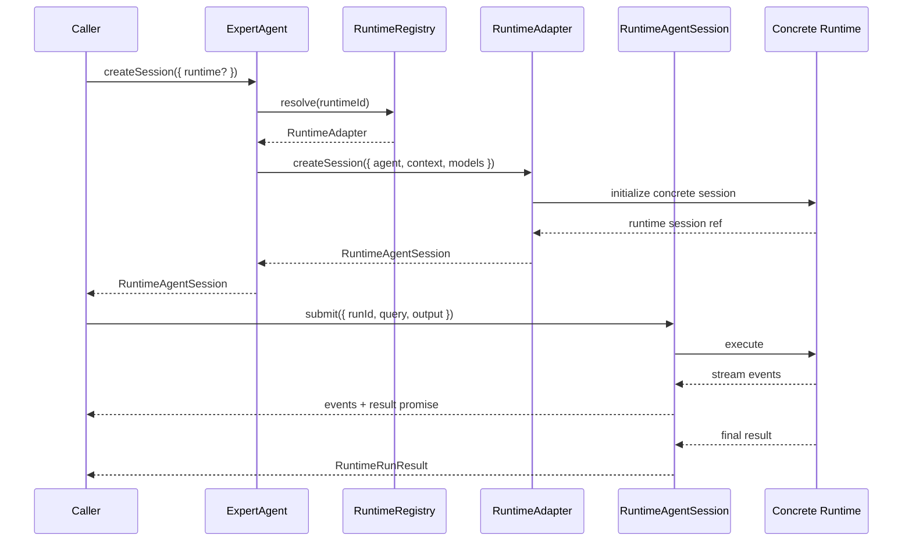
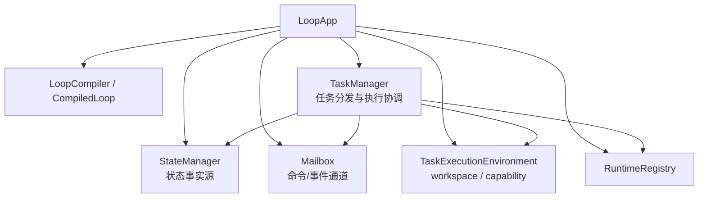
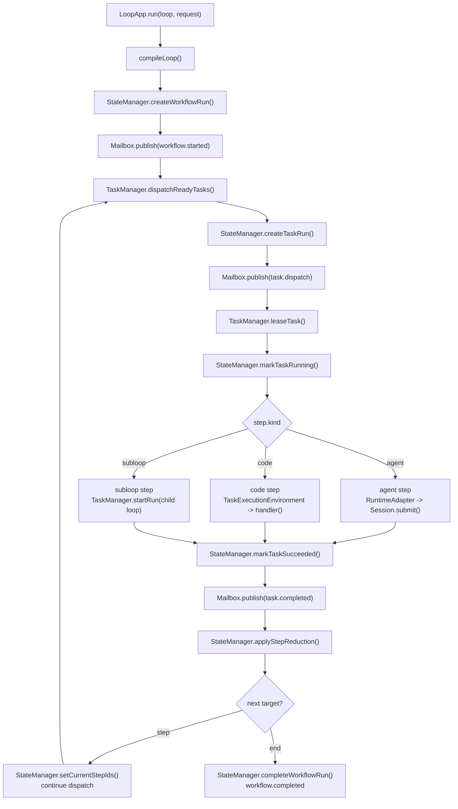
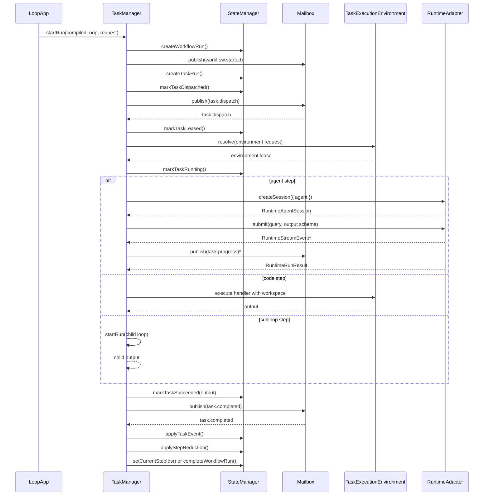
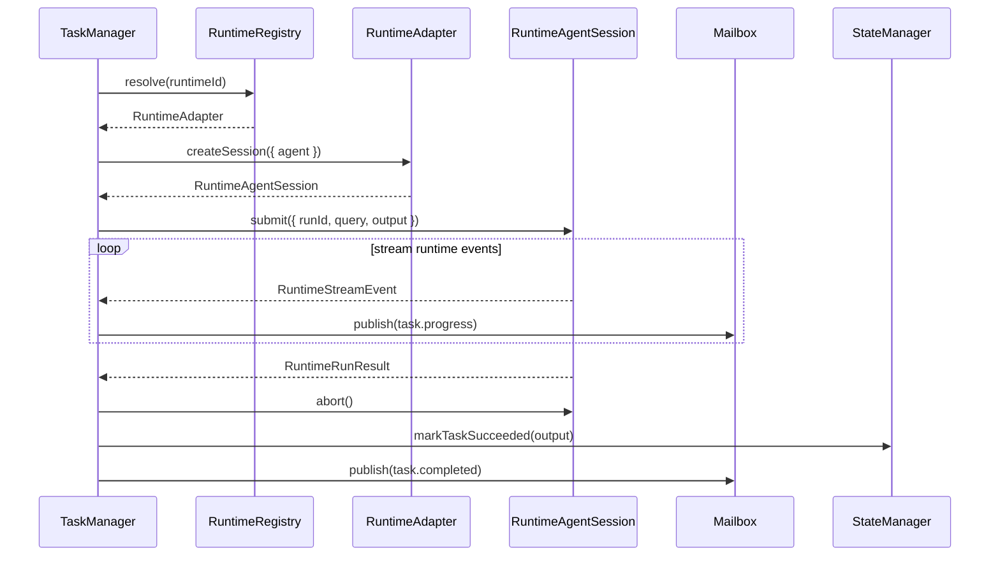
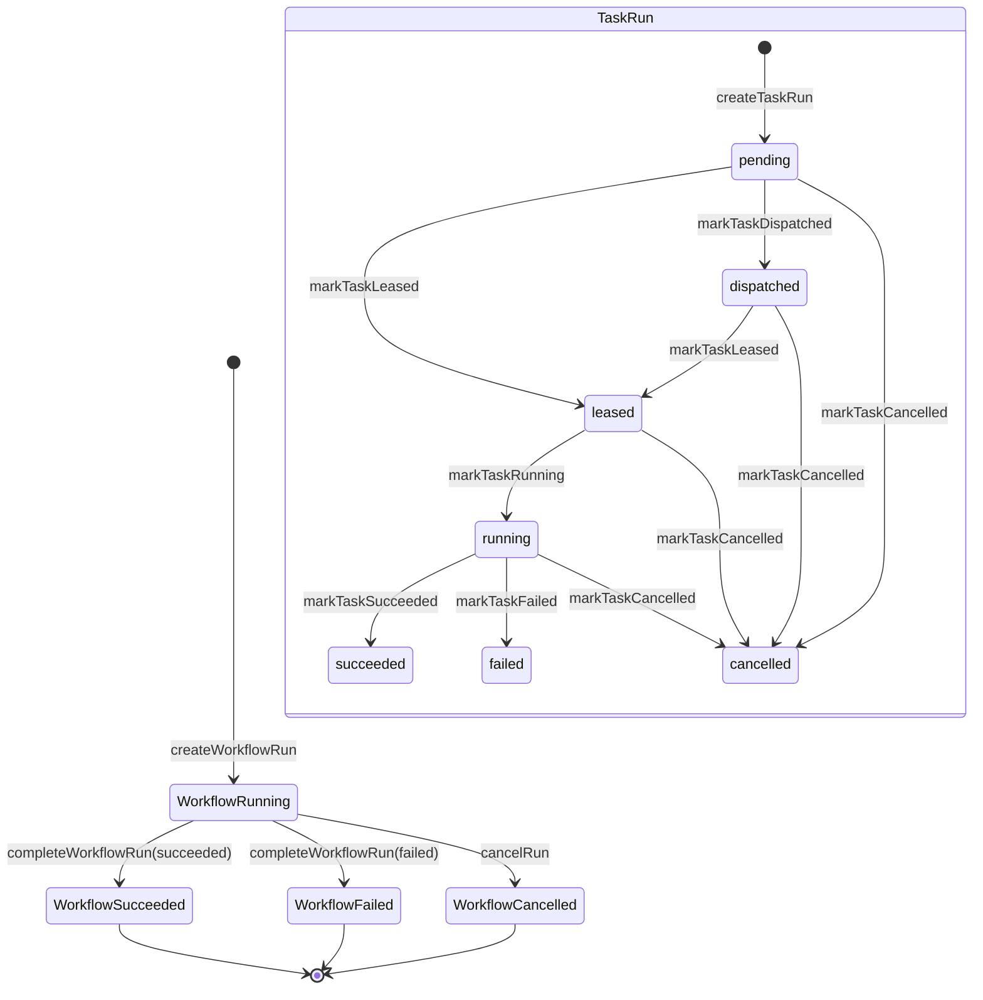

# Agent Core 架构说明

本文说明 `@expertmesh/core` 的当前架构边界、主要模块职责，以及 Agent 实现、Runtime、Loop 三者之间的关系。

`@expertmesh/core` 是 ExpertMesh 的专家 Agent 执行核心。它不负责 HTTP API、数据库 Controller、Web UI 或 Desktop 权限界面，而是提供以下能力：

- 定义专家 Agent 的声明模型和创建入口。
- 管理 Agent 的上下文、工具、插件、子 Agent 和模型配置。
- 抽象 Runtime Adapter，使 Agent 可以运行在不同执行环境中。
- 提供 Loop 编排能力，把多个 Agent、代码步骤或子 Loop 组织成可执行流程。
- 将运行事件、任务状态和协议对象保持在可治理、可替换的边界内。

## 模块总览

核心源码位于：

```text
packages/core/src
```

主要模块：

```text
agent/            ExpertAgent 实现与上下文组装入口
runtime/          RuntimeAdapter、Session、事件流和运行上下文抽象
pi-runtime/       当前默认云端 Runtime，适配 PI agent SDK
loop/             Loop 编排、任务调度、状态推进、执行环境
context-system/   Agent 上下文存储、索引、搜索、读写和默认工具
plugins/          ExpertAgent 插件加载与合并
tools/            Managed Tool、审批策略和工具解析
subagents/        子 Agent 声明与工具化调用
logging/          Agent 运行日志抽象
runtime-registry.ts Runtime 注册、查找和默认 Runtime 创建
index.ts          core 公共 API 出口
```

核心模块之间的关系可以概括为：

```text
ExpertAgent
  使用 ContextSystem / plugins / tools / subagents 形成专家能力
  通过 RuntimeRegistry 选择 RuntimeAdapter
  创建 RuntimeAgentSession 并提交任务

Loop
  编排实现 Loop 接口的可执行单元
  ExpertAgent、本地代码 Loop、编译后的组合 Loop 都是 Loop
  步骤只持有 Loop，不再区分 agent/code/subloop 分支

RuntimeAdapter
  屏蔽具体执行环境
  当前默认实现是 cloud-pi-agent
  未来可以扩展 cloud sandbox、local desktop bridge、self-hosted runtime
```

## Agent 实现

Agent 实现主要在：

```text
packages/core/src/agent/expert-agent.ts
packages/core/src/agent/context-manager.ts
```

`ExpertAgent` 是专家能力的标准运行对象。它承载专家身份、能力配置和运行入口。

核心字段包括：

- `id`、`name`、`description`、`version`、`tags`：专家身份与发现信息。
- `instructions`：专家默认指令。
- `scope`、`workspace`：能力边界和工作区边界。
- `mcp`：专家可用 MCP Server 声明。
- `skills`：专家可用 Skill 声明。
- `models`：模型提供方和默认模型配置。
- `contextSystem`：专家上下文系统。
- `subAgents`：子 Agent 注册表。
- `tools`：受管理工具集合。
- `hooks`：插件合并后的生命周期扩展点。
- `pluginLoadIssues`：插件加载问题记录。
- `logger`：Agent 日志入口。

### 创建入口

标准创建入口是：

```ts
ExpertAgent.create(options);
```

`defineAgent()` 和 `agent()` 只是 `ExpertAgent.create()` 的声明语法糖，位于：

```text
packages/core/src/index.ts
```

创建过程会做几件事：

1. 拆分 inline plugin entry 和外部 plugin source。
2. 初始化 Agent logger。
3. 加载外部插件。
4. 合并插件提供的 MCP、Skills、Models、SubAgents、Tools 和 Hooks。
5. 创建 `ContextManager`。
6. 返回标准化后的 `ExpertAgent` 实例。

这意味着插件、工具、上下文和子 Agent 都属于 Agent 能力装配阶段，而不是散落在 Runtime 实现中。

### 上下文能力

上下文系统主要在：

```text
packages/core/src/context-system
```

当前提供：

- `ContextSystem`：上下文读写、索引、搜索的核心入口。
- `ContextManager`：面向 Agent 运行时组装上下文。
- `createContextTools()`：把上下文能力暴露成 Agent 默认工具。
- `InMemoryContextStore`：内存上下文存储。
- `FileSystemContextStore`：文件系统上下文存储。

`ExpertAgent` 对外提供：

- `buildContext()`
- `listContext()`
- `readContext()`
- `searchContext()`
- `addContext()`
- `updateContext()`
- `deleteContext()`
- `createDefaultTools()`

上下文不会一次性塞进 Runtime，而是通过 ContextSystem 和工具按需读取。这个方向和专家协议里的“渐进式上下文加载”保持一致。

## Runtime 模块

Runtime 抽象主要在：

```text
packages/core/src/runtime
packages/core/src/runtime-registry.ts
packages/core/src/pi-runtime
```

Runtime 的目标是让 ExpertAgent 不绑定具体执行环境。Agent 只关心“创建会话”和“提交任务”，具体由哪个 Runtime 执行由 `RuntimeRegistry` 决定。

### RuntimeAdapter

核心接口是：

```text
RuntimeAdapter
RuntimeAgentSession
RuntimeSubmitHandle
RuntimeStreamEvent
```

`RuntimeAdapter` 描述一个可用运行时：

- `descriptor`：Runtime ID、类型、展示名和能力声明。
- `createSession()`：为某个 Agent 创建运行会话。
- `setSessionSyncCallback()`：可选，会话同步回调。
- `setSessionRestoreHandler()`：可选，会话恢复处理。

`RuntimeAgentSession` 表示一次 Agent 会话：

- `info()`：读取会话信息。
- `messages()`：读取消息历史。
- `submit()`：提交用户请求，返回事件流、最终结果和取消函数。
- `abort()`：终止会话。

`submit()` 返回的 `RuntimeSubmitHandle` 包含：

- `runId`
- `events`
- `result`
- `cancel()`

这样 Loop 或上层应用可以边消费事件流，边等待结构化结果。

### Runtime Registry

`runtime-registry.ts` 负责注册和解析 Runtime。

默认行为：

- 默认 Runtime ID 是 `default`。
- 如果没有显式注册 `default`，会自动创建默认 Runtime。
- 当前默认 Runtime 类型是 `cloud-pi-agent`。

主要接口：

- `createRuntimeRegistry()`
- `createDefaultRuntime()`
- `RuntimeRegistry.list()`
- `RuntimeRegistry.get()`
- `RuntimeRegistry.resolve()`

`ExpertAgent.createSession()` 会通过 Runtime Registry 解析 Runtime，然后调用对应 Runtime 的 `createSession()`。

### PI Runtime

当前默认 Runtime 在：

```text
packages/core/src/pi-runtime
```

它负责把 ExpertAgent 的声明模型转换成 PI agent SDK 能理解的会话配置。

主要职责包括：

- 建立 PI Runtime Adapter。
- 转换模型、工具、MCP、Skills、SubAgents 和资源。
- 管理 Runtime Session。
- 处理消息、事件流、输出 schema 和工具调用。
- 将 Runtime 事件转换为 Core 层统一事件。

PI Runtime 是当前实现，不应该成为 Core 的唯一假设。后续云端沙箱 Runtime、本地 Desktop Runtime、自托管 Runtime 都应通过同一组 RuntimeAdapter 接口接入。

## Loop 模块

Loop 编排主要在：

```text
packages/core/src/loop
```

Loop 的职责是把多个步骤组织成一个可运行工作流。它不是某个模型的 prompt chain，而是一个带状态、任务、环境、消息和转移规则的执行框架。

核心概念：

- `CompiledLoop`：已编译的 Loop 定义。
- `LoopStepDefinition`：步骤定义。
- `LoopTransition`：步骤之间的转移规则。
- `LoopState`：工作流运行状态，定义在 `@expertmesh/shared`。
- `WorkflowRunRecord`：一次工作流运行记录。
- `TaskRunRecord`：一次步骤任务运行记录。
- `TaskManager`：任务派发、租约、执行、完成和失败处理。
- `Mailbox`：命令和事件消息通道。
- `StateManager`：工作流和任务状态存储。
- `TaskExecutionEnvironment`：步骤运行环境。

### TaskManager、StateManager、Mailbox

Loop 运行时由三个核心协作接口组成：

```text
TaskManager   负责任务分发和执行编排
StateManager 负责工作流与任务状态同步
Mailbox      负责命令/事件通信协议
```

当前代码中没有单独命名为 `MailboxManager` 的接口，通信层接口名是 `Mailbox`。如果后续需要持久化消息队列或远程队列，可以在不改变 TaskManager 调用方式的前提下替换 `Mailbox` 实现。

相关文件：

```text
packages/core/src/loop/types.ts
packages/core/src/loop/task-manager.ts
packages/core/src/loop/in-memory-state-manager.ts
packages/core/src/loop/in-memory-mailbox.ts
packages/core/src/loop/loop-app.ts
```

#### TaskManager

`TaskManager` 是调度和执行协调器。它不直接保存最终事实状态，而是通过 `StateManager` 写入状态，通过 `Mailbox` 发布命令和事件。

主要职责：

- 启动 Loop run。
- 找出当前可执行步骤。
- 创建并派发 task run。
- 租约任务，避免同一个任务被重复执行。
- 执行步骤持有的 `Loop`。
- 通过 execution context 把 Runtime 流式事件转成 `task.progress`。
- 处理 `task.completed`、`task.failed`、`task.cancelled`。
- 根据 transition 推进下一个 step 或结束 workflow。

当前本地实现：

```text
createLocalTaskManager()
```

#### StateManager

`StateManager` 是状态事实源。它负责维护 workflow run、task run、LoopState、revision 和幂等事件应用。

主要职责：

- 创建 `WorkflowRunRecord`。
- 创建 `TaskRunRecord`。
- 维护 task 状态流转：`pending -> dispatched -> leased -> running -> succeeded/failed/cancelled`。
- 维护 workflow 状态流转：`running/waiting -> succeeded/failed/cancelled`。
- 保存当前 step 集合 `currentStepIds`。
- 保存已完成 step 集合 `completedStepIds`。
- 应用 step reduce，更新 `LoopState`。
- 使用 `revision` 防止并发状态覆盖。
- 记录已应用 message id，避免重复事件造成重复状态推进。

当前内存实现：

```text
createInMemoryStateManager()
```

后续云端化时，`StateManager` 应替换为数据库或事务性存储实现。TaskManager 不应该绕过它直接改状态。

#### Mailbox

`Mailbox` 是 Loop 内部的命令和事件通道。它承载的是通信协议，而不是业务状态。

主要职责：

- `publish()` 发布 command 或 event。
- `subscribe()` 订阅指定 workflow、task 或 message type。
- 用 `MailboxMessage` 统一承载 `workflow.started`、`task.dispatch`、`task.completed` 等消息。
- 隔离 TaskManager 和具体消息系统，便于后续替换为队列、事件总线或分布式消息系统。

当前内存实现：

```text
createInMemoryMailbox()
```

当前内存 Mailbox 是同步进程内发布/订阅模型，适合本地验证和单进程测试。后续云端 Worker 场景应替换为可持久化、可重试、可观测的消息实现。

#### 三者协作关系

一次任务推进的关系是：

```text
TaskManager
  -> StateManager.createTaskRun()
  -> StateManager.markTaskDispatched()
  -> Mailbox.publish("task.dispatch")
  -> TaskManager.leaseTask()
  -> StateManager.markTaskLeased()
  -> StateManager.markTaskRunning()
  -> execute step.loop.run()
  -> StateManager.markTaskSucceeded() 或 markTaskFailed()
  -> Mailbox.publish("task.completed" 或 "task.failed")
  -> StateManager.applyTaskEvent()
  -> StateManager.applyStepReduction()
  -> StateManager.setCurrentStepIds() 或 completeWorkflowRun()
```

边界上可以这样理解：

| 模块         | 负责                                              | 不负责                     |
| ------------ | ------------------------------------------------- | -------------------------- |
| TaskManager  | 任务分发、租约、执行协调、转移推进                | 保存权威状态、承载消息协议 |
| StateManager | Workflow/Task 状态、LoopState、revision、幂等应用 | 运行具体 Agent、发布消息   |
| Mailbox      | command/event 发布订阅、消息过滤、通信协议承载    | 决定状态变化、执行任务     |

### Loop 步骤

Loop 步骤不再按 agent、code、subloop 建立不同定义。`LoopStepDefinition` 只保存步骤 id、输入解析、输出校验、状态归并、运行环境策略，以及一个实现 `Loop` 接口的可执行单元。

当前可注册的典型 Loop：

- `ExpertAgent`：通过 Runtime Registry 解析 Runtime，创建 Runtime Session，并提交任务。
- `defineCodeLoop()` 创建的本地代码 Loop：通过 `TaskExecutionEnvironment` 获取 workspace，适合做确定性转换、校验、文件处理或轻量逻辑。
- `CompiledLoop`：编译后的组合 Loop，本身也实现 `Loop`，可继续注册进更大的组合 Loop。

因此 TaskManager 不需要理解具体执行类型，只调用 `step.loop.run()`，再用步骤输出推进 `LoopState` 和 transition。

### LoopApp

`createLoopApp()` 是 Loop 运行入口。

默认组装：

- `InMemoryMailbox`
- `InMemoryStateManager`
- `RuntimeRegistry`
- `LocalTaskExecutionEnvironment`
- `LocalTaskManager`

`LoopApp.run(loop, request)` 会：

1. 编译或接收已编译 Loop。
2. 调用 `TaskManager.startRun()`。
3. 等待工作流完成。
4. 返回最终输出和状态。

### TaskManager 执行过程

`TaskManager` 是 Loop 的核心调度器。当前本地实现是：

```text
createLocalTaskManager()
```

一次运行的大致过程：

1. `startRun()` 创建 `WorkflowRunRecord` 和初始 `LoopState`。
2. 发布 `workflow.started` 事件。
3. `dispatchReadyTasks()` 找到当前可运行步骤。
4. 为步骤创建 `TaskRunRecord`。
5. 发布 `task.dispatch` 命令。
6. `leaseTask()` 获取任务租约。
7. `executeTask()` 调用步骤持有的 `Loop`。
8. 执行成功后发布 `task.completed`。
9. `handleTaskCompleted()` 应用 reduce，解析 transition。
10. 如果还有后续步骤，继续派发；否则发布 `workflow.completed`。

失败时会发布 `task.failed` 和 `workflow.failed`，取消时会发布 `workflow.cancelled`。

## 文本架构图

本节使用 Mermaid 文本图描述 Core 的架构、流程和时序。它们是文档图，不生成图片文件，后续在支持 Mermaid 的 Markdown 渲染器中可以直接预览。

### Core 总体架构图



这张图表达的是源码模块关系，不是部署拓扑。`pi-runtime` 是当前默认 Runtime 实现；`runtime/` 是抽象层。

### Agent 子模块架构图



Agent 层的重点是能力装配。插件、上下文、工具、子 Agent、模型配置都在 `ExpertAgent` 创建时归一化，Runtime 只消费装配后的 Agent。

### ExpertAgent 创建流程图



对应代码入口：

```text
packages/core/src/agent/expert-agent.ts
packages/core/src/plugins/plugin-loader.ts
packages/core/src/plugins/expert-agent-plugin.ts
```

### Runtime 子模块架构图



Runtime 层只承诺统一接口。`cloud-pi-agent` 是一个实现，后续本地 Runtime、云端沙箱 Runtime、自托管 Runtime 应以相同接口接入。

### Runtime 会话时序图



### Loop 子模块架构图



Loop 的核心不是某个单独 manager，而是 `TaskManager + StateManager + Mailbox` 三者协作：

- `TaskManager` 负责推进。
- `StateManager` 负责事实状态。
- `Mailbox` 负责通信协议。

### Loop 步骤执行流程图



### TaskManager / StateManager / Mailbox 时序图



### Agent 步骤时序图



Agent 步骤不会直接调用具体 Runtime SDK。它只通过 `RuntimeRegistry` 和 `RuntimeAdapter` 找到可用 Runtime。

### Workflow / Task 状态流转图



状态权威来源是 `StateManager`。`Mailbox` 中的消息用于驱动状态变化，但消息本身不是状态事实源。

## Agent、Runtime、Loop 的关系

三者的边界如下：

| 模块    | 负责什么                                                               | 不负责什么                              |
| ------- | ---------------------------------------------------------------------- | --------------------------------------- |
| Agent   | 专家身份、能力声明、上下文、工具、插件、子 Agent、创建 Runtime Session | 任务队列、工作流状态机、HTTP Controller |
| Runtime | 执行一个 Agent 会话，处理消息、事件流、工具调用和最终输出              | 决定业务流程、管理数据库、编排多个步骤  |
| Loop    | 编排多个步骤，管理工作流状态、任务派发和转移规则                       | 具体模型 SDK 细节、专家上下文装配细节   |

关键调用关系：

```text
ExpertAgent.create()
  装配专家能力

ExpertAgent.createSession()
  RuntimeRegistry.resolve()
  RuntimeAdapter.createSession()

LoopApp.run()
  TaskManager.startRun()
  TaskManager.executeTask()
  agent step -> RuntimeAdapter -> RuntimeAgentSession.submit()
  code step -> TaskExecutionEnvironment -> handler()
  subloop step -> TaskManager.startRun()
```

简化理解：

- Agent 是“专家能力单元”。
- Runtime 是“专家怎么被执行”。
- Loop 是“多个步骤怎么被编排”。

## 与其他 package 的边界

`@expertmesh/core` 允许依赖：

```text
@expertmesh/shared
运行时 SDK，例如 PI agent SDK
```

`@expertmesh/core` 不应该依赖：

```text
@expertmesh/client
@expertmesh/server
apps/web
apps/server
apps/worker
apps/desktop UI
React / Next 页面
数据库实现
```

Shared 层提供 Core 需要的跨进程协议对象，例如：

- `AgentMessage`
- `LoopState`
- `WorkflowRunRecord`
- `TaskRunRecord`
- `MailboxMessage`
- `RunStatus`
- `StreamEvent`

Server/Worker 后续可以调用 Core 创建 ExpertRun、PlaybookRun 或 LoopRun，但 Core 不反向调用 Server。

Desktop 后续可以通过本地桥接协议接入 Runtime Adapter，但具体本地权限确认 UI 和 Claude Code / Codex 调用实现不放在 Core 里。

## 当前状态

已具备：

- `ExpertAgent.create()` 标准创建入口。
- 插件加载和 inline plugin entry 合并。
- ContextSystem 和上下文工具。
- Managed Tool、SubAgent、Logger 基础设施。
- RuntimeAdapter 核心接口。
- RuntimeRegistry 和默认 Runtime。
- `cloud-pi-agent` Runtime 实现。
- Loop 的内存版 Mailbox、StateManager、TaskManager 和本地执行环境。
- 统一 `Loop` 接口与 `use()` 编排模型。

仍属于后续演进：

- 持久化 Mailbox 和 StateManager。
- 云端 Runtime Gateway。
- 本地 Desktop Runtime Adapter。
- 租户、权限、预算、审计和成本治理与 Server 层打通。
- Expert Manifest 文件协议落地和加载器。
- Playbook 层面更完整的发布、评测和回滚机制。

## 设计约束

后续改动应遵守以下约束：

- Agent 能力优先加到 `ExpertAgent`，不要只放进某个 Runtime 包装层。
- Runtime 新实现必须通过 `RuntimeAdapter` 接入，不要让业务代码直接依赖具体 SDK。
- Loop 不直接理解具体模型 SDK，只面向 RuntimeAdapter。
- 上下文、工具、插件、子 Agent 属于 Agent 装配层。
- 任务状态、转移规则、环境租约属于 Loop 层。
- Server/Worker 可以调 Core，Core 不依赖 Server/Worker。
- Desktop 是本地 Agent 产品入口，本地权限 UI 不进入 Core。
