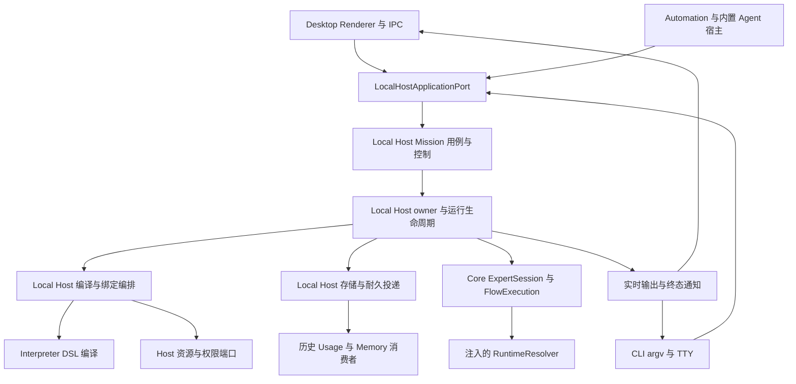

# Mission 统一 Local Host 应用内核分阶段重构方案

新增 PR 评论核验、Native 资源释放修复及最新验收状态见[第二轮补充](local-host-kernel-r1-pr-review-r2.md)。

大输出同步计数、关联 Memory 预算及真实 Mission 释放修复见[计数问题补充](local-host-kernel-r1-token-counter-followup.md)；依据维护者后续修复要求披露估算策略变化，R1 阶段验收仍未完成。

日期：2026-10-03。状态：R1 已通过 PR #353 合入 main，工程验证与真实 Native Mission smoke 已通过；真实模型性能及完整产品场景验收仍有缺口，未标记全部完成。R2 编译编排实施已交付，阶段退出以 [R2 实施与验证报告](local-host-kernel-r2-implementation.md)的逐项结果及缺口为准；R3 工程实施与验证进行中，退出以 [R3 实施与验证报告](local-host-kernel-r3-implementation.md)为准；R4 未开始。R1 历史证据见[实施与验证报告](local-host-kernel-r1-implementation.md)和[CR 与复核](local-host-kernel-r1-code-review.md)。

本方案对应 [issue #348](https://github.com/pqpo/pragma/issues/348)，基于拉取后的 `main`，代码基线为 `8fdbd4526d0f62d0b36891165539ed9ec47dc603`。目标是让 Desktop 与 CLI 的 Mission 控制、编译编排、运行、Session 与恢复共用 `@pragma/local-host` 的一套实现，同时保留最近四轮首 Token 优化。实施采用 R1 至 R4 四个阶段；基线测量与中立契约准备并入 R1 的前置工作；每阶段独立验证、合并，并删除该阶段已替代的业务路径。

这次重构优先迁移职责和调用关系，保持现有持久格式、事务边界和性能机制。SQLite 增量 Execution 存储已经落地，不再把“更换 Execution 引擎”列为重构待办。第四轮仍缺真实模型端到端验收，因此必须分别回答“是否收敛架构”“是否保留当前性能”“是否达到产品性能目标”，不能用其中一项代替另一项。

## 1 设计依据与当前实现

### 1.1 最近四轮优化

以下为主线合并提交，日期统一按本机 Asia/Shanghai 解释。保留的是最新 main 上仍有效的行为，不恢复中途撤回的实验。

| 轮次   | 主线提交                                                                                                       | 已落地且必须保留的机制                                                                                                                                                                                                                  | 证据                                                                                                                                   |
| ------ | -------------------------------------------------------------------------------------------------------------- | --------------------------------------------------------------------------------------------------------------------------------------------------------------------------------------------------------------------------------------- | -------------------------------------------------------------------------------------------------------------------------------------- |
| 第一轮 | [`bad15b56`，#347](https://github.com/pqpo/pragma/commit/bad15b562b954df50020c2effdb3a52cf18fb8b0)，10 月 1 日 | Desktop 的 Mission owner 跨轮保留；同进程 Inbox 立即唤醒；operation waiter 先订阅再读耐久状态；Runtime 元数据批量提交；canonical 后台投递；`ExpertTurn.settled`；独立 queue patch；五分钟 idle 释放                                     | [优化交接](../performance/mission-latency-handoff.md)、[ADR 063](../adr/063-idle-mission-resource-release.md)                          |
| 第二轮 | [`cbb8a421`，#349](https://github.com/pqpo/pragma/commit/cbb8a4210ab7447524842041f6ee00761825648d)，10 月 1 日 | Session 单锁 `readSnapshot`；请求局部 Revision 复用；相同进行中展示读取合并；history/control/Context 独立刷新和水位；接入与收尾分段计时                                                                                                 | [阶段二报告](../performance/mission-latency-phase-two.md)、[真实复测](../performance/mission-latency-phase-two-live-retest.md)         |
| 第三轮 | [`a5054c38`，#350](https://github.com/pqpo/pragma/commit/a5054c388e46dd5419b929fcb865b08e7c3e4f9a)，10 月 1 日 | Usage 耐久源事实；有限且独立的投递任务；admission 与 observer 收尾分离；移除同步容量扫描及全局容量门禁；semantic write 锁内覆盖完整事务；Core 接受后 timeline 失败保留 applying 重放                                                    | [阶段三报告](../performance/mission-latency-phase-three.md)、[ADR 064](../adr/064-mission-durable-delivery-and-capacity-accounting.md) |
| 第四轮 | [`8fdbd452`，#352](https://github.com/pqpo/pragma/commit/8fdbd4526d0f62d0b36891165539ed9ec47dc603)，10 月 2 日 | 流式期间不做 tokenizer/Usage preview；attempt 结束精确上报优先、缺失时统一 fallback；目标依赖闭包 readiness；终态必要提交合并；SQLite 增量事务和索引分页；Host 两存储 worker；owner 准备隔离；Usage/receipt SQL 离开 Main；有界后台读取 | [阶段四报告](../performance/mission-latency-phase-four.md)、[增量存储 ADR 065](../adr/065-incremental-execution-storage.md)            |

另有 [`e17b71bb`，#351](https://github.com/pqpo/pragma/commit/e17b71bb) 的删除优化，已整合进第四轮：冻结派发、Runtime 停止确认、分批文件移动、既有删除 journal、后台五项后处理，以及进程租约 metadata 不再逐锁 fsync。它不是第五轮首 Token 优化，但属于此次重构不可回退的主线行为。详见[删除 ADR 065](../adr/065-mission-deletion-stop-and-post-processing.md)。引用 ADR 时使用完整文件名，避免两个 065 的歧义。

第三轮的全局容量计量 adapter、账本、启动校准和同步容量写入门禁已撤销，不能随“统一存储层”重新引入。第四轮也已替代第三轮的 Usage preview 和全量 Runtime readiness；应保留最终实现，而不是同时保留每轮旧方案。

### 1.2 已共享与仍重复的部分

| 当前入口                              | 实际实现                                                                                                           | 重构判断                                                                                            |
| ------------------------------------- | ------------------------------------------------------------------------------------------------------------------ | --------------------------------------------------------------------------------------------------- |
| Controller、lease、Inbox、query/watch | `packages/local-host/src/missions/controller/`                                                                     | 已共享，继续复用                                                                                    |
| Command dispatch table                | `packages/local-host/src/missions/command-dispatcher.ts`                                                           | 路由表已共享，但 handlers 和 strict target 校验仍有两份；不能把共享 dispatch table 当成控制统一完成 |
| CLI 默认执行                          | `node-application.ts` → `project-catalog.ts` / `built-in-executors.ts` → `core-run.ts` / `core-control-adapter.ts` | 有默认内核，但 compile/binding/lifetime 与 Desktop 不对等                                           |
| Desktop 控制和首轮运行                | `application-container.ts` 注入 `missionControlAdapter`、`runExecutor`；回调进入 Desktop Runner                    | 应移除的反向业务注入                                                                                |
| Desktop 编译与生命周期                | `mission-runner-composition.ts`，当前约 7,136 行                                                                   | 真正需要拆分和下沉的执行内核                                                                        |
| Desktop Runner 出口                   | `mission-runner.ts`，当前仅 27 行                                                                                  | 只是门面；仅改此文件不能完成重构                                                                    |
| Execution authority                   | Core 合约与规则 + Local Host SQLite adapter、worker                                                                | 已完成引擎边界调整，不改回 Core 默认 File store                                                     |
| Mission 持久模型与 timeline           | Desktop `mission-store.ts` 及 migrations；Local Host controller 另有共享事实视图                                   | 先抽中立契约，再迁移业务写入职责，避免把 Desktop DTO 直接复制进 Local Host                          |
| 内部发起者                            | Automation、Pragma、Memory Curator、修订 Agent、Evaluation 仍引用 Runner                                           | R4 统一接入应用用例                                                                                 |

Desktop IPC 的 send/steer 等入口已经经过 Local Host；但恢复仍直接调用 `runner.recover()`，选项、Context mount、压缩、force interrupt、删除也存在 Runner 调用。验收需覆盖这些旁路。

CLI 当前 `createLocalHostAdapterHost()` 对 binding/secret 返回 `undefined`，external artifact 抛错；Desktop 对 external artifact/secret 也没有完整通用实现。重构应把实际支持能力变成显式配置与诊断，不能把空 resolver 包装成两端已实现的能力。

### 1.3 当前性能证据的边界

最新应引用[整合存储测量](../performance/mission-latency-phase-four-storage-merged.json)，而不是此前回退样本。整合 #351 后，canonical 开启、每个单 owner 20 样本，0/50/500/5,000 历史提交 P95 为 **6.95/7.13/7.87/6.93 ms**；5,000 历史、四 owner 共 80 样本为 **53.27 ms**。此前四 owner 曾出现 255.19 ms，合并唤醒后为 176.37 ms，均不是最新主线基线。

这些数字来自同一 Intel i7-9750H 主机的存储局部测量，不含 renderer、模型和正常 Memory/Automation 负载。#351 同时改变了文件锁成本，不能把改善归因于单一重构或恢复修复。R1 的前置测量必须在实施机器重新测量最新 main。

现有 renderer 局部基准中，100/1,000/5,000 entries 的流式 input→paint P95 为 35.2/34.2/34.9 ms，见[绘制样本](../performance/mission-latency-phase-four-stream-ui.json)。第四轮真实模型 pilot 没有有效样本，受 native Keychain 确认阻塞；完整产品指标仍待验收。以上为已有报告事实。随后已对当前 main 完成两组存储、准备隔离与 renderer 局部基线测量，详见[实施前性能基线](../performance/local-host-kernel-baseline.md)；真实模型与完整产品场景以该记录中的验收状态为准。

## 2 目标边界与模块组织



| 所有者      | 保留职责                                                                                                                                  |
| ----------- | ----------------------------------------------------------------------------------------------------------------------------------------- |
| Shared      | 浏览器安全的值对象、跨进程 Mission command/event Schema；新增 wire type 必须用 Zod 并推导 type                                            |
| Core        | Execution/Invocation 状态规则、CAS、ExpertSession、FlowExecution、Runtime Context 与 RuntimeAdapter 合约、统一 Token 计数、Core 持久迁移  |
| Interpreter | DSL AST、parser、validator、compiler、compiler capability、纯相邻迁移与目标依赖解析                                                       |
| Local Host  | Mission 创建与控制、编译准备、绑定组合、权限规则编排、active owner、Session/recovery/admission、Board/Memory wiring、存储与投递、删除协调 |
| Desktop     | Electron、IPC、窗口与 picker、OS 交互、桌面绑定策略、审批 UI、产品展示与通知；通过端口实现资源访问                                        |
| CLI         | argv、stdin/stdout、TTY、signal、exit code、presentation、具体 Runtime composition                                                        |

不新增 package、Server、daemon 或通用 readiness registry。新增模块按实际职责放入现有 `packages/local-host/src/missions/`；保留 `controller/`，建议增加 `application.ts`、`mission-repository.ts`、`execution-owner.ts`、`execution-service.ts`、`compile-service.ts`、`binding-ports.ts`、`runtime-readiness.ts`。文件名为拟定名称，实施时优先复用现有模块；不把 7,000 行函数原样搬成另一个大文件。

`core-control-adapter.ts` 收敛为唯一控制入口并委托这些模块；`core-run.ts` 提供共用的 Core 执行 wiring；`run.ts` 保留外部 request reservation、attached/detached 和 presentation 编排。首轮 start 与后续 control 必须访问同一个 owner 服务，不能各自维护 active Session map。

## 3 应用契约与 Host Ports

### 3.1 对外应用边界

沿用 `LocalHostApplicationPort` 的 `run`、`missionControl`、`queryMission`、`watchMission` 和 catalog 能力。以下是需要增补的用例范围，不要求为了改命名重写已有 API：

- Mission 创建、attached run、恢复及显式 resume；区分当前 `resumeMission` 的 missing-pin 修复与真正的执行恢复。
- Mission 选项与 Context mount 变更、显式压缩、force interrupt、删除。这些 mutation 进入共用 admission/fencing，不留在 UI read service。
- 同进程的实时输出、durable terminal 与 command outcome 订阅，供 Desktop/CLI 薄适配层消费。
- Host 生命周期启动与关闭。Node composition 返回明确的 dispose/close 能力或伴随 handle，统一拥有 store pool lease、consumer、owner 与订阅的清理；不能靠应用绕回内部 Runner 释放。

运行事件只含中立身份、状态、cursor 与必要输出。Desktop 的 name/avatar、窗口 channel、localized text 和 renderer page DTO 由展示适配层处理。现有 wire 与 IPC 格式优先保持；增加纯内部 TypeScript 用例不自动升级持久协议。

实时输出使用同进程调用/订阅，不新增 MessagePort/worker round trip，也不等待 durable history consumer。订阅处理器不能进入执行成功屏障；live delta 可合并，耐久恢复事实不可丢。慢客户端需要有界缓冲和明确的重读水位，不能让订阅 Promise 集合无限增长。

### 3.2 需要的端口与禁止注入的业务

| 端口类别                       | 提供的数据或操作                                                       | Local Host 负责的规则                                            |
| ------------------------------ | ---------------------------------------------------------------------- | ---------------------------------------------------------------- |
| Project revision reader        | pinned revision、source snapshot hash、derived compiler view、资源读取 | pin 校验、目标依赖闭包、请求局部复用、编译 identity              |
| System executor source         | 内置 descriptor、DSL resource、当前定制 fingerprint、执行 profile      | 普通/系统 executor 的共同编译入口与失效                          |
| Capability resolver            | 当前 active revision、definition、contribution、credential fingerprint | 依赖收集、工具白名单校验、编译前后稳定性、Execution 环境记录     |
| Plugin 与 artifact resolver    | package fingerprint、受控 artifact 打开、安装缓存句柄                  | 目标声明的加载、错误分类、资源释放；不扫描完整缓存               |
| ContextStore resolver          | revision、权限范围、只读/可写句柄、Knowledge draft 挂载信息            | Mission scope、private Context 隔离、mount 变更与 successor 决策 |
| Secret access                  | 既有 SecretStore 的 scoped handle、fingerprint、dispose                | 最小范围获取；不把明文放进 cache key、日志或 IPC                 |
| Runtime environment            | 注入 `RuntimeResolver`、不可变 binding、目标 `canUse` 探测             | routing、目标 readiness 合并/失效；不导入具体 Runtime            |
| Permission 与 HumanInteraction | 当前 Host policy、自动应答或用户答复通道                               | 调用前校验、durable checkpoint、response 幂等与权限闸门          |
| Built-in management bindings   | Desktop 资源管理与修订工具端口                                         | Mission/workspace scope、绑定组合；业务审批仍由原子系统处理      |
| 展示与产品存储 adapter         | title/source 等产品 metadata、history/status 通知                      | 不能决定 Core 终态、Session successor、strict steer 或恢复路径   |

端口只能提供资源、存储或平台操作，禁止提供 `startMission()`、`sendMessage()`、完整 command consumer、`recoverSession()` 等替代内核。不要用一个大 `HostServices` 对象暴露所有 Desktop service。

优先使用已有 `PragmaAdapterHost`、`PragmaManagementToolPorts`、SecretStore、RuntimeResolver 和 Core HostContextBindings 合约。新增端口只覆盖当前两端差异；不为尚未支持的 external artifact 预建 resolver。实际无配置时返回现有稳定诊断；不得通过空实现伪装支持，也不得收紧当前成功路径。

Desktop 的绑定 ref 解析、身份创建和 mutation coordinator 继续属于 `desktop-bound-resource-policy.ts` 等 Host adapter。Local Host 接收 canonical identity 和已解析 binding，不复制 Desktop ID 派生逻辑。普通 Expert、Project 和 System Expert 仍只引用 Capability identity；每次执行解析当前 active revision，既有 Execution 保持其实际 revision/fingerprint。

CLI 的默认 Node adapters 必须在 Desktop 关闭时可独立访问已支持的本机资源。纯 Node/可共用的 resolver 应移入 Local Host，由 Desktop 也使用；Electron/桌面交互部分留在 Desktop。共享内核不要求新增 CLI UI 或自动批准不支持的权限请求。

## 4 四轮优化的保护契约

这些保护契约适用于每个实施 PR。数值队列限制是现有实现约束，调整必须单独给出测量与边界理由。

| 编号 | 不可回退的行为                                                                                                                                                            | 主要承接位置与验证                                                                                       |
| ---- | ------------------------------------------------------------------------------------------------------------------------------------------------------------------------- | -------------------------------------------------------------------------------------------------------- |
| P01  | Desktop owner 跨 turn 保留；CLI one-shot 在底层资源释放后释放 Mission owner。Desktop idle 默认五分钟，资格检查至多每分钟一次；活跃、queued、waiting 不释放                | `execution-owner` + 既有 controller；跨轮和 idle race 集成                                               |
| P02  | Inbox 落盘后立即本地唤醒、同 Mission 单消费者、dirty 合并；跨进程 Inbox 基础轮询最大 500 ms；waiter 先订阅后读                                                            | 继续复用 controller；不要与 canonical 消费者的 30 秒恢复兜底混淆                                         |
| P03  | 仅复用 pinned 不可变 Revision；每次接入检查当前权限、active Capability、凭据 fingerprint、系统 fingerprint 和 Runtime binding；compile miss 保留稳定性检查                | `compile-service`；改变绑定的真实用例不能错误命中                                                        |
| P04  | 一次 Session `readSnapshot`；同类展示一个进行中读取加一个 dirty 后续读取；250 ms 展示超时不释放底层槽位；history 非紧急 500 ms 合并                                       | Local Host query source 与 Desktop read model；延迟读取/晚到响应测试                                     |
| P05  | history、control、queue、Context 的水位独立；同 revision queue patch 不被完整旧状态覆盖；idle 释放不撤销正常展示读取，删除/关闭代次拒绝晚到响应                           | 保留当前 renderer model 与 chat service 规则                                                             |
| P06  | 实时文本先发布；普通耐久事实按现有批量机制提交，有序队列上限 256 条/1 MiB（含进行中）；普通工具通知不强制 flush，人工确认与结束保留真实屏障                               | Core Runtime event queue；密集工具与慢磁盘专项                                                           |
| P07  | 流式期间零 tokenizer/final Usage preview；attempt 结束一次结算，精确上报优先，缺失才调用统一 RuntimeTokenCounter；未 dispatch attempt 不制造估算                          | Core 与 Runtime；10,000 delta、retry、无 delta 最终正文回归                                              |
| P08  | standalone root 最终消息、Invocation/Execution 成功合并提交；Team/Flow/子 Invocation 仍按各自真实完成条件；Session active 释放有耐久意图并按原 request/Execution 条件完成 | Core 规则保持；不以 Runtime stream end 提前成功                                                          |
| P09  | `admissionReady` 与 `observer settlement` 分离；下一轮只等待必要 Session release 与旧 live observer 脱离，不等待 Usage/历史/归档/Memory 提炼                              | `execution-service`；三种立即发送场景与故障注入                                                          |
| P10  | SQLite WAL/FULL 增量 authority；不全量读写历史；cursor/limit 索引分页；重复 commit 不重复 live 发布；Core 显式注入 store                                                  | 现有 SQLite adapter、transaction rules、分页测试                                                         |
| P11  | 同一个 Host storage pool 最多两个存储 worker；owner 控制有序，准备/大 outbox/Usage 批次隔离，ID-only ack 不独占后台 lane；普通 RPC 128 条/32 MiB，outbox/ack 64 条/8 MiB  | 继续使用 `host-storage-pool.ts`；不为新 service 各建一个 pool。这是 admission 上限，不是整个进程内存上限 |
| P12  | canonical 唤醒从首个待投递合并 250 ms，后续提交不重置期限；最多 128 owner timer；drain/close 直接排空、删除保留 fence；健康消费者不恢复 500 ms 空轮询                     | 现有 canonical/delivery consumers；挂起后台时暖 owner 仍能提交                                           |
| P13  | 迁移仅首次访问最小 owner；ready RPC 不导入 JSON；首次转换隔离且分块重放；authority marker 后不读旧 JSON；源错误只降级该 owner                                             | 既有转换链与 prepared 查询；主窗口前不扫描所有 owner                                                     |
| P14  | Core 接受 prompt/steer 后 timeline 写入失败保留 Inbox applying，按同 requestId 重放，不重复模型投递；semantic write 完整事务持有同一 Mission 锁                           | Mission repository 与 control；不得为了降低锁等待撤销串行边界                                            |
| P15  | Usage/Memory/投递故障不改变已成功回答，保留耐久事实、退避、degraded、Module 和稳定错误码；Evidence 数量不等于 Memory 生成数量                                             | 独立消费者与健康投影；恢复后一次入账                                                                     |
| P16  | 删除先冻结派发与确认 Runtime 停止，再 journal/catalog 提交；后台 Usage/Memory/draft/claim/settlement 五步骤独立恢复；旧回调不能重建 owner                                 | 既有删除服务与 fence；重构必须保留 #351 的锁顺序和停止预算                                               |
| P17  | 容量统计只在闲时独立 worker 六小时限频运行，操作恢复可取消；超限只提示手动清理；窗口先创建再启动后台服务                                                                  | Desktop startup/composition；CLI 不启动容量轮询                                                          |

这些机制不应重新实现成一套“重构版”。优先迁移现有实现和测试；Core、Runtime、renderer 中已稳定的优化只调整注入和接线。

## 5 运行关键路径与状态归属

### 5.1 接入与完成屏障

```text
UI/CLI 请求
  → wire 与身份校验
  → Inbox 耐久接受和幂等 reservation
  → 本地 owner 唤醒或跨进程消费
  → owner fence + Mission admission
  → 目标 readiness、当前权限/绑定、必要编译
  → 共用 ExpertSession / FlowExecution
  → Runtime submit
  → live delta 直接通知
  → 必要耐久事实与 Core terminal
  → 立即 terminal 通知
  → Session active release + 旧 live observer 脱离
  → 允许下一轮接入

已耐久 canonical outbox
  → 独立 Usage / Memory / history / metadata / archive 消费
```

权限、fencing、Memory 当前 conversation 的持久 invalidation/abort、人工确认、必要子任务和 Session 释放仍是真实屏障。Memory 后续提炼、Usage 入账、历史补全和 observer 全部后处理不重新加入接入路径。用户回答成功与投递模块健康分别表达。

### 5.2 统一 owner 服务

共用 `MissionExecutionOwner`（拟定内部名称）持有 Session 或 Flow handle、run generation、编译 identity、definition fingerprint、Context successor 标记、admission 串行链和实时订阅。它是本进程运行句柄容器，持久 authority 仍属于现有 Mission controller、ExpertSession 与 Execution store，不新增持久“双写 owner”。

首轮 start、恢复和后续 command 只能经该服务获取当前 owner。旧 generation 的异步 callback 按 handle identity 拒绝覆盖新 turn；结束时清除 Promise/订阅，避免积压。删除、Context mount 变更、压缩也经过同一个 Mission 协调边界。

Desktop 保留 owner 与 CLI 单轮退出的差异用有限 lifecycle policy 表达，不复制状态机。`detach` 仍按当前 integration 语义返回耐久接受，不变成 daemon。CLI 退出期间只负责该进程持有的资源；跨进程 takeover 以持久 lease/fence 裁决。

Runtime Context 的 identity、runtimeId 和 snapshot 继续由 Core RuntimeContextRecord 唯一保存；不因创建统一 owner 再复制到 Mission/Invocation 或改 Context identity。恢复使用原 owner 与 RuntimeSessionRef。外部资源目录继续通过 PragmaPaths 编解码。

## 6 分阶段实施

### R1 统一 Mission Control 与 active owner 访问

#### 前置工作 固定基线与整理中立契约

**交付：** 建立本次重构的可重复前后对照，定义可下沉的 Mission 和运行端口范围，暂不改变生产执行路径。

1. 在最新 main 重跑存储、准备隔离和 renderer 基准；记录 commit、Node/Electron、硬件、历史规模、canonical 与后台能力、样本量。原始结果存 `docs/performance/`，不能覆盖四轮历史报告。
2. 补齐现有 E2E harness 的正常 Memory/Automation 合成负载、四 Mission 并发、立即发送/queue/steer 场景与缺失指标。现有脚本没有这些全部场景；设计时不能声称直接运行即可完成验收。
3. 从 Desktop Mission contracts 中识别中立 identity、execution binding、model selection、Context mount 和权限值对象。跨进程共用的最小 Schema 放 Shared；Desktop view DTO、avatar/model picker 等继续保留。Shared 不依赖 Interpreter AST，DSL ref 校验继续在 Interpreter/Host 边界；需要共用的基础值 Schema 从既有底层出口复用，保持接受集合不变。
4. Mission 持久 envelope、origin、timeline、branch、projection journal 的 parser 与历史 Schema 先保持完整。位置迁移不是格式 cutover，不删除旧合法 origin/default/字段，也不复制最新 Schema 作为历史版本。
5. 增加 R1 所需 owner/compile/repository 的具体端口定义；不预建未使用抽象，不为完整 Runner 定义巨型接口。

**涉及入口：** `packages/local-host/src/index.ts`、`node-application.ts`、`apps/desktop/src/shared/contracts/missions.ts` 与 `mission-base.ts`、现有 benchmark 脚本。

**验收：** 现有调用行为不变；contract extraction 有真实旧数据接受/当前输出等价校验；已有 P01–P17 测试位置和覆盖缺口清单明确。真实模型缺少授权凭据时可先完成局部基线与契约工作，但不能把局部结果填成 E2E 通过；切换关键执行路径前必须补齐相应可比较样本。

#### 控制实现与阶段验收

**交付：** 所有 command 的业务规则进入 Local Host，共用一个 controller consumer 和 active owner 服务。

1. 将 `MissionSessionService` 的运行句柄、compilation identity 与 `MissionLifecycleService` 的 run generation/admission 部分提取到 Local Host。展示 metadata cache 不随之下沉。Desktop Runner 和 Local Host 暂时引用同一个对象，禁止各自保留副本。
2. 扩展 `core-control-adapter.ts`，承接 Desktop 已支持的 send、strict steer、respond、interrupt、queue.remove/resume/steer/try-steer。严格目标解析、apply 前复查、supportsSteer、uncertain delivery、恢复/暂停队列和 command rejection 只保留这一份。
3. 将 Desktop `sendMissionMessage` / `applyMissionMessage` 的接入规则拆入 Local Host 的 command admission 服务；编译暂由 R2 要替代的窄 compile dependency 提供，首轮 start 暂仍由 R3 要替代的既有 run wiring 提供。不能留下 `send(command) => desktopRunner.sendMessage()` 的回调冒充控制迁移。
4. Desktop `createLocalHostMissionControlAdapter()` 删除，`application-container.ts` 使用 Local Host 创建的 consumer。IPC 只保留 DTO 转换、request correlation 和通知映射。内部旧 Runner 控制方法暂作直接转发共用 application 的薄入口，R4 删除调用与出口。
5. prompt 被 Core 接受后 timeline 失败的处理与 semantic write 保持；operation 的 accepted/applied/rejected/Execution terminal 不合并成一个“成功”。

**阶段依赖：** 本阶段允许暂存 compile 与首轮 start 的实现位置差异，但不允许两套 command handlers。未替代部分在 R2/R3 明确删除；不能新增永久 rich Host runner 注入 API。

**验收：** Desktop/CLI 的相同 MissionCommand 经同一 `core-control-adapter`；测 strict target 变更、queue.try-steer fallback、human checkpoint、cancel、接管、Core 接受后写失败重放。旧 Desktop handlers/target resolver 删除；业务测试迁入 Local Host，Desktop 保留 IPC mapping。暖 owner 的后续命令不得因为统一控制额外 open Session、重新 compile 或 probe 全 Runtime。

### R2 统一 Mission Compile Orchestration

**交付：** 普通、系统、内置 executor 经一个 Mission compile service；Interpreter 继续拥有实际 DSL 编译。

1. 提取 `createIdentityReadScope()`、`missionCapabilityIds()`、`capabilityEnvironmentIdentity()`、`compilationIdentity()`、`compileMissionExecutorWithStableCapabilities()` 与 definition fingerprint 决策。每请求以一个 pinned Revision promise 贯穿依赖遍历、readiness 和 compile。
2. identity 保留 project/revision、executor、Context mount、system dependency fingerprint、tool permission、model override、Capability definition/credential fingerprint，以及现有 Runtime 环境约束。保持已有序列化和 hash 算法；确需改变 identity 时按可恢复 binding 变更治理，不能仅因换文件位置导致全部 Session successor。
3. 保留 compile miss 最多三次稳定环境尝试；hit 每次验证可变 authority，但不重做 DSL compile。cache 生命周期与 Session/owner 一致，有界清理，不缓存 secret 明文、approval 决策或跨 owner 私有句柄。
4. 目标依赖闭包和 30 秒成功探测缓存收敛到 Local Host readiness；Host 提供实际 probe。相同 binding/environment 合并，失败、配置变化、执行失败和手动刷新失效。model list/全 Runtime list 仅用于 picker/诊断，不能回到发送路径。
5. 用 R1 前置工作定义的资源端口替代 Desktop store 具体类型；Knowledge/Skill draft、management capability 等只把编排下沉，审批、持久写入和资源身份策略留在原 Host 子系统。Board、overflow target 与私有 Context 范围不变。
6. CLI catalog resolve 和 built-in resolver 委托相同服务；复用可运行的 Node adapter。缺失资源必须在目标准备边界明确诊断，不能编译成缺工具的执行对象后继续运行。

**删除：** Desktop `compileMissionExecutor*`、identity/依赖遍历实现，以及 CLI `project-catalog.ts` / `built-in-executors.ts` 中重复的 Mission 编排。catalog query 和 revision reader 保留；Interpreter compiler 不迁移。

**验收：** 同一资源与等价 Host binding 的 compiled definition、环境 identity 与 pin 等价；改变 active Capability、凭据、system Expert、model/thinking、Context mount 会正确失效。无关坏资源/慢 Runtime 不阻断当前目标；历史 Revision 使用可重建 compiler view，原 snapshotHash/revision 不改写。旧源与 derived fingerprint 明确区分。记录 cache hit/miss 的读取数、编译次数和准备时间。

### R3 统一 Run Session Recovery 与 Mission 持久业务写入

**交付：** fresh run、多轮、queue continuation、恢复、waiting resume 和删除前协调均由 Local Host execution service 执行。

1. 将 Desktop `executionContext()`、首轮 run、`openMissionExpertSession()`、successor 创建、`trackExecution()` 中执行裁决、`attachNextSessionTurn()`、admissionReady、owner idle release 和 recovery 下沉。使用 R1 的同一个 owner 服务与 R2 的 compiler；`core-run.ts` 与 control recovery 不再各维护 recovered/live owner map。
2. Desktop `startLocalHostRun()` / `assertLocalHostRunAllowed()` 的业务移入 Local Host，删除 `runExecutor` 反向注入。`run.ts` 直接组合共用 execution service。用户创建、attached run 和 CLI reservation 仍使用当前稳定身份和 request hash。
3. 将 Mission 初始绑定、状态变更、user timeline、execution reference、options/mount mutation、branch 必要规则和完整 semantic write 事务迁入 `mission-repository`。持久 Mission envelope 和历史迁移也移到拥有该 aggregate 的 Local Host；保持现有路径与字节语义，不借机统一所有存储为 SQLite。
4. 先让现有 Desktop MissionStore 实现中立 repository port，随后在本阶段内迁移 Node 文件实现及历史链。Desktop 最终只保留产品 metadata 展示 adapter。CLI 已有 controller-only Mission 从现有 pinned/controller 事实恢复，不要求已有 Desktop metadata 文件才能运行；不伪造 initial message 或重跑模型来补齐 metadata。
5. Controller 事实视图和产品 envelope/projection 的读取仍有不同用途，但核心 binding/queue/Execution 裁决只有一个来源。CLI 与 Desktop 的写操作都经过共用 repository/use case；产品投影失败可恢复，不能成为第二套执行 authority。
6. 保留 live output、durable terminal、Session release 三个独立信号。`trackExecution` 的执行生命周期归 Local Host；Desktop chat/work/status service 只订阅并转换。删除必须先冻结执行、确认原生停止，再提交既有 owner 删除事务；恢复与 Runtime close 不等待全部 observer/hook 收尾。
7. storage pool、ExecutionStore、ExpertSessionStore、canonical feed、Usage、Memory wiring 由一次 Node composition 创建并共享；禁止首轮、控制和恢复各创建一套 store/feed/worker。关闭 drain 与 lease release 明确归属。

**删除：** Desktop Core execution 生命周期与 run/recover 实现；`composeInjectedRun()` 中任意 domain runner 的接入；Local Host 重复的首轮/控制 owner 恢复逻辑。短期搬迁 adapter 应在本阶段退出，而不是成为长期兼容层。

**验收：** Desktop 关闭后 CLI 定向接管、CLI 退出后 Desktop 恢复、活跃 lease 拒绝接管、睡眠后续租、终态已提交但 Session 未释放、人工确认 checkpoint、排队、successor、删除 freeze 与 late callback 均走同一服务。每条恢复路径核对 systemSessionId/RuntimeSessionRef，无重复副作用；三类 executor（Expert、Team、Flow）分别验证，不用 standalone 成功推断 Team/Flow 正确。性能重点比较模型完成→Core terminal、terminal→UI、Session release→下一轮 dispatch。

### R4 收敛内部调用并删除旧内核

#### 内部调用与耐久产品投递

**交付：** 所有需要创建/运行/控制 Mission 的 Desktop 内部模块依赖 Local Host 用例，而非旧 Runner。

| 调用方                  | 改造入口                                                               | 保留边界                                                                                |
| ----------------------- | ---------------------------------------------------------------------- | --------------------------------------------------------------------------------------- |
| Automation              | `automation-service.ts` 的 run/send/recovery                           | scheduler 与 Desktop integrations 保留；dispatch requestId 幂等、origin 与预算不变      |
| Pragma                  | `pragma-agent-task-adapter.ts`                                         | management tools 和资源端口仍来自 Built-in Agents；Host task port 委托应用用例          |
| Memory Curator          | `memory-curator.ts`                                                    | hidden/internal audience、提炼状态与失败预算不变；不暴露为用户 Mission 聊天             |
| Store 与 Skill Revision | `store-revision-agent.ts`、`skill-agents.ts`、Memory revision planners | draft owner/claim、审批与激活属于原修订子系统；不能由统一内核自动批准                   |
| Evaluation              | `evaluation-executor.ts`                                               | Evaluation 协议与 Run Dry 执行仍属于 evaluation；仅 Mission-backed 实际调用改接应用用例 |
| IPC 旁路                | recovery/options/mount/compact/forceInterrupt/delete                   | 执行 mutation 移至 Local Host，picker/通知/页面查询映射保留 Desktop                     |

通用 Usage、terminal、history custody、claim/retry 与 association 编排复用现有 receipt store 和 consumers，放入 Local Host；Desktop 仅提供产品 payload materialization/通知 adapter。重用 SQL worker 和耐久源，不另建投递总线。Task cursor 与 custody 原子提交，坏来源隔离不阻断其他 owner；archive 的 history 前置关系保留。

启动时先初始化必要存储根、装配 IPC、创建窗口，再启动后台消费者、Automation 与 warm-up。构造内核不能隐式启动全量恢复或 storage maintenance；恢复只访问 pending registration 或明确 owner。

**删除：** 内部 `runner.run/sendMessage/recover/interrupt/respond...` 调用和对应转发出口。不强制五个内置 Agent 使用一个万能业务接口，它们独立宿主端口只共享 Mission 执行服务。

**验收：** normal Memory/Automation 负载与投递故障下，前台发送/终态不新增 await；重复 Automation/修订请求不重复创建 Mission；internal audience、private Context、审批、degraded 与稳定 Module/errorCode 不变。执行 `test:revision` 和 queued chat 专项，确认修订与队列用户入口保留。

#### 删除旧内核与固定工程边界

**交付：** issue #348 的目标完成，无法再通过 Host 注入恢复双内核。

1. 删除 `mission-runner-composition.ts` 中已下沉全部执行/控制/编译代码，移除旧 `MissionRunner` 接口中的 mutation/lifecycle 方法。剩余 chat/work/context 页面读取拆为职责明确的 view services；不保留一个同名 Runner 装载业务。
2. 收紧 `LocalHostNodeApplicationOptions.application`：移除 `missionControlAdapter`、`runExecutor`、整套 `run` 与 command application override；只保留具体资源/平台 adapter 和只读展示定制。缺省 Node composition 与 Desktop rich composition 创建相同内核。
3. ESLint 按路径和具体 API 限制 Desktop Mission/Automation/Built-in task adapters 直接创建 ExpertSession/FlowExecution、直接调用 execution mutation 或实现 command consumer。不要禁止 composition root 注入 Runtime、store 或已授权的 Desktop 资源业务；Core/Interpreter/Memory/Runtime 继续不得依赖 Local Host。
4. CLI 继续只依赖 Local Host、Shared integration 和具体 Runtime composition；补 package exports、workers 的 Desktop bundling、CLI npm 产物与 examples 干净构建验证。
5. 更新 [ADR 042](../adr/042-local-host-and-cli-boundary.md)、[module boundaries](module-boundaries.md)、[当前架构概览](current-architecture-overview.md) 和 AGENTS.md；用新的 ADR 记录统一内核、Host lifetime policy 与投递边界，声明持久格式是否改变。方案文档不是 Accepted ADR。
6. 清理已废弃的双路径 tests、重复 fixture 和转发接口；保留真实历史迁移 fixture 和有业务价值的故障断言，不能通过删除失败用例“完成”收敛。

**验收：** production 入口只能创建一套 Mission 内核；全部完成清单通过；真实模型/正常后台负载性能验收有可比较报告。Desktop/CLI adapter smoke 证明相同内核可用，不能仅用 import 搜索作为运行验收。

## 7 合并顺序与阶段退出规则

实施顺序为 `R1 → R2 → R3 → R4`。R1 前置工作先固定最新 main 的性能基线；R4 同时完成内部调用收敛和旧内核清理。原 issue #348 正文列出五个 Phase，本方案将其最后两个 Phase 合并为 R4，不额外增加准备或清理阶段。阶段内可以按改动大小拆 PR，不再预设更多实施阶段。

| 阶段 | 交付                                                                     | 退出条件                                                          |
| ---- | ------------------------------------------------------------------------ | ----------------------------------------------------------------- |
| R1   | 基线与契约准备、共用 owner access、唯一 control adapter                  | baseline 可重跑，所有 command 规则单份，控制专项与性能对照通过    |
| R2   | 共用 compile/readiness service、Host resource ports、CLI/built-in 同入口 | binding 支持与诊断明确，热缓存/失效测试通过，Desktop 关闭时可运行 |
| R3   | 共用 Mission repository、execution/session/recovery，删除 run 注入       | 三 executor、跨进程接管、checkpoint、idle、删除与性能门禁通过     |
| R4   | 内部调用与消费者接线、旧代码删除、工程边界与最终证据                     | 无业务旁路，修订/Memory/Automation 故障隔离、构建与完整验收通过   |

可并行的是阶段内准备与独立适配工作：R1 的基准、契约与测试盘点可并行；R1 实施时可准备 R2 资源端口；R2/R3 实施时可梳理 R4 调用方并准备展示适配。核心生产路径按上述依赖顺序切换：R3 使用 R1 owner 与 R2 compiler，R4 删除工作等待调用方全部迁移。并行准备不能跳过每阶段的性能与恢复门禁。

每个 PR 都必须说明 P01–P17 受影响项、关键路径新增/移除的 await、必要耐久写次数与 owner/锁归属。源码搬迁后路径较短、文件较少、函数较小都不能直接作为性能收益。

## 8 性能验收方案

### 8.1 场景与测量口径

主对照使用 R1 前置测量的最新 main 与各阶段候选构建，在同机器、Node/Electron、Runtime、模型/thinking、权限、prompt/context、历史与日志等级下交替运行。默认真实路径沿用已复测的 Pi + DeepSeek v4 flash 配置，模型是否可用由实际配置确认；另选一个已安装 native Runtime 做多轮、queue/steer 与恢复 smoke，不新增不支持的 Runtime 要求。

| 场景                                                             | 样本与目的                                                                                                                       |
| ---------------------------------------------------------------- | -------------------------------------------------------------------------------------------------------------------------------- |
| 冷进程、新 Mission、暖 Session                                   | 各至少 20 有效轮；分别报告 startup/create、接入、模型等待、首正文/reasoning、Core/renderer terminal                              |
| 最后可见输出后立即发送、Core terminal 后立即发送、活跃回复中排队 | 各至少 20 轮；不能人为等 observer/Usage 排空掩盖屏障；steer 按支持的 Runtime 测真实消费                                          |
| 小历史与十倍历史                                                 | 至少 500/5,000 events 的固定增量写和分页读；每 owner 至少 20 次；普通 commit 不随全历史线性放大                                  |
| 四 Mission 并发、正常后台负载                                    | 记录每 Mission 及总体分布，至少每个 Mission 20 次；Memory/Automation 使用隔离的合成配置与任务，不复制用户真实 Automation         |
| UI 首屏与 streaming                                              | 沿用 100/1,000/5,000 entries，静态/流式每组 40 样本；实际 Mission/Studio 首屏另外测，prepared Team root 未验证时不放宽子任务过滤 |
| 迁移与故障负载                                                   | cold worker/旧 owner 转换单列；挂起另一个 owner 准备、大 outbox、大输入、Usage/receipt retry，验证当前暖 owner 隔离              |

关联 renderer requestId、Mission/command/Execution ID、Runtime attempt 与 durable receipt。单进程耗时用 monotonic clock；跨进程 marker 说明时钟误差。first reasoning 与 first answer text 分开，SDK acknowledged 与实际 steer consumed 分开。失败、负耗时和缺 marker 样本不进百分位，但保留失败数与原因；不能静默筛选成功样本。

### 8.2 产品目标与不回退门禁

沿用既有交接的待验收目标：

| 指标                                     | 目标与适用范围                                                                                                  |
| ---------------------------------------- | --------------------------------------------------------------------------------------------------------------- |
| 暖 Session 接入额外开销                  | P95 < 250 ms；UI 操作至 dispatch 的本地路径，完整报告 Inbox/owner/admission/prepare，不扣除真实 settlement 等待 |
| 模型完成至 Core terminal                 | P95 < 500 ms；无工具、无子任务、无人工等待的短回答                                                              |
| Core terminal 至 renderer terminal paint | P95 < 200 ms；不能用 Main status log 替代实际 UI paint                                                          |
| enqueue 耐久接受至 queue control 可用    | P95 < 200 ms；以独立控制通知和控件绘制计时，不等待完整 history                                                  |

另完整报告点击至首正文/reasoning、SDK TTFT、Session active release、observer 与下一轮 dispatch；不为模型服务时间编造固定本地 SLA。这四项目标目前尚无最新完整达标证据。

**本方案建议的不回退门禁：** 每阶段对相关场景至少做两组交替前后测量。Host 可控段或总首 Token P95 相比同条件 main/上一已验收阶段，若同时恶化超过 10% 且超过 20 ms，则阻止该阶段退出，增加样本并定位；若重复出现，即修正或撤回该候选实现。该阈值是本方案提出的审查触发线，不是既有已达指标，也不能把阈值以内的退化称为性能改善。真实 provider 波动需用 SDK 分段判断，但总用户体验仍报告。

存储提交/读取、worker queue、文件锁等待/持有、前台 I/O、首屏和后台积压同样比较；出现线性历史放大、后台阻塞必要提交、无界内存/队列或恢复行为错误，直接失败，不适用 10% 容忍线。性能关键路径不能以降低 WAL/FULL 耐久、取消 fencing、加长超时、关闭正常后台能力或删日志 marker 换取通过。

R1 等早期阶段先证明等价与不回退；第四轮未完成的产品目标作为独立待验收项跟踪。R4 要给出目标逐项结果，未达则记录阻塞段和继续整改，不能将“内核统一”写成“首 Token 达标”。

### 8.3 可复用命令与现有缺口

```bash
# 存储与准备基准依赖 Local Host 的 dist；由 Turbo 构建传递依赖
pnpm exec turbo run build --filter='@pragma/local-host...'
node packages/local-host/scripts/benchmark-execution-storage.mjs
node packages/local-host/scripts/benchmark-storage-preparation.mjs

# production Desktop 与 renderer 局部测量
pnpm --filter @pragma/desktop build
pnpm --filter @pragma/desktop benchmark:mission-stream-ui

# 现有真实模型 harness，需可访问的 provider 配置与 native Keychain 确认
node apps/desktop/scripts/run-mission-latency-benchmark.mjs \
  --source-home "$HOME/.pragma" --samples 20 --groups cold,new,warm \
  --model deepseek-v4-flash --thinking medium \
  --output /tmp/pragma-kernel-refactor-e2e.json
```

现有真实模型脚本能覆盖 UI 触发的 cold/new/warm，但不会自动复制 Automation，也没有完整三种立即发送、四 Mission 与正常后台负载场景；R1 前置测量需补齐相关场景。native credential 超时继续显式失败，不生成有效结果。I/O 数据区分 worker 边界序列化、数据库增长与进程内核磁盘字节；worker 收件等待不包含 Host owner 链与消息克隆，不当成完整排队耗时。

## 9 正确性测试与测试迁移

| 层          | 重构后重点                                                                                                | 实施方式                                                                                     |
| ----------- | --------------------------------------------------------------------------------------------------------- | -------------------------------------------------------------------------------------------- |
| Local Host  | control、compile、run/session、recovery、queue、binding、owner/lease、真实 SQLite、durable delivery、删除 | Desktop Runner 有价值的业务测试连同 fixture 迁入；生产两端共用同一测试内核与等价资源 adapter |
| Core        | Execution/Invocation 规则、Runtime Context、Session release、事件批量与 Token/Usage 合约                  | 保持现有中立内存 store 合约测试；持久引擎集成留在 Local Host                                 |
| Interpreter | DSL parse/link/compile、目标闭包、compiler migration                                                      | 不把 Host binding 规则塞入 compiler；验证 compile service 调用当前能力                       |
| Desktop     | IPC 映射、Host Port、query/live 事件映射、renderer 水位、Electron/worker 打包                             | 删除重复 control/run 状态机断言，保留真正的 UI、queued chat 与薄接线集成                     |
| CLI         | argv/TTY/signal/exit、json/jsonl、composition 与 npm 包                                                   | 使用共用内核 smoke；不再重测第二份 Mission 状态机                                            |

必须保留并归并的专项包括：跨进程重复提交/CAS/takeover、strict steer 改 target、queue.try-steer 未消费、Core 接受后 timeline 写失败、waiting checkpoint/restart、cancel/native stop、旧回调覆盖新轮、Context/Capability successor、历史 unknown field、Usage 精确值/fallback/retry 幂等、投递来源晚关联、删除途中进程崩溃与晚到 Memory 写入。

针对性能职责使用确定性故障测试：挂住 UsageSink、history consumer、另一个 owner 转换/outbox 时，先断言当前 terminal/Session release/下一轮必要操作完成，再解除阻塞。测试有时间预算只为防止挂死，不把随机 wall-clock 单测当 benchmark。已有 33 MiB/worker lane 等隔离回归继续保留。

每阶段执行变更模块的定向 Vitest、lint/typecheck；影响 composition/exports/worker 时执行 build 与包 smoke。阶段退出及最终执行 `pnpm check`、`pnpm build`、`pnpm test:mission-chat`，修订接线变化执行 `pnpm test:revision`。若测试迁移改变这些 script 的路径或 filter，在同 PR 更新，防止“0 项通过”。I/O 与全状态机集成不塞进 `test:core`，不要求每个小 PR 无差别跑 `test:all`。

## 10 持久兼容升级与回滚

本次首选保持 DSL apiVersion、compilerVersion、Mission/Session/Execution/controller schemaVersion、数据库 user_version、wire capability 与删除/投递 journal 的语义和版本。源码/Schema/module 迁移不需要自动升级版本；历史迁移链仍由原 authority family 静态注册并执行。

若任一实施阶段改变既有合法数据的接受集合、字段语义、binding identity 或 IPC/wire 的安全读取能力，该 PR 必须同时提交版本升级、真实历史 Schema/fixture、相邻与链式迁移、备份/journal/原子替换、崩溃恢复、当前 no-op、未来版本拒绝和升级后执行。Core family 继续遵循 `storage/migrations/<family>/schemas` 与 `steps`；Host family 由 Local Host 持有，不在业务 store 保留历史字段分支。

Project Revision 仍不可变，compiler 升级只生成源 snapshot/源目标 compiler/迁移链版本寻址的可重建 view。DSL 未知字段继续递归保留并 warning，未知 discriminator、未来版本、lock 完整性仍 fail closed。不能假定“没有用户”来绕过迁移。

每阶段代码回滚以部署前一份已验证且理解当前数据 authority 的构建为准，不保留运行时双内核或 dual-write 开关。涉及新持久语义的阶段必须单独定义回滚读取能力；旧构建不能读新格式时采用备份/离线升级恢复方案，不静默降级。

已经 SQLite 切 authority 的 owner，回滚不能选择旧 JSON 备份。停掉所有访问 Host 后保留整个 Execution 目录及 marker、WAL/SHM、canonical pending registration；Session/Mission 也需来自同一一致恢复点。沿用增量存储 ADR 的恢复要求，导出不是自动降级协议。迁移失败只影响目标 owner，不在启动扫描或阻塞无关 Mission。

## 11 风险与处置

| 风险                                             | 处置与阻断证据                                                                             |
| ------------------------------------------------ | ------------------------------------------------------------------------------------------ |
| 只共享接口，Desktop Runner 仍裁决执行            | 搜索 application 注入与 Core mutation 调用，并做两端同内核集成；R3/R4 删除旧实现是退出条件 |
| control 先迁移后暖 Session 被二次恢复            | R1 共用 owner access；检查 Session open/Runtime acquire/compile 次数和身份                 |
| binding port 默认空实现导致 CLI 功能缩减         | 提供可独立运行的 Node adapter；缺能力明确诊断；旧成功场景不能改成拒绝来通过测试            |
| Schema 拆分误删旧字段或改变默认值                | 持久等价 fixture；有语义变化立即进入同 PR 升级链，不作为普通源码搬迁                       |
| 统一 service 又创建一个 pool/feed/Usage consumer | composition 资源所有权断言、关闭测试与 diagnostics；保留两个存储 worker 的现有调度         |
| 终态通知改成等待产品 event bus                   | live/terminal 同进程直接通知；故障注入证明 history/Usage 不阻塞 Session                    |
| query/read model 下沉重引全历史和 Team 泄露      | 保留有界分页、prepared 状态与 root 身份过滤；首屏/streaming 专项                           |
| 重构与新性能算法混在一个 PR，无法定位回退        | 先等价职责迁移；改变 batch/lane/cache 算法单独 PR、单独基线                                |
| 删除恢复、native stop 或背景结算重新串成前台链   | 保留 #351 五步骤服务与 journal；stop 未确认不移动文件，已提交删除不因后处理失败改为失败    |
| 模型/Keychain 不可测却宣布性能完成               | 报告无有效样本与缺口；继续可做的局部工作，关键路径性能退出门禁保持未通过                   |

## 12 最终完成清单

- [ ] MissionCommand dispatch、handlers、strict target、queue recovery 与 rejection 只有 Local Host 一套实现。
- [ ] Desktop 与 CLI fresh run、多轮、waiting resume、recovery、Session successor 共用一个 execution service 和 owner 服务。
- [ ] Mission compile orchestration、binding identity、目标 readiness 与 cache 规则只有一套，DSL compiler 保持 Interpreter 所有。
- [ ] Desktop 不再注入完整 run/control 内核；Node application options 只允许资源与平台 adapter。
- [ ] Automation、五个内置 Agent 宿主及 Mission-backed Evaluation 全部从应用用例发起和控制任务。
- [ ] Mission options/mount/compact/forceInterrupt/delete 无 Desktop 执行业务旁路；产品 read model 不承担执行状态机。
- [ ] P01–P17 按受影响阶段有测试/基准证据，所有四轮已落地优化保留，撤回的容量账本不恢复。
- [ ] 真实历史 fixture、authority、迁移、删除、private Context 与权限支持范围未被重构隐式改变。
- [ ] 大部分 Mission 业务测试归 Local Host，Desktop/CLI 只保留平台、映射、presentation 与必要 composition smoke。
- [ ] 干净构建、Desktop main/preload/worker 产物和 CLI package smoke 通过；旧 exports/转发层/重复 tests 已删除。
- [ ] 提供同条件性能前后报告，完整列出四项产品目标、总首 Token、尾部、下一轮与 I/O；缺测项不记为通过。
- [ ] ADR 042、边界、当前架构、AGENTS.md 和相关测试 scripts 已同步到最终实现。

本方案只交付重构设计与阶段验收要求。issue #348 的实现完成状态和四轮性能目标的验收状态，在实施过程中分别记录。
