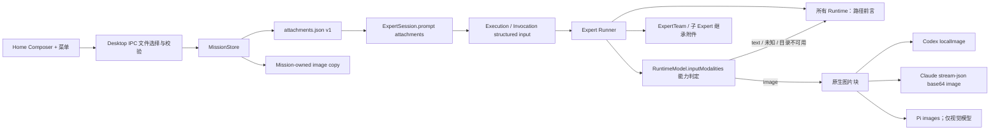

# Mission 附件与图片多模态输入

## 目标

Home 任务输入框提供统一的 `+` 入口，支持选择图片、文件和文件夹。附件必须在 Renderer、Desktop 主进程、Mission 持久化、Expert Core 和具体 Runtime 之间保持明确边界，并能在进程恢复和 ExpertTeam 委派后继续使用。

本方案不改变 Flow 的结构化输入语义；附件只用于 Expert 和 ExpertTeam Mission。

## 参考实现

- OpenAI Codex 的 `UserInput` 将文本、远程图片和本地图片建模为不同输入块；`LocalImage` 在请求序列化时转换为图片数据，而不是把 base64 长期放在 UI 状态中：<https://github.com/openai/codex/blob/main/codex-rs/protocol/src/user_input.rs>
- Codex 对本地媒体先做受限读取和请求级转换：<https://github.com/openai/codex/blob/main/codex-rs/protocol/src/local_media.rs>
- Cindy 在 Renderer 维护路径型附件，在主进程归一化虚拟或缓存资源，并在 Codex adapter 中把图片转为 `localImage`、把文件和目录写成可读的路径前言：
  - <https://github.com/makecindy/cindy/blob/main/apps/desktop/src/renderer/hooks/useAttachments.ts>
  - <https://github.com/makecindy/cindy/blob/main/apps/desktop/src/main/maker-ipc/normalizeAttachments.ts>
  - <https://github.com/makecindy/cindy/blob/main/packages/maker-core/src/agents/codex/index.ts>
- OpenAI 的 Codex 模型资料将图片列为输入模态：<https://developers.openai.com/api/docs/models/gpt-5.2-codex>

## 架构



### Renderer 与 IPC

Renderer 不读取文件内容，只保存主进程返回的附件描述：

```ts
type ExpertPromptAttachment = {
  id: string;
  kind: "image" | "file" | "directory";
  name: string;
  path: string;
  mimeType?: string;
  size?: number;
};
```

`missions:attachments:pick` 使用 Electron 原生选择器，并在主进程验证对象类型、图片扩展名和大小。Renderer 合并时按 `kind + path` 去重，最多保留 20 项。

### Mission 持久化

附件不进入 `pragma.mission/v7` 或 `pragma.mission-message/v1`，避免改变既有 Mission 与时间线协议。每个 Mission 使用独立文件：

```text
<mission>/
  mission.yaml
  messages.jsonl
  attachments.json
  attachments/
    images/
      <attachment-id>.<ext>
```

`attachments.json` 使用 `pragma.mission-attachments/v1`：

- 老 Mission 没有该文件时等价于空附件，不需要扫描或迁移。
- 图片在 Mission 临时目录中复制完成后，随 Mission 原子重命名一起发布，保证初次创建不会留下半成品。
- 普通文件和目录不复制，只保留经过 `realpath` 和类型校验的绝对路径，避免大目录进入 `~/.pragma/data/`。
- 未识别或损坏的附件 manifest 会 fail closed，并报告 `config_invalid`。
- 删除 Mission 时，Mission-owned 图片随 owner 图一起删除。

Mission 聊天快照会在读取时把该 manifest 投影到首条用户消息的可选 `attachments` 字段，供详情页展示；
投影不写回 `pragma.mission-message/v1`。图片缩略图通过只读
`pragma-mission-attachment://` 协议按 Mission ID 与附件 ID 加载，主进程会重新校验 manifest、文件类型和
Mission-owned 图片目录边界，Renderer 不能把任意本地路径转换成可读取 URL。

### Expert Core

`PromptRequest` 继续保存纯文本；附件本身仍不要求升级 ExpertSession。当前
`pragma.expert-session/v6` 的升级来自 steer delivery attempt 的安全语义。有附件时，既有
`ExecutionRecord.input` 和根 `Invocation.input` 的 `unknown` 插槽保存 `ExpertPromptInput`；没有附件时仍保存
原来的字符串。这使旧数据保持原义，同时让崩溃恢复可以从 Invocation 重新取得附件。

Core 为所有 Runtime 构造稳定的模型可见前言：

```text
# Images mentioned by the user:
## screen.png: /.../screen.png

# Files mentioned by the user:
## requirements.md: /.../requirements.md

# Directories mentioned by the user:
## fixtures: /.../fixtures

# My request
Review these inputs.
```

结构化附件只在首个 Runtime attempt 发送；结构化输出重试和编排 continuation 不重复注入。ExpertTeam、普通 Expert launcher 和嵌套 Expert resource 调用继承父 Invocation 的附件，使新的子 Runtime Context 仍能获得图片。

### Runtime 适配与降级

| Runtime                 | 原生图片能力来源                                 | 不支持或能力异常时 |
| ----------------------- | ------------------------------------------------ | ------------------ |
| Codex                   | 模型目录 `input_modalities`；发送 `localImage`   | 路径前言           |
| Claude Code             | 官方 Claude 模型；发送 stream-json base64 图片块 | 路径前言           |
| Pi                      | 当前模型 `input` 包含 `image`；发送 `images`     | 路径前言           |
| Qoder CLI / Antigravity | 当前目录明确声明为 text-only                     | 路径前言           |

Core 将输入模态统一放在 `RuntimeModel.inputModalities`，并在每次带图片的首轮请求前执行 fail-soft 判定：只有当前模型明确声明 `image` 时才传原生图片；模型为 text-only、模型无法匹配、目录没有能力字段或模型目录临时读取失败时，都会移除原生图片块，确保路径已经写入文本上下文，并记录稳定日志 `runtime.image_input_degraded`。因此附件不会因为模型能力异常阻断整个任务。

Claude Code 的第三方映射端点在没有权威模态元数据时按 text-only 处理，避免把图片发给未知兼容模型。Pi 在 Core 判定之外还使用实际 native session model 再检查一次。Qoder CLI 和 Antigravity 虽然暂不使用原生图片协议，仍能通过相同路径上下文和文件工具消费附件。

此降级只处理输入模态能力。认证失败、网络失败或模型已经开始执行工具后的运行错误仍按真实错误报告，不自动重放整轮请求，避免重复副作用。

Desktop 的模型发现将 Provider 模型 ID 与 Runtime 目录中的权威能力元数据合并。Qwen/Bailian 使用
`qwen-token-plan-cn` 作为仅用于能力发现的目录别名，实际 Runtime provider identity 与 Qwen compatibility
profile 不变。模型编辑器允许用户通过 `inputOverride` 显式开启或关闭图片输入；再次发现只刷新没有显式
覆盖的输入模态。

## 安全与资源限制

- 图片格式限 PNG、JPEG、GIF、WebP。
- 单张图片上限 20 MiB，单个 Mission 最多 20 个附件。
- Desktop 主进程在选择时验证，MissionStore 在持久化前再次验证，Renderer 输入不作为信任边界。
- 文件夹不递归计算大小、不复制、不在启动时扫描。
- Runtime 只在发送原生视觉输入时读取 Mission-owned 图片；Renderer 和跨进程协议不传 base64。
- 附件路径写入模型上下文，因此沿用 Mission 的本地访问权限和审计边界。

## 后续扩展

- 为 Mission 后续消息增加附件时，应新增带版本的消息附件协议和相邻迁移，不能直接修改 `pragma.mission-message/v1`。
- 若需要离线、跨设备或云端 Mission，应把文件/目录引用升级为显式 artifact 上传协议；当前绝对路径语义只适用于 Desktop 本机 Runtime。
- UI 后续可消费已标准化的 `inputModalities`，在发送前展示“原生视觉”或“路径上下文”提示。
