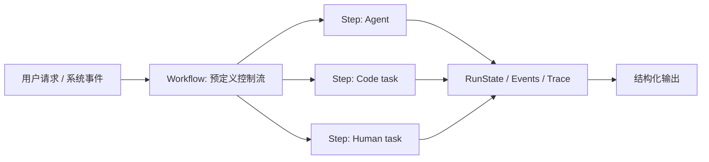
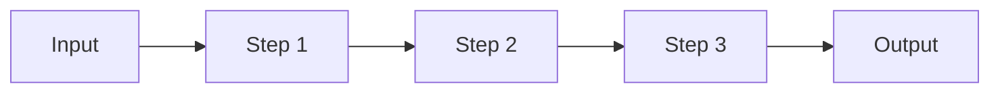
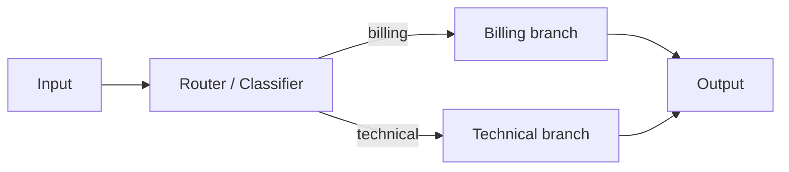
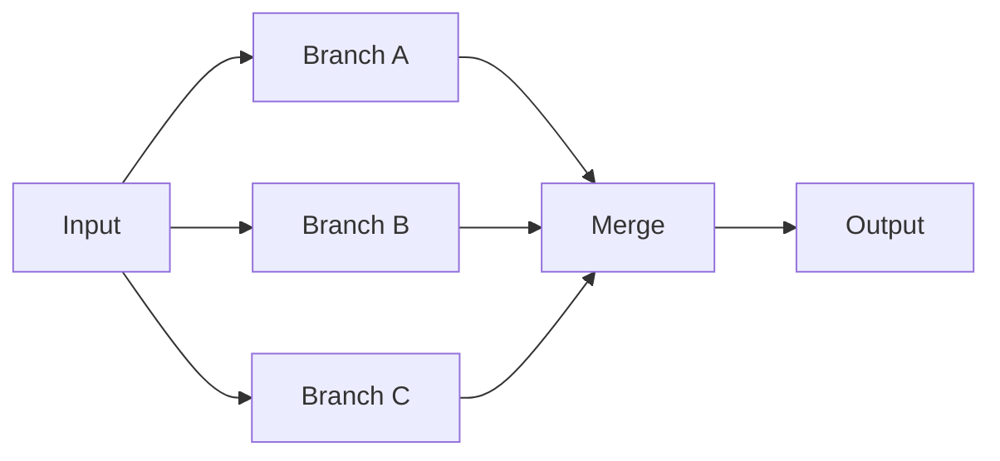
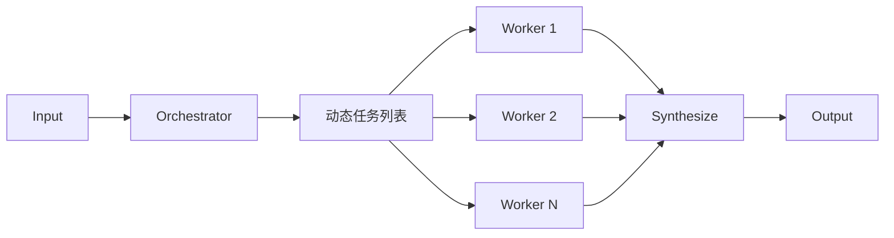
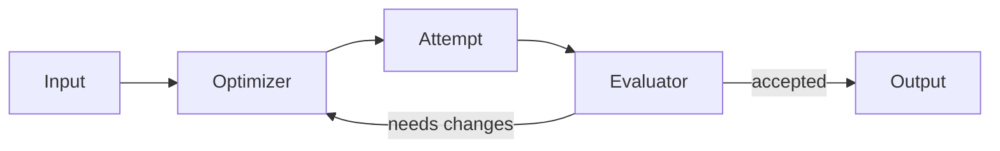

# Workflow 范式快捷 API

本文面向已经理解 [Directive 核心 API](./directives.md) 的开发者，说明 `patterns` 快捷 API。

Anthropic 在 [Building effective agents](https://www.anthropic.com/engineering/building-effective-agents) 中把 Workflow 定义为“LLM 和工具沿着预定义代码路径编排”的模式，并总结了五类常用范式：

- `promptChain`：把任务拆成顺序步骤，前一步输出默认作为下一步输入。
- `routing`：先分类，再把输入路由到专门处理分支。
- `parallel`：并行运行多个独立分支，再合并结果。
- `orchestratorWorkers`：先由 orchestrator 动态拆分任务，再并行派发 worker，最后汇总。
- `evaluatorOptimizer`：optimizer 生成候选结果，evaluator 评估，不通过则带反馈继续迭代。

这些快捷 API 都返回普通 `Directive` 或 `FlowSpec`，可直接传给 `createPragma().run()`，也可以作为子 Directive 注册进另一个 `defineFlow()`。

```ts
import { patterns } from "@pragma/core";
```

最简单场景可以直接传入裸 `Directive`；需要覆盖 step id、输入、输出 schema、runtime 或 sandbox 时，再展开成 `{ directive, input, output, runtime, sandbox }`。

可运行示例：

```bash
pnpm --filter @pragma/examples start:workflow-patterns
```

## Workflow 的作用

Workflow 适合“控制流已知，但每个步骤可以由 Agent、代码 task、工具或人工节点完成”的场景。它把不确定性限制在单个 step 内，把整体执行路径、状态归并、分支和重试交给 Directive 层治理。



使用判断：

- 控制流明确、需要可审计和可复现时，用 Workflow。
- 每一步可以交给不同 Agent、代码 task 或人工节点。
- 如果下一步该做什么本身需要模型持续自主判断，应该使用 Agent directive，而不是强行套 Workflow。

## Prompt Chain



```ts
const chain = patterns.promptChain({
  id: "support-chain",
  output: z.string(),
  steps: [classifyRequest, draftReply, polishReply],
});
```

默认行为：

- 第一步输入是 workflow input。
- 后续步骤输入是上一步输出。
- 最后一步输出写入 `state.results["final"]` 并作为 workflow output。

需要自定义某一步输入时，在 step 上声明 `input` resolver：

```ts
{
  directive: draftReply,
  input: ({ state }) => ({
    originalRequest: state.input,
    classification: state.private,
  }),
}
```

## Routing



```ts
const routed = patterns.routing({
  id: "ticket-router",
  field: "route",
  router: {
    directive: classifyTicket,
    output: z.object({
      route: z.enum(["billing", "technical"]),
    }),
  },
  routes: {
    billing: {
      directive: billingAgent,
    },
    technical: {
      directive: technicalAgent,
    },
  },
});
```

`field` 从 router 的结构化输出中读取。分支默认接收原始 workflow input；如需传入分类结果，可以给分支配置 `input` resolver。

## Parallel



```ts
const review = patterns.parallel({
  id: "parallel-review",
  output: z.object({
    summary: z.string(),
  }),
  branches: {
    correctness: correctnessReviewer,
    security: securityReviewer,
    ux: uxReviewer,
  },
  merge: ({ outputs }) => ({
    summary: Object.values(outputs).join("\n"),
  }),
});
```

`parallel` 适合多个独立视角同时处理同一输入，例如多维 review、候选方案投票、批量信息抽取。没有 `merge` 时，输出是按 branch id 组织的对象。

## Orchestrator Workers



```ts
const report = patterns.orchestratorWorkers({
  id: "report-builder",
  orchestrator: {
    directive: planner,
  },
  worker: {
    directive: sectionWriter,
  },
  getWorkerInputs: ({ orchestration }) => orchestration.sections,
  synthesize: ({ workerOutputs }) => ({
    markdown: workerOutputs.map((item) => item.output).join("\n\n"),
  }),
});
```

如果不提供 `getWorkerInputs`，orchestrator 输出必须包含 `tasks` 数组。这个范式适合运行前不知道子任务数量的场景，例如按文件、章节、模块或待办项动态拆分。

## Evaluator Optimizer



```ts
const refined = patterns.evaluatorOptimizer({
  id: "refine-answer",
  optimizer: {
    directive: answerWriter,
  },
  evaluator: {
    directive: answerEvaluator,
  },
  maxIterations: 3,
});
```

默认约定：

- 第 1 次 optimizer 输入是 workflow input。
- 后续 optimizer 输入是 `{ input, previousAttempt, evaluation, iteration }`。
- evaluator 输入是 optimizer 的 attempt。
- evaluator 输出包含 `accepted` / `approved` boolean，或 `status` 为 `accepted`、`approved`、`pass`、`passed`、`success`、`succeeded` 时视为通过。
- 达到 `maxIterations` 仍未通过时默认失败；需要返回最后一次结果可设置 `onMaxIterations: "return-last"`。

需要更强控制时可声明：

```ts
patterns.evaluatorOptimizer({
  id: "refine-with-custom-feedback",
  optimizer: {
    directive: answerWriter,
  },
  evaluator: {
    directive: answerEvaluator,
  },
  buildOptimizerInput: ({ input, previousAttempt, evaluation }) => ({
    goal: input,
    previousAttempt,
    feedback: evaluation,
  }),
  buildEvaluatorInput: ({ attempt }) => ({
    candidate: attempt,
  }),
  accept: ({ evaluation }) => evaluation.score >= 0.9,
  result: ({ attempt, evaluation, iterations }) => ({
    attempt,
    score: evaluation.score,
    iterations,
  }),
});
```
